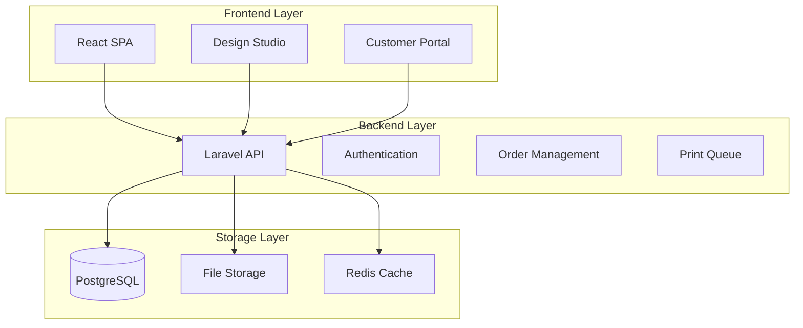

# Architecture Decision Record: Custom Development Strategy

**Status:** ACCEPTED  
**Date:** October 2, 2025  
**Decision Makers:** Technical Architecture Team  
**Context:** Caldron Flex Printing Business Management System

---

## Decision

We will build a **custom Laravel-React application** from scratch, specifically designed for printing business management needs.

## Context

### Business Requirements
Caldron Flex is a small-to-medium printing business handling:
- Approximately 6 orders per day
- 3-4 staff members
- Various printing services (business cards, brochures, large format)
- Need for scalable SaaS solution

### Problems with Existing Solutions

1. **Over-Engineering**
   - Generic ERP/CRM platforms are oversized for specific business needs
   - Unnecessary features increase complexity
   - Higher maintenance burden than required

2. **Integration Complexity**
   - Multiple system integrations create sync issues
   - API version conflicts
   - Complex deployment and debugging
   - Higher system failure probability

3. **Customization Limitations**
   - Existing platforms have rigid workflows
   - Difficult to modify core business processes
   - Limited flexibility for printing-specific features
   - Risk of breaking with updates

4. **Resource Constraints**
   - Coolify VPS with limited resources (8GB RAM, 4 vCPU)
   - Need for efficient resource utilization
   - Simple deployment architecture required

## Decision Rationale

### Custom Development Advantages

#### 1. **Perfect Business Fit**
- Workflows designed specifically for printing operations
- Direct implementation of Caldron Flex processes
- No unnecessary features or complexity
- Easy to evolve with business needs

#### 2. **Technical Simplicity**
- Single tech stack: Laravel (Backend) + React (Frontend)
- Consistent patterns and conventions
- Faster development and debugging
- Lower learning curve for team

#### 3. **Resource Efficiency**
- Single application deployment
- Optimized for available infrastructure
- Lower memory and CPU footprint
- Better performance on limited resources

#### 4. **Maintainability**
- Full control over codebase
- No external platform dependencies
- Direct debugging access
- Clear code ownership

#### 5. **Cost Effectiveness**
- No licensing concerns
- Lower hosting requirements
- Reduced development complexity
- Faster time to market

## Architecture Overview

### Core Components

### Technology Stack

| Component | Technology | Purpose |
|-----------|------------|---------|
| Backend | Laravel 11 | API & Business Logic |
| Frontend | React 18 | User Interface |
| Database | PostgreSQL 15 | Data Persistence |
| Cache | Redis | Performance Optimization |
| Queue | Laravel Horizon | Background Processing |
| Storage | S3/Local | File Management |

## Implementation Strategy

### Phase 1: Core Foundation (Months 1-2)
- Authentication and authorization system
- Basic order management
- Customer portal
- Admin dashboard

### Phase 2: Printing Features (Months 3-4)
- Design studio integration
- Print queue management
- Production workflow
- File processing

### Phase 3: Business Operations (Months 5-6)
- Inventory management
- Financial reporting
- Staff management
- Analytics dashboard

### Phase 4: SaaS Features (Month 7)
- Multi-tenancy
- Subscription billing
- Tenant isolation
- White-labeling

## Consequences

### Positive
- Complete control over features and roadmap
- Optimized for specific business needs
- Lower operational costs
- Faster feature delivery
- Better performance on limited resources

### Negative
- Higher initial development effort
- Need to build common features from scratch
- Full responsibility for security and maintenance
- No existing community or plugins

## Mitigation Strategies

1. **Use Laravel Packages**
   - Leverage existing packages for common functionality
   - Focus custom development on business-specific features

2. **Progressive Development**
   - Start with MVP features
   - Iterate based on actual usage
   - Avoid premature optimization

3. **Security Best Practices**
   - Follow OWASP guidelines
   - Regular security audits
   - Automated testing

4. **Documentation**
   - Maintain comprehensive documentation
   - API documentation with OpenAPI
   - Clear deployment guides

## Decision Review

This decision will be reviewed after:
- MVP deployment (3 months)
- First customer onboarding (6 months)
- SaaS launch (12 months)

## Alternatives Considered

While various existing platforms were evaluated, they were rejected due to:
- Complexity overhead for small business needs
- Difficult customization for printing workflows
- Resource inefficiency
- Higher total cost of ownership

## Approval

**Approved by:** Technical Architecture Team  
**Review Date:** January 2026

---

*This Architecture Decision Record documents the strategic choice to build a custom Laravel + React application specifically designed for the Caldron Flex printing business management system.*
