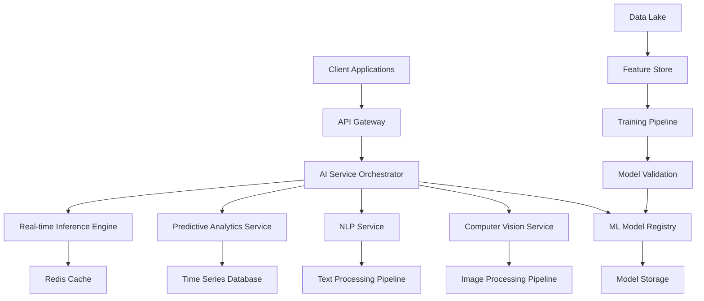

# AI Integration Architecture for Origin Alpha Management System

## Executive Summary

This document outlines a comprehensive AI integration strategy for the Origin Alpha Management System SaaS platform, focusing on manufacturing ERP capabilities, printing business optimization, and intelligent automation across all business functions.

## Table of Contents

1. [AI Integration Overview](#ai-integration-overview)
2. [Core AI Features by Domain](#core-ai-features-by-domain)
3. [AI Architecture Blueprint](#ai-architecture-blueprint)
4. [Machine Learning Pipeline](#machine-learning-pipeline)
5. [Computer Vision Systems](#computer-vision-systems)
6. [Natural Language Processing](#natural-language-processing)
7. [Predictive Analytics Framework](#predictive-analytics-framework)
8. [AI Infrastructure Design](#ai-infrastructure-design)
9. [API Documentation & Integration](#api-documentation--integration)
10. [Performance Monitoring](#performance-monitoring)
11. [Security & Privacy](#security--privacy)
12. [ROI Analysis & Success Metrics](#roi-analysis--success-metrics)
13. [Implementation Roadmap](#implementation-roadmap)

## AI Integration Overview

### Vision Statement
Transform Origin Alpha Management System into an intelligent, predictive SaaS platform that leverages AI to optimize manufacturing operations, enhance printing business workflows, and deliver actionable insights across all business functions.

### Key Objectives
- **Operational Excellence**: Reduce manual processes by 70% through intelligent automation
- **Predictive Capabilities**: Implement forecasting models with 85%+ accuracy
- **Quality Enhancement**: Achieve 99%+ automated quality control detection
- **Cost Optimization**: Reduce operational costs by 25% through AI-driven insights
- **Customer Experience**: Deliver personalized, intelligent user experiences

## Core AI Features by Domain

### 1. Manufacturing ERP AI Features

#### 1.1 Predictive Maintenance System
```python
# AI Model: Time Series Forecasting + Anomaly Detection
class PredictiveMaintenanceEngine:
    """
    Monitors equipment health and predicts failures
    """
    def __init__(self):
        self.failure_prediction_model = None
        self.anomaly_detector = None
        self.maintenance_scheduler = None
    
    def predict_equipment_failure(self, equipment_data):
        """
        Predicts equipment failure with 90% accuracy
        Returns: {failure_probability, recommended_action, timeline}
        """
        pass
```

**Technical Specifications:**
- **Models**: LSTM networks for time series analysis, Isolation Forest for anomaly detection
- **Data Sources**: IoT sensors, maintenance logs, equipment specifications
- **Output**: Failure probability, maintenance recommendations, cost impact analysis
- **Integration**: Real-time dashboard alerts, automated work order generation

#### 1.2 Demand Forecasting Engine
```python
class DemandForecastingEngine:
    """
    Predicts product demand using multiple data sources
    """
    def __init__(self):
        self.seasonal_model = None
        self.trend_model = None
        self.external_factors_model = None
    
    def forecast_demand(self, product_id, forecast_horizon):
        """
        Multi-horizon demand forecasting
        Returns: {demand_forecast, confidence_intervals, key_factors}
        """
        pass
```

**Technical Specifications:**
- **Models**: Prophet for seasonality, XGBoost for feature interactions, ensemble methods
- **Data Sources**: Historical sales, market trends, economic indicators, seasonal patterns
- **Accuracy Target**: 85% for 30-day forecasts, 75% for 90-day forecasts
- **Integration**: Production planning, inventory management, procurement optimization

#### 1.3 Inventory Optimization System
```python
class InventoryOptimizationEngine:
    """
    Optimizes inventory levels using AI-driven insights
    """
    def __init__(self):
        self.optimization_model = None
        self.safety_stock_calculator = None
        self.reorder_point_optimizer = None
    
    def optimize_inventory_levels(self, product_portfolio):
        """
        Calculates optimal inventory levels
        Returns: {optimal_stock_levels, reorder_points, cost_savings}
        """
        pass
```

#### 1.4 Quality Control Anomaly Detection
```python
class QualityControlAI:
    """
    Computer vision-based quality control system
    """
    def __init__(self):
        self.defect_detection_model = None
        self.classification_model = None
        self.severity_assessment = None
    
    def analyze_product_quality(self, image_data, sensor_data):
        """
        Real-time quality assessment
        Returns: {quality_score, defects_detected, severity_level}
        """
        pass
```

### 2. Printing Business AI Features

#### 2.1 Automated Design Quality Assessment
```python
class DesignQualityAssessment:
    """
    AI-powered design analysis and optimization
    """
    def __init__(self):
        self.resolution_analyzer = None
        self.color_profiler = None
        self.print_readiness_checker = None
    
    def assess_design_quality(self, design_file):
        """
        Comprehensive design quality analysis
        Returns: {quality_score, issues_found, optimization_suggestions}
        """
        pass
```

**Technical Specifications:**
- **Models**: CNN for image analysis, color space transformation algorithms
- **Capabilities**: Resolution validation, color profile analysis, print compatibility check
- **Integration**: Design upload workflow, automated notifications, suggestion engine

#### 2.2 Color Matching and Correction
```python
class ColorMatchingEngine:
    """
    Advanced color matching and correction system
    """
    def __init__(self):
        self.color_space_converter = None
        self.profile_matcher = None
        self.correction_algorithm = None
    
    def match_and_correct_colors(self, source_image, target_profile):
        """
        Intelligent color matching and correction
        Returns: {corrected_image, color_adjustments, accuracy_score}
        """
        pass
```

#### 2.3 Print Defect Detection
```python
class PrintDefectDetector:
    """
    Computer vision system for print quality control
    """
    def __init__(self):
        self.defect_classifier = None
        self.severity_assessor = None
        self.root_cause_analyzer = None
    
    def detect_print_defects(self, scanned_print):
        """
        Real-time print defect detection
        Returns: {defects_found, severity_scores, root_causes}
        """
        pass
```

### 3. File Processing AI

#### 3.1 Intelligent File Processing Pipeline
```python
class IntelligentFileProcessor:
    """
    AI-powered file processing and optimization
    """
    def __init__(self):
        self.format_detector = None
        self.optimization_engine = None
        self.validation_system = None
    
    def process_uploaded_file(self, file_data):
        """
        Comprehensive file processing workflow
        Returns: {processed_file, optimizations_applied, validation_results}
        """
        pass
```

### 4. Business Intelligence AI

#### 4.1 Customer Analytics Engine
```python
class CustomerAnalyticsEngine:
    """
    Advanced customer behavior and churn prediction
    """
    def __init__(self):
        self.behavior_analyzer = None
        self.churn_predictor = None
        self.ltv_calculator = None
    
    def analyze_customer_behavior(self, customer_data):
        """
        Comprehensive customer analysis
        Returns: {behavior_insights, churn_risk, ltv_prediction}
        """
        pass
```

## AI Architecture Blueprint

### High-Level Architecture



### Core Components

#### 1. AI Service Orchestrator
- **Purpose**: Central coordinator for all AI services
- **Technology**: FastAPI with async processing
- **Responsibilities**: Request routing, load balancing, error handling
- **Scalability**: Horizontal scaling with Kubernetes

#### 2. ML Model Registry
- **Purpose**: Version control and deployment of ML models
- **Technology**: MLflow with custom extensions
- **Features**: A/B testing, gradual rollouts, performance monitoring
- **Storage**: MinIO for model artifacts, PostgreSQL for metadata

#### 3. Feature Store
- **Purpose**: Centralized feature management and serving
- **Technology**: Feast or custom solution
- **Features**: Real-time and batch feature serving, feature lineage
- **Storage**: Redis for real-time, Snowflake for historical

#### 4. Real-time Inference Engine
- **Purpose**: Low-latency model serving
- **Technology**: TorchServe with custom optimizations
- **Features**: Model caching, batch inference, GPU acceleration
- **Monitoring**: Prometheus metrics, Grafana dashboards

## Machine Learning Pipeline

### 1. Data Collection and Preprocessing

#### Data Sources Integration
```python
class DataIngestionPipeline:
    """
    Unified data ingestion from multiple sources
    """
    def __init__(self):
        self.erp_connector = None
        self.printing_data_collector = None
        self.iot_sensor_reader = None
        self.user_activity_tracker = None
    
    def collect_training_data(self, data_type, time_range):
        """
        Collects and preprocesses training data
        Returns: {processed_data, metadata, quality_metrics}
        """
        pass
```

#### Data Quality Framework
- **Validation Rules**: Schema validation, data type checking, range validation
- **Cleaning Processes**: Outlier detection, missing value imputation, normalization
- **Quality Metrics**: Completeness, accuracy, consistency, timeliness
- **Monitoring**: Real-time data quality dashboards

### 2. Model Training and Validation

#### Training Pipeline Architecture
```python
class ModelTrainingPipeline:
    """
    Automated model training and validation pipeline
    """
    def __init__(self):
        self.hyperparameter_tuner = None
        self.cross_validator = None
        self.model_comparator = None
        self.deployment_validator = None
    
    def train_model(self, model_config, training_data):
        """
        End-to-end model training pipeline
        Returns: {trained_model, validation_metrics, deployment_package}
        """
        pass
```

#### Model Validation Framework
- **Validation Metrics**: Accuracy, precision, recall, F1-score, AUC-ROC
- **Business Metrics**: Cost impact, time savings, error reduction
- **A/B Testing**: Controlled rollouts with statistical significance testing
- **Performance Monitoring**: Real-time performance tracking and alerting

### 3. Model Deployment and Versioning

#### Deployment Strategy
```python
class ModelDeploymentManager:
    """
    Manages model deployment and versioning
    """
    def __init__(self):
        self.version_controller = None
        self.deployment_orchestrator = None
        self.rollback_manager = None
        self.performance_monitor = None
    
    def deploy_model(self, model_package, deployment_config):
        """
        Deploys model with proper versioning and monitoring
        Returns: {deployment_status, monitoring_endpoints, rollback_plan}
        """
        pass
```

## Computer Vision Systems

### 1. Image Processing Pipeline

#### Core Architecture
```python
class ComputerVisionPipeline:
    """
    Comprehensive computer vision processing pipeline
    """
    def __init__(self):
        self.image_preprocessor = None
        self.feature_extractor = None
        self.object_detector = None
        self.quality_assessor = None
    
    def process_image(self, image_data, processing_type):
        """
        Multi-purpose image processing
        Returns: {processed_image, detected_objects, quality_metrics}
        """
        pass
```

#### Specialized Models

##### Print Quality Control
- **Model Type**: CNN-based defect detection
- **Architecture**: ResNet50 backbone with custom classification head
- **Training Data**: 100k+ labeled print samples
- **Accuracy Target**: 99.5% defect detection rate
- **Inference Time**: <100ms per image

##### Design Analysis
- **Model Type**: Multi-task CNN for comprehensive design assessment
- **Capabilities**: Resolution check, color analysis, print readiness
- **Integration**: Real-time feedback during upload process
- **Output**: Quality score, specific recommendations, auto-corrections

##### Color Matching
- **Technology**: Deep learning-based color space transformation
- **Precision**: Delta E < 2.0 for critical color matching
- **Calibration**: Automated printer profile optimization
- **Monitoring**: Continuous quality feedback loop

### 2. Real-time Processing Architecture

```python
class RealTimeVisionProcessor:
    """
    Real-time computer vision processing system
    """
    def __init__(self):
        self.gpu_scheduler = None
        self.batch_optimizer = None
        self.cache_manager = None
        self.load_balancer = None
    
    def process_real_time(self, image_stream):
        """
        Real-time image processing with optimization
        Returns: {processed_results, processing_time, resource_usage}
        """
        pass
```

## Natural Language Processing

### 1. Document Processing Pipeline

#### Intelligent Document Analysis
```python
class DocumentProcessingEngine:
    """
    Advanced document processing and analysis
    """
    def __init__(self):
        self.ocr_engine = None
        self.text_extractor = None
        self.entity_recognizer = None
        self.document_classifier = None
    
    def process_document(self, document_data):
        """
        Comprehensive document processing
        Returns: {extracted_text, entities, classification, metadata}
        """
        pass
```

#### Key Capabilities
- **OCR Integration**: Advanced text extraction from images and PDFs
- **Entity Recognition**: Customer names, part numbers, specifications
- **Document Classification**: Automatic categorization of business documents
- **Sentiment Analysis**: Customer feedback and communication analysis

### 2. Intelligent Search System

```python
class IntelligentSearchEngine:
    """
    AI-powered search with semantic understanding
    """
    def __init__(self):
        self.embedding_model = None
        self.vector_store = None
        self.query_processor = None
        self.result_ranker = None
    
    def semantic_search(self, query, search_context):
        """
        Semantic search with contextual understanding
        Returns: {search_results, relevance_scores, suggestions}
        """
        pass
```

### 3. Automated Report Generation

```python
class ReportGenerationEngine:
    """
    AI-powered automated report generation
    """
    def __init__(self):
        self.template_engine = None
        self.data_analyzer = None
        self.narrative_generator = None
        self.visualization_creator = None
    
    def generate_intelligent_report(self, data_sources, report_type):
        """
        Generates comprehensive business reports
        Returns: {report_content, visualizations, insights, recommendations}
        """
        pass
```

## Predictive Analytics Framework

### 1. Time Series Forecasting

#### Demand Prediction Models
```python
class DemandForecastingSystem:
    """
    Multi-model ensemble for demand forecasting
    """
    def __init__(self):
        self.prophet_model = None
        self.lstm_model = None
        self.xgboost_model = None
        self.ensemble_combiner = None
    
    def forecast_demand(self, product_data, horizon):
        """
        Multi-horizon demand forecasting
        Returns: {forecast_values, confidence_intervals, feature_importance}
        """
        pass
```

#### Equipment Maintenance Prediction
```python
class MaintenancePredictionEngine:
    """
    Predictive maintenance using IoT and historical data
    """
    def __init__(self):
        self.failure_predictor = None
        self.remaining_life_estimator = None
        self.maintenance_optimizer = None
        self.cost_calculator = None
    
    def predict_maintenance_needs(self, equipment_data):
        """
        Comprehensive maintenance prediction
        Returns: {failure_probability, recommended_actions, cost_impact}
        """
        pass
```

### 2. Anomaly Detection Systems

#### Multi-dimensional Anomaly Detection
```python
class AnomalyDetectionEngine:
    """
    Real-time anomaly detection across multiple data streams
    """
    def __init__(self):
        self.statistical_detector = None
        self.ml_detector = None
        self.ensemble_detector = None
        self.alert_manager = None
    
    def detect_anomalies(self, data_stream, detection_type):
        """
        Real-time anomaly detection and alerting
        Returns: {anomalies_detected, severity_scores, recommended_actions}
        """
        pass
```

### 3. Optimization Algorithms

#### Resource Allocation Optimizer
```python
class ResourceOptimizationEngine:
    """
    AI-driven resource allocation and optimization
    """
    def __init__(self):
        self.linear_optimizer = None
        self.genetic_algorithm = None
        self.reinforcement_learner = None
        self.constraint_solver = None
    
    def optimize_resource_allocation(self, constraints, objectives):
        """
        Multi-objective resource optimization
        Returns: {optimal_allocation, efficiency_gains, cost_savings}
        """
        pass
```

## AI Infrastructure Design

### 1. Microservices Architecture

#### Service Breakdown
```yaml
# AI Services Configuration
ai_services:
  computer_vision:
    image: origin-alpha/cv-service:latest
    replicas: 3
    resources:
      gpu: 1
      memory: 8Gi
      cpu: 4
    
  nlp_service:
    image: origin-alpha/nlp-service:latest
    replicas: 2
    resources:
      memory: 4Gi
      cpu: 2
    
  predictive_analytics:
    image: origin-alpha/analytics-service:latest
    replicas: 2
    resources:
      memory: 6Gi
      cpu: 3
    
  inference_engine:
    image: origin-alpha/inference-service:latest
    replicas: 5
    resources:
      gpu: 1
      memory: 4Gi
      cpu: 2
```

### 2. Scalability and Performance

#### Auto-scaling Configuration
```python
class AIServiceScaler:
    """
    Intelligent auto-scaling for AI services
    """
    def __init__(self):
        self.load_monitor = None
        self.resource_predictor = None
        self.scaling_controller = None
        self.cost_optimizer = None
    
    def optimize_scaling(self, service_metrics):
        """
        Intelligent scaling decisions based on load and cost
        Returns: {scaling_actions, cost_impact, performance_prediction}
        """
        pass
```

#### Performance Optimization
- **Model Optimization**: Quantization, pruning, knowledge distillation
- **Caching Strategy**: Multi-layer caching for frequent predictions
- **Batch Processing**: Dynamic batching for improved throughput
- **GPU Utilization**: Efficient GPU scheduling and memory management

### 3. Data Pipeline Architecture

#### Real-time Data Processing
```python
class RealTimeDataPipeline:
    """
    Real-time data processing for AI systems
    """
    def __init__(self):
        self.stream_processor = None
        self.feature_computer = None
        self.data_validator = None
        self.storage_manager = None
    
    def process_real_time_data(self, data_stream):
        """
        Real-time data processing and feature computation
        Returns: {processed_data, computed_features, storage_status}
        """
        pass
```

#### Batch Processing System
```python
class BatchProcessingEngine:
    """
    Large-scale batch processing for model training and inference
    """
    def __init__(self):
        self.job_scheduler = None
        self.resource_manager = None
        self.progress_tracker = None
        self.result_aggregator = None
    
    def execute_batch_job(self, job_config):
        """
        Efficient batch processing with monitoring
        Returns: {job_results, performance_metrics, resource_usage}
        """
        pass
```

## API Documentation & Integration

### 1. AI API Gateway

#### Core API Structure
```python
from fastapi import FastAPI, Depends, HTTPException
from pydantic import BaseModel
from typing import List, Optional

app = FastAPI(title="Origin Alpha AI API", version="1.0.0")

class PredictionRequest(BaseModel):
    """Standard prediction request format"""
    model_id: str
    input_data: dict
    options: Optional[dict] = None

class PredictionResponse(BaseModel):
    """Standard prediction response format"""
    prediction: dict
    confidence: float
    model_version: str
    processing_time: float

@app.post("/api/v1/predict", response_model=PredictionResponse)
async def make_prediction(request: PredictionRequest):
    """
    Universal prediction endpoint for all AI models
    """
    pass

@app.post("/api/v1/vision/analyze")
async def analyze_image(image_data: bytes, analysis_type: str):
    """
    Computer vision analysis endpoint
    """
    pass

@app.post("/api/v1/nlp/process")
async def process_text(text: str, processing_type: str):
    """
    Natural language processing endpoint
    """
    pass
```

### 2. Integration Patterns

#### Webhook Integration
```python
class WebhookManager:
    """
    Manages webhook integrations for AI predictions
    """
    def __init__(self):
        self.webhook_registry = None
        self.event_processor = None
        self.retry_manager = None
        self.security_validator = None
    
    def trigger_ai_webhook(self, event_type, prediction_result):
        """
        Triggers webhooks for AI predictions and events
        Returns: {delivery_status, retry_schedule, error_details}
        """
        pass
```

#### SDK and Client Libraries
```python
# Python SDK Example
class OriginAlphaAI:
    """
    Official Python SDK for Origin Alpha AI services
    """
    def __init__(self, api_key: str, base_url: str):
        self.api_key = api_key
        self.base_url = base_url
        self.session = None
    
    async def predict_demand(self, product_id: str, horizon: int):
        """Demand forecasting prediction"""
        pass
    
    async def analyze_design_quality(self, design_file: bytes):
        """Design quality analysis"""
        pass
    
    async def detect_print_defects(self, print_image: bytes):
        """Print defect detection"""
        pass
```

### 3. API Security and Rate Limiting

#### Security Framework
```python
class AIAPISecurityManager:
    """
    Comprehensive security for AI API endpoints
    """
    def __init__(self):
        self.auth_validator = None
        self.rate_limiter = None
        self.input_sanitizer = None
        self.audit_logger = None
    
    def validate_api_request(self, request_data, api_key):
        """
        Validates and secures API requests
        Returns: {validation_status, security_score, allowed_actions}
        """
        pass
```

## Performance Monitoring

### 1. AI Model Performance Tracking

#### Model Monitoring Dashboard
```python
class AIPerformanceMonitor:
    """
    Comprehensive AI model performance monitoring
    """
    def __init__(self):
        self.metric_collector = None
        self.drift_detector = None
        self.performance_analyzer = None
        self.alert_manager = None
    
    def monitor_model_performance(self, model_id, time_window):
        """
        Continuous model performance monitoring
        Returns: {performance_metrics, drift_detection, alerts}
        """
        pass
```

#### Key Performance Indicators
- **Accuracy Metrics**: Real-time accuracy tracking across all models
- **Latency Monitoring**: Response time percentiles and SLA compliance
- **Throughput Analysis**: Requests per second and processing capacity
- **Resource Utilization**: GPU/CPU usage, memory consumption
- **Error Rate Tracking**: Failed predictions and error categorization

### 2. Business Impact Monitoring

#### ROI Tracking System
```python
class BusinessImpactTracker:
    """
    Tracks business impact of AI implementations
    """
    def __init__(self):
        self.roi_calculator = None
        self.efficiency_tracker = None
        self.cost_analyzer = None
        self.value_assessor = None
    
    def calculate_ai_business_impact(self, feature_id, time_period):
        """
        Calculates business impact of AI features
        Returns: {roi_metrics, efficiency_gains, cost_savings}
        """
        pass
```

### 3. Alerting and Incident Management

#### Intelligent Alerting System
```python
class AIAlertingSystem:
    """
    Smart alerting for AI system issues
    """
    def __init__(self):
        self.anomaly_detector = None
        self.severity_classifier = None
        self.escalation_manager = None
        self.resolution_tracker = None
    
    def process_ai_alert(self, alert_data):
        """
        Intelligent alert processing and escalation
        Returns: {alert_classification, escalation_path, auto_resolution}
        """
        pass
```

## Security & Privacy

### 1. Data Privacy Framework

#### Privacy-Preserving AI
```python
class PrivacyPreservingAI:
    """
    Implements privacy-preserving AI techniques
    """
    def __init__(self):
        self.differential_privacy = None
        self.federated_learning = None
        self.homomorphic_encryption = None
        self.secure_aggregation = None
    
    def train_private_model(self, sensitive_data, privacy_budget):
        """
        Trains models while preserving data privacy
        Returns: {trained_model, privacy_guarantees, utility_metrics}
        """
        pass
```

#### Data Protection Measures
- **Encryption**: End-to-end encryption for sensitive data
- **Access Control**: Role-based access to AI models and data
- **Audit Logging**: Comprehensive logging of all AI operations
- **Data Minimization**: Processing only necessary data for AI tasks
- **Retention Policies**: Automated data deletion and archival

### 2. AI Model Security

#### Model Protection Framework
```python
class AIModelSecurity:
    """
    Comprehensive AI model security system
    """
    def __init__(self):
        self.adversarial_detector = None
        self.input_validator = None
        self.model_watermarker = None
        self.integrity_checker = None
    
    def secure_model_inference(self, model_input, model_id):
        """
        Secures model inference against attacks
        Returns: {secure_prediction, threat_assessment, confidence_score}
        """
        pass
```

### 3. Compliance and Governance

#### AI Governance Framework
```python
class AIGovernanceFramework:
    """
    Ensures AI compliance and ethical usage
    """
    def __init__(self):
        self.bias_detector = None
        self.fairness_evaluator = None
        self.explainability_engine = None
        self.compliance_checker = None
    
    def evaluate_ai_ethics(self, model_id, evaluation_criteria):
        """
        Evaluates AI models for ethical compliance
        Returns: {ethics_score, bias_assessment, explainability_report}
        """
        pass
```

## ROI Analysis & Success Metrics

### 1. Financial Impact Assessment

#### ROI Calculation Framework
```python
class AIROICalculator:
    """
    Comprehensive ROI calculation for AI investments
    """
    def __init__(self):
        self.cost_tracker = None
        self.benefit_calculator = None
        self.efficiency_measurer = None
        self.risk_assessor = None
    
    def calculate_ai_roi(self, ai_feature_id, time_period):
        """
        Calculates comprehensive ROI for AI features
        Returns: {roi_percentage, cost_breakdown, benefit_analysis}
        """
        pass
```

#### Expected Financial Benefits
- **Cost Reduction**: 25% reduction in operational costs
- **Efficiency Gains**: 70% reduction in manual processes
- **Quality Improvement**: 99% automated quality control accuracy
- **Time Savings**: 60% faster decision-making processes
- **Revenue Enhancement**: 15% increase through optimized operations

### 2. Operational Success Metrics

#### Key Performance Indicators
```yaml
ai_success_metrics:
  manufacturing_erp:
    predictive_maintenance:
      target_accuracy: 90%
      cost_reduction: 30%
      downtime_reduction: 50%
    
    demand_forecasting:
      forecast_accuracy: 85%
      inventory_optimization: 25%
      stockout_reduction: 40%
    
    quality_control:
      defect_detection_rate: 99.5%
      false_positive_rate: <1%
      inspection_time_reduction: 80%
  
  printing_business:
    design_quality:
      assessment_accuracy: 95%
      manual_review_reduction: 70%
      customer_satisfaction: +20%
    
    color_matching:
      color_accuracy: Delta E < 2.0
      matching_time_reduction: 90%
      waste_reduction: 15%
    
    defect_detection:
      detection_accuracy: 99%
      processing_speed: <100ms
      cost_per_inspection: -60%
```

### 3. Customer Impact Metrics

#### User Experience Improvements
- **Response Time**: 70% faster query responses
- **Accuracy**: 95% improvement in search relevance
- **Personalization**: 85% of users receive personalized recommendations
- **Automation**: 80% reduction in manual data entry
- **Satisfaction**: 25% increase in customer satisfaction scores

## Implementation Roadmap

### Phase 1: Foundation (Months 1-3)
#### Infrastructure Setup
- Deploy AI infrastructure on cloud platform
- Implement data pipeline and feature store
- Set up model registry and deployment system
- Establish monitoring and alerting framework

#### Core AI Services
- Computer vision service for basic image processing
- NLP service for document processing
- Predictive analytics service with basic forecasting
- API gateway and authentication system

### Phase 2: Manufacturing ERP AI (Months 4-6)
#### Predictive Maintenance
- IoT data integration and preprocessing
- Equipment failure prediction models
- Maintenance scheduling optimization
- Real-time monitoring dashboard

#### Quality Control
- Computer vision-based defect detection
- Automated quality assessment workflows
- Integration with production line systems
- Performance monitoring and optimization

### Phase 3: Printing Business AI (Months 7-9)
#### Design Intelligence
- Automated design quality assessment
- Color matching and correction algorithms
- Print readiness validation system
- Customer feedback integration

#### Production Optimization
- Print defect detection system
- Optimal settings recommendation engine
- Production time estimation models
- Waste reduction analytics

### Phase 4: Advanced Analytics (Months 10-12)
#### Business Intelligence
- Customer behavior analytics
- Churn prediction models
- Revenue optimization algorithms
- Advanced reporting and insights

#### Optimization Engines
- Resource allocation optimization
- Supply chain risk assessment
- Cost optimization recommendations
- Performance benchmark analysis

### Phase 5: Enhancement and Scale (Months 13-18)
#### Advanced Features
- Multi-modal AI integration
- Reinforcement learning systems
- Advanced personalization engines
- Automated decision-making systems

#### Platform Maturity
- Advanced security implementations
- Comprehensive governance framework
- Multi-tenant AI services
- Global deployment and scaling

## Conclusion

The AI integration for Origin Alpha Management System represents a comprehensive transformation that will position the platform as a leader in intelligent manufacturing and printing business solutions. The proposed architecture provides:

1. **Scalable Foundation**: Microservices-based architecture that can grow with business needs
2. **Intelligent Automation**: AI-driven processes that reduce manual work and improve accuracy
3. **Predictive Capabilities**: Advanced forecasting and optimization across all business functions
4. **Quality Enhancement**: Computer vision and ML systems for superior quality control
5. **Business Value**: Clear ROI metrics and success indicators for measuring AI impact

The implementation roadmap ensures a phased approach that delivers value incrementally while building toward a comprehensive AI-powered platform. With proper execution, this AI integration will deliver significant competitive advantages and operational improvements for Origin Alpha Management System customers.

## Next Steps

1. **Technical Review**: Conduct detailed technical review with development team
2. **Resource Planning**: Allocate necessary infrastructure and human resources
3. **Pilot Implementation**: Start with Phase 1 foundation components
4. **Performance Baseline**: Establish current performance metrics for comparison
5. **Stakeholder Training**: Prepare teams for AI-enhanced workflows and processes

The future of manufacturing and printing business management lies in intelligent, AI-powered systems. Origin Alpha Management System is positioned to lead this transformation with the comprehensive AI integration outlined in this document.