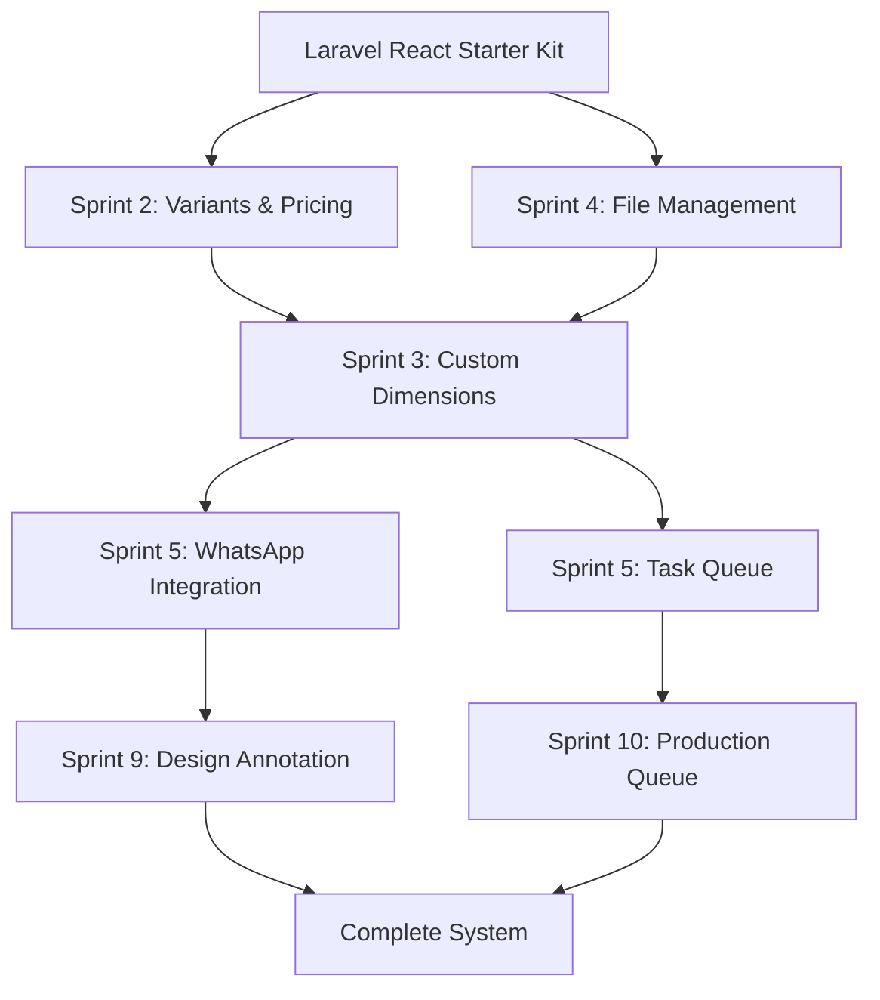
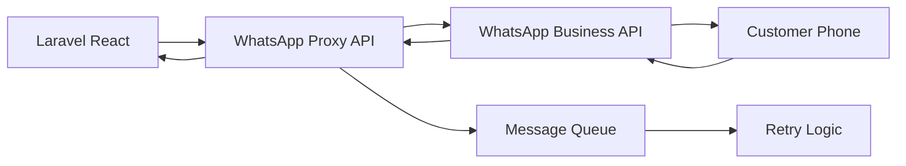
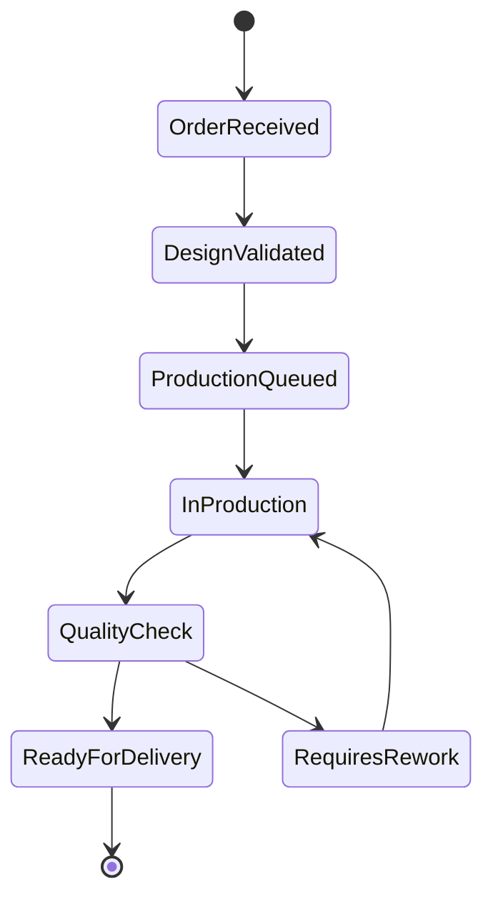
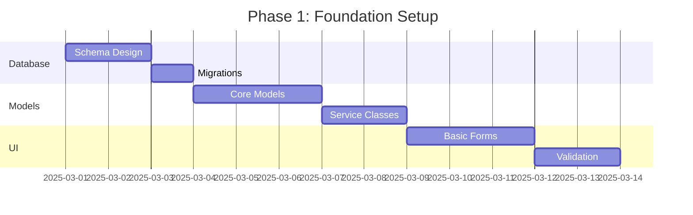
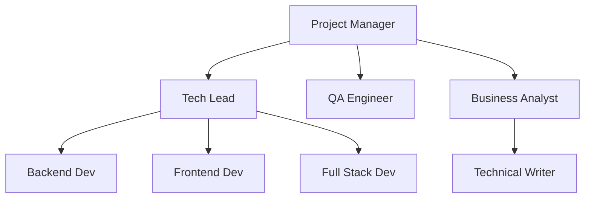

# CaldronFlex.Com.np Laravel React Customization Strategy

## Executive Summary

This document provides a comprehensive customization strategy for implementing all pending features in the CaldronFlex.Com.np Laravel React system. Based on the analysis of completed work (Sprint 2 and 4) and pending requirements (Sprint 3 and beyond), this strategy focuses on delivering a complete printing business management system with emphasis on the critical path components.


## 1. Customization Strategy Components


### 1.2 Technical Dependencies Map



### 1.3 Risk Assessment Matrix

| Risk Factor | Impact | Probability | Mitigation Strategy |
|------------|--------|-------------|-------------------|
| Sprint 3 Delay | High | High | Immediate start with dedicated resources |
| WhatsApp Proxy Reliability | High | Medium | Implement fallback SMS/Email |
| Performance (30 users) | High | Medium | Caching optimization, load testing |
| File Storage Capacity | Medium | Low | Implement archival strategy |
| User Adoption | Medium | Medium | Phased rollout with training |


### 2.1 CFBS-015: Custom Dimension Input for Flex Banners (5 SP)

#### Technical Specifications
```php
// Database Schema
CREATE TABLE item_dimensions (
    id INT PRIMARY KEY AUTO_INCREMENT,
    item_id INT NOT NULL,
    dimension_type ENUM('width', 'height', 'depth', 'custom'),
    min_value DECIMAL(10,2),
    max_value DECIMAL(10,2),
    default_value DECIMAL(10,2),
    unit VARCHAR(10) DEFAULT 'cm',
    step_increment DECIMAL(10,2) DEFAULT 0.1,
    affects_pricing BOOLEAN DEFAULT TRUE,
    created_at DATETIME,
    created_by INT,
    FOREIGN KEY (item_id) REFERENCES items(id)
);
```

#### Implementation Tasks
1. Create migration file: `2025_03_01_000001_create_item_dimensions_table.php`
2. Develop `ItemDimensions_model.php` with CRUD operations
3. Extend `Items` controller with dimension management methods
4. Build UI components:
   - Dimension input widget with validation
   - Visual dimension preview
   - Integration with area calculator
5. Update pricing engine to factor custom dimensions

#### Acceptance Criteria
- [ ] Users can input custom dimensions within defined limits
- [ ] Dimensions automatically calculate area for pricing
- [ ] Visual feedback shows dimension constraints
- [ ] Price updates in real-time based on dimensions

### 2.2 CFBS-016: Material and Finish Selections (5 SP)

#### Technical Specifications
```php
// Extend item_variants table
ALTER TABLE item_variants 
ADD COLUMN variant_image VARCHAR(255),
ADD COLUMN variant_description TEXT,
ADD COLUMN availability_status ENUM('in_stock', 'limited', 'out_of_stock'),
ADD COLUMN lead_time_days INT DEFAULT 0;
```

#### Implementation Tasks
1. Enhance variant selection UI with:
   - Material swatches/previews
   - Finish samples gallery
   - Availability indicators
2. Create `MaterialFinish` service class
3. Implement variant combination validator
4. Add lead time calculator based on selections

#### Acceptance Criteria
- [ ] Visual material/finish selector implemented
- [ ] Stock status displayed for each option
- [ ] Lead time calculated based on selections
- [ ] Price modifiers applied correctly

### 2.3 CFBS-017: Design File Validation System (8 SP)

#### Technical Specifications
```php
class DesignValidator {
    private $rules = [
        'file_types' => ['pdf', 'ai', 'psd', 'tiff', 'png', 'jpg'],
        'max_size' => 524288000, // 500MB
        'min_resolution' => 300, // DPI
        'color_modes' => ['CMYK', 'RGB'],
        'bleed_required' => true,
        'bleed_size' => 3 // mm
    ];
    
    public function validate($file, $specifications) {
        // Validation logic
    }
}
```

#### Implementation Tasks
1. Create `DesignValidator` library
2. Implement file analysis tools:
   - Resolution checker
   - Color mode detector
   - Bleed verification
   - File integrity validator
3. Build validation UI with detailed feedback
4. Create validation report generator
5. Integrate with file upload system

#### Acceptance Criteria
- [ ] All file types validated before acceptance
- [ ] Clear error messages for validation failures
- [ ] Validation report generated for each file
- [ ] Option to override with admin approval

### 2.4 CFBS-018: Printing Specifications Capture (5 SP)

#### Technical Specifications
```php
CREATE TABLE printing_specifications (
    id INT PRIMARY KEY AUTO_INCREMENT,
    order_id INT NOT NULL,
    print_method ENUM('digital', 'offset', 'screen', 'large_format'),
    color_profile VARCHAR(50),
    paper_type VARCHAR(100),
    coating_type VARCHAR(50),
    special_instructions TEXT,
    production_notes TEXT,
    estimated_production_hours DECIMAL(5,2),
    created_at DATETIME,
    FOREIGN KEY (order_id) REFERENCES orders(id)
);
```

#### Implementation Tasks
1. Create specifications form builder
2. Implement dynamic field display based on product type
3. Build specification templates system
4. Create production requirement calculator
5. Integrate with order workflow

#### Acceptance Criteria
- [ ] Comprehensive specification capture form
- [ ] Templates for common print jobs
- [ ] Specifications linked to production queue
- [ ] PDF export of specifications

### 2.5 CFBS-019: Basic Inventory Tracking System (8 SP)

#### Technical Specifications
```php
CREATE TABLE inventory_tracking (
    id INT PRIMARY KEY AUTO_INCREMENT,
    item_id INT,
    variant_combination_id INT,
    current_stock INT DEFAULT 0,
    reserved_stock INT DEFAULT 0,
    reorder_point INT,
    reorder_quantity INT,
    last_restocked DATETIME,
    stock_location VARCHAR(100),
    INDEX idx_stock_lookup (item_id, variant_combination_id)
);

CREATE TABLE stock_movements (
    id INT PRIMARY KEY AUTO_INCREMENT,
    tracking_id INT,
    movement_type ENUM('in', 'out', 'reserved', 'released'),
    quantity INT,
    reference_type VARCHAR(50),
    reference_id INT,
    notes TEXT,
    created_at DATETIME,
    created_by INT
);
```

#### Implementation Tasks
1. Create inventory database schema
2. Build `Inventory_model` with stock management methods
3. Implement stock movement tracking
4. Create inventory dashboard
5. Build stock adjustment interface
6. Integrate with order processing

#### Acceptance Criteria
- [ ] Real-time stock levels displayed
- [ ] Stock reserved on order placement
- [ ] Movement history tracked
- [ ] Stock reports available

### 2.6 CFBS-020: Low Stock Alerts (5 SP)

#### Technical Specifications
```php
class StockAlertService {
    public function checkLowStock() {
        // Query items below reorder point
        // Generate alerts
        // Send notifications
    }
    
    public function getAlertChannels() {
        return ['email', 'dashboard', 'whatsapp'];
    }
}
```

#### Implementation Tasks
1. Create alert configuration system
2. Build notification templates
3. Implement alert scheduler (cron job)
4. Create alert dashboard widget
5. Build alert management interface

#### Acceptance Criteria
- [ ] Configurable alert thresholds
- [ ] Multiple notification channels
- [ ] Alert history maintained
- [ ] Bulk alert actions available

## 3. Technical Specifications for Each Component

### 3.1 Database Schema Modifications

```sql
-- Summary of all new tables needed
CREATE TABLE item_dimensions (...);
CREATE TABLE printing_specifications (...);
CREATE TABLE inventory_tracking (...);
CREATE TABLE stock_movements (...);
CREATE TABLE whatsapp_messages (...);
CREATE TABLE task_queue (...);
CREATE TABLE design_annotations (...);
CREATE TABLE production_queue (...);

-- Modifications to existing tables
ALTER TABLE item_variants ADD COLUMN variant_image VARCHAR(255);
ALTER TABLE orders ADD COLUMN production_status ENUM(...);
ALTER TABLE clients ADD COLUMN whatsapp_number VARCHAR(20);
```

### 3.2 API Endpoint Customizations

```php
// New API endpoints needed
POST   /api/v1/items/{id}/dimensions
GET    /api/v1/items/{id}/validate-design
POST   /api/v1/orders/{id}/specifications
GET    /api/v1/inventory/stock-levels
POST   /api/v1/inventory/movements
GET    /api/v1/alerts/low-stock
POST   /api/v1/whatsapp/send
GET    /api/v1/tasks/queue
POST   /api/v1/production/assign
```

### 3.3 User Interface Adaptations

1. **Order Creation Flow**
   - Step 1: Product selection with variants
   - Step 2: Custom dimensions input
   - Step 3: Material/finish selection
   - Step 4: Design file upload with validation
   - Step 5: Printing specifications
   - Step 6: Review and pricing

2. **Staff Dashboard Enhancements**
   - Task queue widget
   - Low stock alerts panel
   - Production queue overview
   - WhatsApp message center

### 3.4 Business Logic Implementations

```php
// Key service classes to implement
class DimensionCalculator {
    public function calculateArea($dimensions) {}
    public function validateDimensions($dimensions, $constraints) {}
}

class ProductionScheduler {
    public function assignToQueue($order) {}
    public function calculateLeadTime($specifications) {}
}

class WhatsAppProxy {
    public function sendMessage($number, $message) {}
    public function receiveWebhook($data) {}
}
```

## 4. Integration Requirements

### 4.1 WhatsApp Proxy Integration Strategy



#### Implementation Steps
1. Set up WhatsApp Business API account
2. Deploy proxy server (Node.js recommended)
3. Implement webhook endpoints
4. Create message templates
5. Build conversation management UI

### 4.2 Task Queue System Implementation

```php
class TaskQueueManager {
    private $priorities = ['urgent', 'high', 'normal', 'low'];
    
    public function createTask($data) {
        // Create task with auto-assignment rules
    }
    
    public function claimTask($taskId, $userId) {
        // Staff claims task
    }
    
    public function completeTask($taskId, $result) {
        // Mark complete and trigger next steps
    }
}
```

### 4.3 Design Annotation System Architecture

```javascript
// Frontend annotation component
class DesignAnnotator {
    constructor(canvas) {
        this.fabric = new fabric.Canvas(canvas);
        this.tools = ['arrow', 'text', 'rectangle', 'freehand'];
    }
    
    addAnnotation(type, data) {
        // Add annotation to canvas
    }
    
    saveAnnotations() {
        // Save to backend
    }
}
```

### 4.4 Production Queue Management Workflow



### 4.5 Multi-subdomain Authentication Setup

```php
// Shared session configuration
ini_set('session.cookie_domain', '.caldronflex.com.np');
session_set_cookie_params([
    'lifetime' => 86400,
    'path' => '/',
    'domain' => '.caldronflex.com.np',
    'secure' => true,
    'httponly' => true,
    'samesite' => 'Lax'
]);
```

## 5. Development Task Breakdown

### 5.1 Sprint 3 Tasks (36 Story Points Total)

| Task ID | Description | Hours | Dependencies | Assignee |
|---------|-------------|-------|--------------|----------|
| S3-001 | Create item_dimensions migration | 2 | None | Backend Dev |
| S3-002 | Build ItemDimensions model | 4 | S3-001 | Backend Dev |
| S3-003 | Implement dimension input UI | 8 | S3-002 | Frontend Dev |
| S3-004 | Integrate with pricing engine | 4 | S3-003 | Backend Dev |
| S3-005 | Enhance variant selection UI | 6 | None | Frontend Dev |
| S3-006 | Create material/finish gallery | 4 | S3-005 | Frontend Dev |
| S3-007 | Build DesignValidator library | 12 | None | Backend Dev |
| S3-008 | Implement validation UI | 8 | S3-007 | Frontend Dev |
| S3-009 | Create specifications form | 6 | None | Full Stack |
| S3-010 | Build specification templates | 4 | S3-009 | Backend Dev |
| S3-011 | Create inventory schema | 4 | None | Backend Dev |
| S3-012 | Build Inventory model | 8 | S3-011 | Backend Dev |
| S3-013 | Implement stock tracking | 8 | S3-012 | Backend Dev |
| S3-014 | Create inventory dashboard | 6 | S3-013 | Frontend Dev |
| S3-015 | Build alert system | 6 | S3-013 | Backend Dev |
| S3-016 | Implement notifications | 4 | S3-015 | Backend Dev |
| S3-017 | Integration testing | 8 | All above | QA Engineer |
| S3-018 | Documentation | 4 | All above | Tech Writer |

**Total Hours**: 106 hours (≈ 13 days with 1 developer, 7 days with 2 developers)

### 5.2 Resource Requirements

#### Developer Skills Needed
1. **Backend Developer** (PHP/CodeIgniter 4)
   - Database design
   - API development
   - Service layer architecture
   - Performance optimization

2. **Frontend Developer** (JavaScript/jQuery)
   - Canvas API for drawing tools
   - AJAX integration
   - Responsive UI design
   - Real-time updates

3. **Full Stack Developer**
   - Laravel React framework knowledge
   - Integration experience
   - Security best practices

4. **QA Engineer**
   - Test automation
   - Performance testing
   - Security testing

### 5.3 Testing Protocols

#### Unit Testing
```php
// Example test for DimensionCalculator
class DimensionCalculatorTest extends TestCase {
    public function testAreaCalculation() {
        $calculator = new DimensionCalculator();
        $result = $calculator->calculateArea([
            'width' => 100,
            'height' => 50,
            'unit' => 'cm'
        ]);
        $this->assertEquals(5000, $result['area']);
        $this->assertEquals('cm²', $result['unit']);
    }
}
```

#### Integration Testing
1. Variant selection → Price calculation
2. File upload → Validation → Storage
3. Order creation → Inventory update
4. Alert trigger → Notification delivery

#### Performance Testing
- Load test with 30 concurrent users
- File upload test with 500MB files
- Database query optimization verification
- Cache effectiveness measurement

### 5.4 Deployment Procedures

```bash
# Deployment checklist
1. Backup current database
2. Run migrations in staging
3. Deploy code to staging
4. Run automated tests
5. Performance verification
6. Deploy to production
7. Monitor for 24 hours
```

### 5.5 Documentation Updates Required

1. **API Documentation**
   - New endpoints with examples
   - Authentication requirements
   - Rate limiting details

2. **User Manuals**
   - Order creation workflow
   - Design file requirements
   - Inventory management guide

3. **Developer Documentation**
   - Architecture diagrams
   - Database schema
   - Integration guides

## 6. Milestone Definitions

### 6.1 Sprint 3 Milestones

| Milestone | Deliverables | Success Criteria | Review Process |
|-----------|--------------|------------------|----------------|
| M1: Dimension System | - Database schema<br>- Input UI<br>- Validation | - Custom dimensions saved<br>- Price updates correctly | Code review + Demo |
| M2: Material/Finish | - Enhanced variants<br>- Visual selector | - All materials displayed<br>- Stock status accurate | UI/UX review |
| M3: File Validation | - Validator library<br>- Feedback UI | - 100% file validation<br>- Clear error messages | Technical review |
| M4: Specifications | - Form system<br>- Templates | - All specs captured<br>- PDF export works | Business review |
| M5: Inventory Core | - Tracking system<br>- Movement logs | - Real-time stock<br>- History maintained | System test |
| M6: Alerts System | - Alert engine<br>- Notifications | - Alerts triggered<br>- Multi-channel delivery | End-to-end test |

### 6.2 Success Metrics and KPIs

#### Technical Metrics
- Code coverage: >80%
- Response time: <500ms
- Error rate: <0.1%
- Uptime: >99.9%

#### Business Metrics
- Order processing time: -50%
- Design revision cycles: -30%
- Stock-out incidents: -75%
- Customer satisfaction: +25%

#### Operational Metrics
- Staff efficiency: +40%
- Training time: -25%
- Support tickets: -30%
- Daily order capacity: 18+ (3x current)

### 6.3 Go/No-Go Decision Points

1. **After Sprint 3 Completion**
   - All acceptance criteria met?
   - Performance benchmarks achieved?
   - Security audit passed?
   - User acceptance testing complete?

2. **Before Production Deployment**
   - Load testing successful?
   - Backup/recovery tested?
   - Rollback plan ready?
   - Support team trained?

## 7. Implementation Timeline

### 7.1 Phase 1: Foundation (Weeks 1-2)



**Week 1 Deliverables:**
- Complete database schema
- Core model implementations
- Basic UI components

**Week 2 Deliverables:**
- Service layer complete
- UI validation working
- Integration points defined

### 7.2 Phase 2: Integration (Weeks 3-4)

**Week 3 Focus:**
- Connect all Sprint 3 components
- Implement pricing integration
- Build inventory workflows

**Week 4 Focus:**
- WhatsApp proxy setup
- Task queue implementation
- System integration testing

### 7.3 Phase 3: Enhancement (Month 2)

**Weeks 5-6:**
- Design annotation system
- Production queue automation
- Advanced reporting

**Weeks 7-8:**
- Performance optimization
- Security hardening
- User training materials

### 7.4 Phase 4: Future Features (Month 3+)

**Priority Features:**
1. Mobile API development
2. AR/VR plugin integration
3. Advanced analytics dashboard
4. Multi-location inventory

**Long-term Roadmap:**
- AI-powered design suggestions
- Predictive inventory management
- Customer self-service portal
- Blockchain order verification

## 8. Quality Assurance Strategy

### 8.1 Testing Methodologies

#### Test Pyramid Approach
```
         /\
        /  \  E2E Tests (10%)
       /----\
      /      \ Integration Tests (30%)
     /--------\
    /          \ Unit Tests (60%)
   /____________\
```

### 8.2 Performance Benchmarks

| Metric | Target | Critical Threshold |
|--------|--------|-------------------|
| Page Load | <2s | >3s |
| API Response | <200ms | >500ms |
| File Upload (500MB) | <5min | >10min |
| Concurrent Users | 30 | 50 |
| Database Queries/Page | <10 | >15 |

### 8.3 Security Validation Procedures

```php
// Security checklist implementation
class SecurityValidator {
    private $checks = [
        'sql_injection' => 'checkSqlInjection',
        'xss_prevention' => 'checkXssPrevention',
        'csrf_protection' => 'checkCsrfProtection',
        'auth_validation' => 'checkAuthentication',
        'file_upload_security' => 'checkFileUploadSecurity'
    ];
    
    public function validateEndpoint($endpoint) {
        foreach ($this->checks as $check => $method) {
            if (!$this->$method($endpoint)) {
                throw new SecurityException("Failed $check validation");
            }
        }
        return true;
    }
}
```

### 8.4 User Acceptance Criteria

1. **Order Creation Flow**
   - Complete order in <5 minutes
   - All validations provide clear feedback
   - Price calculations accurate to ±0.01

2. **File Management**
   - Upload 500MB file successfully
   - Validation results in <30 seconds
   - Preview generation for all formats

3. **Inventory Management**
   - Real-time stock updates
   - Alert delivery within 1 minute
   - Accurate movement history

## 9. Compatibility Requirements

### 9.1 Laravel React Starter Kit Alignment

#### Core Compatibility
- Maintain existing database structure
- Extend without modifying core files
- Use Laravel React coding patterns
- Respect existing permissions

#### Plugin Architecture
```php
// Follow Laravel React component structure
class CaldronFlexPlugin extends App_Controller {
    public function __construct() {
        parent::__construct();
        $this->init_permission_checker("invoice");
    }
    
    public function index() {
        // Plugin logic
    }
}
```

### 9.2 Backward Compatibility

1. **Database Migrations**
   - Non-destructive changes only
   - Rollback scripts provided
   - Data preservation guaranteed

2. **API Versioning**
   - Maintain v1 endpoints
   - Deprecation warnings
   - Migration guides

### 9.3 Database Migration Safety

```php
// Safe migration pattern
public function up() {
    // Check if table exists
    if (!$this->db->tableExists('new_table')) {
        $this->forge->addField([...]);
        $this->forge->createTable('new_table');
    }
    
    // Check if column exists
    if (!$this->db->fieldExists('new_column', 'existing_table')) {
        $this->forge->addColumn('existing_table', [...]);
    }
}

public function down() {
    // Safe rollback
    if ($this->db->tableExists('new_table')) {
        $this->forge->dropTable('new_table');
    }
}
```

## 10. Resource Allocation

### 10.1 Team Structure



### 10.2 Skill Requirements Matrix

| Role | Required Skills | Nice to Have |
|------|----------------|--------------|
| Backend Dev | PHP 7.4+, CodeIgniter 4, MySQL | Redis, Queue systems |
| Frontend Dev | JavaScript ES6+, jQuery, Bootstrap | React, Canvas API |
| Full Stack | Laravel React, REST APIs | GraphQL, WebSockets |
| QA Engineer | Selenium, PHPUnit | JMeter, Security testing |

### 10.3 Training Needs

1. **Technical Training**
   - Laravel React framework (2 days)
   - CodeIgniter 4 patterns (1 day)
   - Security best practices (1 day)

2. **Business Training**
   - Printing industry basics (1 day)
   - Order workflow (0.5 day)
   - Customer service (0.5 day)

### 10.4 External Dependencies

1. **WhatsApp Business API**
   - Account setup required
   - API access approval
   - Monthly messaging costs

2. **SMS Gateway** (Backup)
   - Provider selection
   - API integration
   - Credit purchase

3. **Cloud Storage** (Future)
   - Provider evaluation
   - Cost estimation
   - Migration planning

## 11. Risk Mitigation Strategies

### 11.1 Technical Risk Matrix

| Risk | Impact | Mitigation | Contingency |
|------|--------|------------|-------------|
| Performance degradation | High | Caching, optimization | Scale infrastructure |
| Data loss | Critical | Automated backups | Recovery procedures |
| Security breach | Critical | Security audits | Incident response plan |
| Integration failure | Medium | Thorough testing | Fallback mechanisms |

### 11.2 Business Continuity

1. **Rollback Procedures**
   ```bash
   # Automated rollback script
   ./rollback.sh --version=previous --backup=true
   ```

2. **Disaster Recovery**
   - Daily automated backups
   - Off-site backup storage
   - 4-hour recovery target

3. **Monitoring & Alerts**
   - Uptime monitoring
   - Performance metrics
   - Error tracking
   - Security scanning

## 12. Success Measurement

### 12.1 Implementation Checkpoints

- [ ] Week 2: Foundation complete
- [ ] Week 4: Sprint 3 fully implemented
- [ ] Week 6: Integration testing passed
- [ ] Week 8: Production deployment ready

### 12.2 Post-Implementation Review

1. **Technical Review**
   - Code quality metrics
   - Performance benchmarks
   - Security audit results

2. **Business Review**
   - KPI achievement
   - User satisfaction
   - ROI calculation

3. **Lessons Learned**
   - What worked well
   - Areas for improvement
   - Future recommendations
