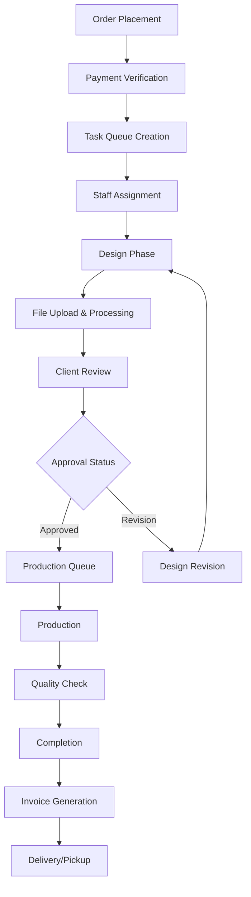

# Caldron Flex Printing Business: Comprehensive Business Analysis

**Document Version:** 1.0
**Date:** October 1, 2025
**Prepared By:** Business Analysis Team

---

## Table of Contents

1. [Executive Summary](#1-executive-summary)
2. [Business Context & Objectives](#2-business-context--objectives)
3. [Core Business Requirements](#3-core-business-requirements)
4. [User Roles & Stakeholder Analysis](#4-user-roles--stakeholder-analysis)
5. [Product Catalog Requirements](#5-product-catalog-requirements)
6. [Order Processing Workflow](#6-order-processing-workflow)
7. [File Management System](#7-file-management-system)
8. [Communication Framework](#8-communication-framework)
9. [Inventory Management](#9-inventory-management)
10. [Pricing & Billing Structure](#10-pricing--billing-structure)
11. [Operational Workflow Analysis](#11-operational-workflow-analysis)
12. [Technology Requirements](#12-technology-requirements)
13. [Performance & Scalability](#13-performance--scalability)
14. [Risk Assessment](#14-risk-assessment)
15. [Success Metrics & KPIs](#15-success-metrics--kpis)
16. [Implementation Recommendations](#16-implementation-recommendations)

---

## 1. Executive Summary

### Business Overview
Caldron Flex is a printing business that requires a comprehensive digital transformation to streamline operations, improve customer experience, and enable scalable growth. The business currently handles diverse printing services ranging from flex banners to custom certificates, serving both individual customers and organizations.

### Key Business Drivers
- **Operational Efficiency**: Reduce manual workflow steps by 50%
- **Capacity Expansion**: Support 3x current order volume (18+ daily orders vs. current 6)
- **Customer Satisfaction**: Achieve 95% first-design approval rate
- **Digital Transformation**: Automate 90% of file management and processing
- **Quality Consistency**: Standardize pricing and reduce errors

### Solution Approach
Implementation of a unified Laravel React-based platform that integrates:
- E-commerce frontend for customer ordering
- Internal CRM for staff operations
- Automated workflow management
- Real-time communication systems
- Advanced file processing capabilities

---

## 2. Business Context & Objectives

### Current Business State
- **Daily Orders**: 6 orders per day average
- **Customer Base**: 60% organizations, 30% individuals, 10% guests
- **Staff Structure**: 1 Super Admin, 1 Staff Admin, 1-2 Staff Helpers
- **Manual Processes**: Extensive manual intervention in order processing
- **Communication**: Predominantly WhatsApp and phone-based

### Strategic Objectives
1. **Process Automation**: Implement end-to-end digital workflow
2. **Customer Experience**: Provide self-service ordering and real-time updates
3. **Operational Scaling**: Handle increased volume without proportional staff increase
4. **Quality Control**: Standardize pricing, reduce errors, ensure consistency
5. **Business Intelligence**: Enable data-driven decision making

### Business Constraints
- **Payment Methods**: Cash and Cheque only (no online payments)
- **File Sizes**: Support up to 500MB uploads
- **Hosting**: Single dedicated server environment
- **Budget**: Cost-effective solution using open-source technologies
- **Timeline**: Phased implementation with immediate operational benefits

---

## 3. Core Business Requirements

### 3.1 Functional Requirements

#### Order Management
- **Order Capture**: Multi-channel order placement (web, phone, walk-in)
- **Order Tracking**: Real-time status updates throughout lifecycle
- **Customer Portal**: Self-service order tracking and communication
- **Staff Dashboard**: Centralized order management interface
- **Rush Orders**: Priority handling with deadline management

#### Product Configuration
- **Dynamic Pricing**: Area-based calculations (width × height × rate)
- **Product Variants**: Material, finish, quality, and size options
- **Custom Quotes**: Manual quote generation for complex items
- **Bulk Discounts**: Quantity-based pricing tiers
- **Inventory Integration**: Real-time availability checking

#### Workflow Automation
- **Task Queue**: Automatic task creation and staff assignment
- **Status Progression**: Automated workflow state management
- **Notification System**: Multi-channel customer communication
- **Quality Gates**: Design approval checkpoints
- **Production Scheduling**: Deadline-based task prioritization

### 3.2 Non-Functional Requirements

#### Performance
- **Concurrent Users**: Support 30 simultaneous users
- **Response Time**: < 3 seconds for all web operations
- **File Processing**: Handle 500MB uploads efficiently
- **System Uptime**: 99.5% availability target

#### Security
- **Role-Based Access**: Granular permission management
- **Data Protection**: Secure file storage and transmission
- **Audit Trails**: Complete activity logging
- **Authentication**: Multi-level user verification

#### Scalability
- **Order Volume**: 3x capacity increase capability
- **Storage**: 1.5TB expandable file storage
- **Processing**: Queue-based background operations
- **Modular Architecture**: Plugin-ready system design

---

## 4. User Roles & Stakeholder Analysis

### 4.1 Internal Stakeholders

#### Super Administrator
- **Count**: 1 person
- **Access Level**: Full system control
- **Responsibilities**:
  - System configuration and maintenance
  - User management and role assignment
  - Financial settings and pricing rules
  - Backup and security management
- **Key Needs**: Complete visibility and control over all operations

#### Staff Admin
- **Count**: 1 person
- **Access Level**: Complete operational access
- **Responsibilities**:
  - Order processing and management
  - Customer communication and support
  - Quality control and approval
  - Staff task coordination
- **Key Needs**: Efficient workflow management and customer satisfaction tools

#### Staff Helper
- **Count**: 1-2 people
- **Access Level**: Limited operational access (excluding purchase prices)
- **Responsibilities**:
  - Task execution and completion
  - File processing and preparation
  - Basic customer communication
  - Production support
- **Key Needs**: Clear task instructions and progress tracking

### 4.2 External Stakeholders

#### Organization Customers (60% of customer base)
- **Characteristics**: Bulk orders, regular clients, credit terms
- **Requirements**:
  - Hierarchical user management
  - Bulk ordering capabilities
  - Credit management and invoicing
  - Dedicated account management
- **Pain Points**: Complex approval processes, bulk pricing transparency

#### Individual Customers (30% of customer base)
- **Characteristics**: Occasional orders, immediate payment, price-sensitive
- **Requirements**:
  - Simple ordering process
  - Instant pricing information
  - Quick turnaround options
  - Direct communication channels
- **Pain Points**: Price uncertainty, order status visibility

#### Guest Users (10% of customer base)
- **Characteristics**: One-time orders, minimal registration
- **Requirements**:
  - Streamlined checkout process
  - Basic order tracking
  - Minimal information capture
  - Quick order placement
- **Pain Points**: Registration barriers, complex processes

---

## 5. Product Catalog Requirements

### 5.1 Fixed Price Products

#### Flex Banner (Rs. 40-150/sqft)
- **Variants**: Normal, Sticker, Degradable
- **Pricing Model**: Area-based (width × height × rate)
- **Inventory Tracking**: Finished goods level only (complex raw material conversion)
- **Production Time**: 1-2 days standard
- **Custom Dimensions**: User-input width and height

#### Certificate Printing (Rs. 99-299/piece)
- **Variants**: Quality levels (Standard, Premium, Deluxe)
- **Pricing Model**: Fixed per piece
- **Customization**: Design templates and content
- **Production Time**: Same day to 1 day

#### Token of Love (Rs. 250-4000/piece)
- **Variants**: Frame design variations
- **Pricing Model**: Design complexity-based
- **Customization**: Personal images and text
- **Production Time**: 2-3 days

#### Photo Frame (Rs. 349-3000/piece)
- **Variants**: Size and design options
- **Pricing Model**: Size and material-based
- **Customization**: Frame styles and materials
- **Production Time**: 1-2 days

#### Stamps (Rs. 300-500/piece)
- **Types**: Pre-ink, Normal
- **Pricing Model**: Fixed per type
- **Customization**: Logo and text design
- **Production Time**: 2-3 days

#### Metal Medals
- **Configuration**: Bundle (Gold/Silver/Bronze) or Individual
- **Pricing Model**: Configurable based on material and quantity
- **Customization**: Engraving and design
- **Production Time**: 3-5 days

### 5.2 Custom Quote Products
- **Holding Board**: Manual quote based on specifications
- **Shield/Trophy**: Design complexity and size-based pricing
- **ID Cards**: Quantity and features-based pricing
- **Process**: Staff-generated quotes with approval workflow

### 5.3 Product Configuration Requirements
- **Dynamic Variant Selection**: Interactive UI for option selection
- **Real-time Pricing**: Immediate price calculation on changes
- **Availability Display**: Stock status and delivery estimates
- **Image Gallery**: Multiple product images and examples
- **Specification Capture**: Detailed requirement collection

---

## 6. Order Processing Workflow

### 6.1 Order Lifecycle



### 6.2 Workflow Stages

#### 1. Order Submission
- **Customer Actions**: Product selection, customization, file upload
- **System Actions**: Price calculation, availability check, order creation
- **Outputs**: Order confirmation, payment request, task creation

#### 2. Task Queue Management
- **Queue Type**: General queue where any staff can claim tasks
- **Priority System**: Deadline-based with urgent flag capability
- **Assignment Method**: Self-assignment by available staff
- **Tracking**: Real-time task status and progress updates

#### 3. Design Phase
- **File Handling**: Multiple format support (JPEG, PDF, SVG, PSD, PNG, TIFF)
- **Processing**: Automatic TIFF to JPG conversion with watermarking
- **Version Control**: Original file + annotation overlay system
- **Collaboration**: Staff-customer design iteration process

#### 4. Client Review Process
- **Preview Generation**: Automated proof creation
- **Annotation Tools**: Visual markup for feedback
- **Revision Limits**: Maximum 5 correction rounds (guidance only)
- **Approval Workflow**: Digital sign-off with timestamp

#### 5. Production Management
- **Queue Organization**: Deadline-based priority scheduling
- **Resource Allocation**: Staff and equipment assignment
- **Progress Tracking**: Real-time production status updates
- **Quality Control**: Completion verification checkpoints

### 6.3 Business Rules

#### Order Validation
- **File Requirements**: Format validation and size limits (500MB max)
- **Payment Verification**: Cash/cheque confirmation before processing
- **Inventory Checking**: Stock availability validation
- **Delivery Scheduling**: Production time and deadline alignment

#### Workflow Controls
- **Rush Order Handling**: Automatic priority escalation
- **Revision Management**: Tracking and limit enforcement
- **Approval Requirements**: Customer sign-off before production
- **No Refund Policy**: Design approval eliminates returns

---

## 7. File Management System

### 7.1 File Handling Requirements

#### Supported Formats
- **Design Files**: JPEG, PDF, SVG, PSD, PNG, TIFF
- **Maximum Size**: 500MB per file
- **Processing**: Automatic format conversion and optimization
- **Validation**: File type, size, and integrity checking

#### Upload Capabilities
- **Progressive Upload**: Chunked upload for large files
- **Multiple Files**: Batch upload support
- **Drag & Drop**: Modern file selection interface
- **Progress Tracking**: Real-time upload status

### 7.2 File Processing Pipeline

#### Automatic Processing
- **Format Conversion**: TIFF to JPG conversion
- **Watermarking**: Automatic watermark application
- **Thumbnail Generation**: Preview image creation
- **Optimization**: File size optimization for web display

#### Version Management
- **Original Preservation**: Secure storage of original files
- **Annotation Overlay**: Separate annotation layer storage
- **Version Tracking**: Change history and revision numbers
- **Access Control**: Secure file access with permissions

### 7.3 Storage Architecture

#### Directory Structure
```
/files/
├── orders/
│   ├── 2025/
│   │   ├── 10/
│   │   │   ├── order_12345/
│   │   │   │   ├── originals/
│   │   │   │   ├── processed/
│   │   │   │   ├── thumbnails/
│   │   │   │   └── proofs/
├── designs/
├── temp/
└── backups/
```

#### CDN Readiness
- **Static Content**: Optimized for CDN distribution
- **Cache Strategy**: Multi-level caching system
- **Fallback Mechanism**: Local storage with CDN preparation
- **Purge Capability**: Cache invalidation on updates

---

## 8. Communication Framework

### 8.1 Primary Communication Channels

#### WhatsApp Integration
- **Implementation**: Proxy server (not official API due to cost)
- **Rate Limits**: 100 messages per hour
- **Message Types**: Order updates, design ready notifications, completion alerts
- **Fallback**: Automatic email fallback on WhatsApp failure
- **Templates**: Automated messaging for standard updates

#### Email Notifications
- **Primary Use**: Official communication and documentation
- **SMTP Configuration**: Local/external SMTP server
- **Templates**: Order confirmation, status updates, invoices
- **Attachments**: Proofs, invoices, and documentation

### 8.2 Communication Workflow

#### Customer Notifications
- **Order Confirmation**: Immediate after placement
- **Payment Reminder**: For cash/cheque payments
- **Design Ready**: When proof is available for review
- **Revision Request**: When changes are needed
- **Production Update**: When order enters production
- **Completion Notice**: When order is ready

#### Internal Communication
- **Task Assignments**: Staff notification of new tasks
- **Priority Alerts**: Urgent order notifications
- **System Alerts**: Low stock, errors, maintenance
- **Progress Reports**: Daily/weekly operational summaries

### 8.3 Multi-Language Support
- **Languages**: English and Nepali
- **Templates**: Localized message templates
- **User Preference**: Language selection in user profiles
- **Dynamic Content**: Automatic language detection

---

## 9. Inventory Management

### 9.1 Inventory Tracking Model

#### Mixed-Level Tracking
- **Flex/Banner Products**: Finished goods only (complex raw material conversion)
- **Other Products**: Both raw materials and finished goods tracking
- **No Barcode System**: Manual tracking initially with future upgrade path
- **Real-time Updates**: Automatic stock adjustments on orders

#### Stock Management Features
- **Low Stock Alerts**: Automated warnings when inventory drops below thresholds
- **Stock Reservations**: Temporary allocation during order processing
- **Movement Tracking**: Complete audit trail of stock changes
- **Reporting**: Stock levels, movement history, and forecasting

### 9.2 Inventory Operations

#### Stock Adjustments
- **Manual Adjustments**: Staff-initiated stock corrections
- **Automatic Deductions**: Order-based inventory reduction
- **Receiving**: New stock addition with validation
- **Transfer**: Inter-location stock movement

#### Integration Points
- **Order Processing**: Automatic stock checking and reservation
- **Pricing System**: No pricing integration with stock levels
- **Purchasing**: Manual reorder point management
- **Reporting**: Stock reports and analytics

---

## 10. Pricing & Billing Structure

### 10.1 Pricing Models

#### Area-Based Pricing
- **Formula**: Width × Height × Base Rate
- **Modifiers**: Material, finish, and quality adjustments
- **Real-time Calculation**: Dynamic pricing on specification changes
- **Transparency**: Detailed cost breakdown display

#### Fixed Pricing
- **Per-Piece Items**: Stamps, certificates, standard items
- **Tier-Based**: Quality or complexity-based pricing
- **Bulk Discounts**: Quantity-based discount application
- **Staff Override**: Manual price adjustment with audit trail

#### Custom Quotes
- **Manual Process**: Staff-generated quotes for complex items
- **Approval Workflow**: Admin approval for custom pricing
- **Quote Validity**: Time-limited quote expiration
- **Conversion Tracking**: Quote to order conversion rates

### 10.2 Payment Management

#### Accepted Methods
- **Cash Payments**: In-person cash transactions
- **Cheque Payments**: Bank cheque acceptance
- **No Online Payments**: Explicitly excluded from scope
- **Credit Terms**: Available for organizations and regular customers

#### Payment Tracking
- **Partial Payments**: Support for installment payments
- **Credit Management**: Outstanding balance tracking
- **No Credit Limits**: Flexible credit arrangements
- **Payment History**: Complete payment audit trail

### 10.3 Invoicing & Taxation

#### Invoice Generation
- **Automatic Creation**: On order completion
- **Customizable Templates**: Professional invoice layouts
- **Multiple Formats**: PDF generation and email delivery
- **Tax Calculations**: Configurable GST/VAT application

#### Financial Reporting
- **Revenue Analysis**: Daily, weekly, monthly reports
- **Customer Payments**: Outstanding and received amounts
- **Tax Reports**: GST/VAT reporting capabilities
- **Profit Analysis**: Cost vs. revenue tracking

---

## 11. Operational Workflow Analysis

### 11.1 Current State Analysis

#### Pain Points
- **Manual Processes**: Extensive manual intervention in all stages
- **Communication Gaps**: Inconsistent customer updates
- **File Management**: Disorganized file storage and processing
- **Pricing Inconsistency**: Manual pricing prone to errors
- **Capacity Limitations**: Cannot handle increased order volume

#### Process Inefficiencies
- **Order Taking**: Multiple channels with no centralized system
- **Task Management**: No systematic task assignment
- **Customer Service**: Reactive communication only
- **Quality Control**: Inconsistent review processes
- **Reporting**: Limited business intelligence

### 11.2 Future State Vision

#### Automated Workflows
- **Order Processing**: 90% automation from placement to production
- **Customer Communication**: Automated status updates and notifications
- **Task Management**: Self-service task queue for staff
- **File Processing**: Automatic conversion and optimization
- **Reporting**: Real-time dashboards and analytics

#### Operational Benefits
- **Staff Efficiency**: 40% increase in productivity
- **Order Capacity**: 3x volume handling capability
- **Customer Satisfaction**: 95% first-design approval target
- **Error Reduction**: 80% reduction in pricing and processing errors
- **Response Time**: 50% faster customer response

### 11.3 Change Management

#### Staff Training
- **Gradual Rollout**: Phased implementation with training
- **Process Documentation**: Clear operational procedures
- **Support System**: Technical support during transition
- **Feedback Loop**: Continuous improvement based on user feedback

#### Customer Transition
- **Parallel Systems**: Maintain existing processes during transition
- **Customer Education**: Training on new system features
- **Support Channels**: Multiple support options during adoption
- **Incentives**: Benefits for early system adoption

---

## 12. Technology Requirements

### 12.1 Platform Architecture

#### Core Platform
- **Framework**: Laravel React Starter Kit
- **Database**: Single MySQL database
- **Web Server**: Apache 2.4 with mod_rewrite
- **File Storage**: 1.5TB local storage with CDN readiness
- **Caching**: File-based caching system

#### Multi-Subdomain Structure
- **Main Store**: caldronflex.com.np (public e-commerce)
- **CRM System**: clients.caldronflex.com.np (internal operations)
- **API Services**: api.caldronflex.com.np (REST API)
- **File Management**: files.caldronflex.com.np (file handling)
- **Backup System**: bck.caldronflex.com.np (automated backups)

### 12.2 Integration Requirements

#### External Services
- **WhatsApp Proxy**: Custom proxy server for notifications
- **SMTP Service**: Email delivery system
- **SSL Certificate**: Let's Encrypt for HTTPS
- **DNS Management**: Cloudflare for DNS and basic CDN
- **Backup Service**: Automated backup system

#### API Integrations
- **REST API**: Comprehensive API for all operations
- **JWT Authentication**: Secure API access
- **Rate Limiting**: API usage control
- **WebHooks**: Event-driven integrations
- **Future APIs**: Adobe Photoshop, mobile apps

### 12.3 Performance & Scalability

#### Performance Targets
- **Concurrent Users**: 30 simultaneous users
- **Response Time**: < 3 seconds for all operations
- **File Upload**: 500MB files with progress tracking
- **System Uptime**: 99.5% availability
- **Database Performance**: Optimized queries and indexing

#### Scalability Planning
- **Horizontal Scaling**: CDN and load balancer ready
- **Vertical Scaling**: Server resource optimization
- **Database Scaling**: Read replicas preparation
- **Cache Strategy**: Multi-level caching implementation
- **Queue System**: Background job processing

---

## 13. Performance & Scalability

### 13.1 Current Performance Baseline

#### Operational Metrics
- **Daily Orders**: 6 orders/day
- **Peak Concurrent Users**: 10-15 users
- **Average File Size**: 50-100MB
- **Processing Time**: 2-3 hours per order
- **Customer Response Time**: 4-6 hours

#### System Requirements
- **Target Daily Orders**: 18+ orders/day (3x increase)
- **Peak Concurrent Users**: 30 users
- **Large File Support**: 500MB maximum
- **Processing Time**: 1 hour per order
- **Customer Response Time**: 1 hour maximum

### 13.2 Performance Optimization Strategy

#### Frontend Optimization
- **Asset Compression**: CSS/JS minification and compression
- **Image Optimization**: Automatic image compression and format conversion
- **Caching Strategy**: Browser and CDN caching implementation
- **Progressive Loading**: Lazy loading for large file previews
- **Mobile Optimization**: Responsive design and mobile performance

#### Backend Optimization
- **Database Indexing**: Strategic database index optimization
- **Query Optimization**: Efficient database queries and relationships
- **Memory Management**: Optimized PHP memory usage
- **Background Processing**: Queue-based heavy operations
- **Connection Pooling**: Database connection optimization

#### File Processing Optimization
- **Chunked Uploads**: Progressive file upload for large files
- **Async Processing**: Background file conversion and optimization
- **CDN Preparation**: Static asset optimization for CDN
- **Storage Optimization**: Efficient file storage and retrieval
- **Cache Management**: File cache with intelligent purging

### 13.3 Scalability Architecture

#### Growth Planning
- **Phase 1**: 3x capacity (current to 18 orders/day)
- **Phase 2**: 5x capacity (30 orders/day)
- **Phase 3**: 10x capacity (60 orders/day)
- **Infrastructure**: Scalable to cloud when needed
- **Modular Design**: Plugin architecture for feature additions

#### Resource Management
- **Server Resources**: Dedicated server optimization
- **Database Performance**: Query optimization and indexing
- **Storage Management**: Efficient file storage with cleanup
- **Memory Allocation**: Dynamic memory management
- **Processing Queues**: Scalable background job processing

---

## 14. Risk Assessment

### 14.1 Technical Risks

#### High-Risk Items
1. **WhatsApp Proxy Reliability**
   - **Risk**: Third-party proxy service failure
   - **Impact**: Customer communication breakdown
   - **Mitigation**: Email fallback system, multiple proxy providers
   - **Probability**: Medium | **Impact**: High

2. **File Processing Performance**
   - **Risk**: 500MB file processing failures
   - **Impact**: Order processing delays
   - **Mitigation**: Chunked upload, background processing, monitoring
   - **Probability**: Medium | **Impact**: Medium

3. **Cross-Subdomain Authentication**
   - **Risk**: Session management failures across subdomains
   - **Impact**: User experience degradation
   - **Mitigation**: JWT tokens, single sign-on implementation
   - **Probability**: Low | **Impact**: Medium

#### Medium-Risk Items
1. **Database Performance Under Load**
   - **Risk**: Slow queries with increased concurrent users
   - **Impact**: System responsiveness degradation
   - **Mitigation**: Database optimization, query caching, indexing
   - **Probability**: Medium | **Impact**: Medium

2. **Storage Capacity Management**
   - **Risk**: 1.5TB storage exhaustion
   - **Impact**: New order acceptance limitations
   - **Mitigation**: Storage monitoring, automated cleanup, expansion planning
   - **Probability**: Medium | **Impact**: Medium

### 14.2 Business Risks

#### Operational Risks
1. **Staff Resistance to Change**
   - **Risk**: Poor adoption of new system
   - **Impact**: Productivity decrease during transition
   - **Mitigation**: Comprehensive training, gradual rollout, support system
   - **Probability**: Medium | **Impact**: High

2. **Customer Adaptation**
   - **Risk**: Customers preferring old processes
   - **Impact**: Reduced system utilization
   - **Mitigation**: Customer education, parallel system operation, incentives
   - **Probability**: Medium | **Impact**: Medium

3. **Business Process Disruption**
   - **Risk**: Workflow interruption during implementation
   - **Impact**: Temporary productivity loss
   - **Mitigation**: Phased implementation, rollback plans, backup processes
   - **Probability**: Low | **Impact**: High

#### Financial Risks
1. **Implementation Cost Overrun**
   - **Risk**: Development costs exceeding budget
   - **Impact**: Project viability concerns
   - **Mitigation**: Fixed-scope implementation, phased approach, cost monitoring
   - **Probability**: Low | **Impact**: Medium

2. **Revenue Impact During Transition**
   - **Risk**: Temporary revenue decrease during implementation
   - **Impact**: Cash flow concerns
   - **Mitigation**: Minimal downtime strategy, customer communication
   - **Probability**: Low | **Impact**: Medium

### 14.3 Risk Mitigation Strategies

#### Technical Risk Mitigation
- **Redundancy**: Multiple fallback systems for critical components
- **Monitoring**: Real-time system monitoring and alerting
- **Testing**: Comprehensive testing at each implementation phase
- **Documentation**: Detailed technical documentation and procedures
- **Support**: Technical support team for issue resolution

#### Business Risk Mitigation
- **Training**: Comprehensive staff and customer training programs
- **Communication**: Clear communication of benefits and changes
- **Phased Rollout**: Gradual implementation to minimize disruption
- **Feedback Loop**: Continuous feedback collection and system improvements
- **Change Management**: Structured change management process

---

## 15. Success Metrics & KPIs

### 15.1 Operational Efficiency Metrics

#### Process Improvement KPIs
- **Manual Workflow Reduction**: 50% reduction in manual steps
- **Order Processing Time**: 60% reduction (from 3 hours to 1 hour)
- **File Management Automation**: 90% automation in preview generation
- **Customer Communication**: 80% reduction in manual notifications
- **Task Assignment Efficiency**: 70% improvement in staff task allocation

#### Quality Metrics
- **First Design Approval Rate**: 95% target
- **Order Accuracy**: 99% error-free processing
- **Customer Satisfaction**: 4.5/5 rating target
- **Revision Cycles**: Average 1.5 revisions per order (down from 3)
- **Delivery Timeline Adherence**: 95% on-time delivery

### 15.2 Business Growth Metrics

#### Capacity & Volume KPIs
- **Order Capacity**: Support 3x current volume (18+ daily orders)
- **Concurrent User Support**: 30 simultaneous users
- **Revenue Growth**: 25% increase in throughput capacity
- **Customer Base Growth**: 40% increase in active customers
- **Market Share**: Regional market penetration improvement

#### Financial Performance
- **Revenue per Order**: 15% increase through better pricing
- **Cost per Order**: 30% reduction through automation
- **Profit Margin**: 20% improvement through efficiency gains
- **Customer Lifetime Value**: 25% increase through improved service
- **Working Capital**: 35% reduction through faster processing

### 15.3 Technical Performance Metrics

#### System Performance KPIs
- **Page Load Time**: < 3 seconds for all pages
- **File Upload Success Rate**: 99% for files up to 500MB
- **System Uptime**: 99.5% availability
- **API Response Time**: < 1 second for all endpoints
- **Database Query Performance**: < 100ms average query time

#### User Experience Metrics
- **User Adoption Rate**: 90% of customers using online system
- **Session Duration**: 15% increase in engagement
- **Task Completion Rate**: 95% successful order completion
- **Error Rate**: < 1% user-facing errors
- **Support Ticket Reduction**: 60% fewer customer support requests

### 15.4 Long-term Strategic Metrics

#### Innovation & Growth
- **Feature Adoption**: 80% usage of new features within 3 months
- **Mobile Usage**: 40% of orders via mobile devices
- **API Utilization**: 50% of orders via API integrations
- **Advanced Feature Usage**: 60% customers using design collaboration tools
- **Platform Scalability**: Support 10x growth within 2 years

#### Competitive Advantage
- **Market Response Time**: 50% faster than competitors
- **Service Differentiation**: Unique value propositions established
- **Customer Retention**: 90% customer retention rate
- **Industry Recognition**: Awards or certifications achieved
- **Technology Leadership**: Pioneer in printing industry digitalization

---

## 16. Implementation Recommendations

### 16.1 Strategic Implementation Approach

#### Phase-Gate Implementation
1. **Foundation Phase** (Weeks 1-4)
   - Core platform setup and basic functionality
   - User management and authentication systems
   - Basic product catalog and ordering

2. **Core Features Phase** (Weeks 5-8)
   - Advanced pricing engine and product variants
   - File management and processing systems
   - Basic workflow automation

3. **Integration Phase** (Weeks 9-12)
   - Communication systems (WhatsApp, Email)
   - Task queue and assignment systems
   - Reporting and analytics

4. **Optimization Phase** (Weeks 13-16)
   - Performance optimization and testing
   - User training and change management
   - System refinement and bug fixes

### 16.2 Critical Success Factors

#### Technical Excellence
- **Architecture Quality**: Robust, scalable, and maintainable system design
- **Performance Optimization**: Consistent performance under load
- **Security Implementation**: Comprehensive security measures
- **Integration Reliability**: Stable third-party integrations
- **Testing Coverage**: Thorough testing at all levels

#### Business Alignment
- **Stakeholder Engagement**: Active involvement of all stakeholders
- **Process Integration**: Seamless integration with existing workflows
- **Training Effectiveness**: Comprehensive user training programs
- **Change Management**: Structured approach to organizational change
- **Continuous Improvement**: Ongoing system enhancement and optimization

### 16.3 Resource Requirements

#### Technical Resources
- **Development Team**: Laravel/React developers, database specialists
- **Infrastructure**: Server setup, domain configuration, SSL certificates
- **Testing Environment**: Staging environment for testing and validation
- **Monitoring Tools**: System monitoring and alerting tools
- **Backup Systems**: Automated backup and disaster recovery

#### Business Resources
- **Project Management**: Dedicated project manager for coordination
- **Training Team**: User training and documentation specialists
- **Change Management**: Change management and communication specialists
- **Quality Assurance**: Business process validation and testing
- **Support Team**: Technical and business support during transition

### 16.4 Timeline & Milestones

#### Major Milestones
- **Week 2**: Foundation platform deployed
- **Week 4**: Basic ordering system operational
- **Week 6**: File management system functional
- **Week 8**: Pricing engine and variants completed
- **Week 10**: Communication systems integrated
- **Week 12**: Task queue and workflow automation
- **Week 14**: Performance optimization completed
- **Week 16**: Full system launch and training completion

#### Go-Live Criteria
- **System Stability**: 48 hours error-free operation
- **Performance Verification**: Load testing passed
- **User Acceptance**: Staff and customer approval
- **Data Migration**: Complete and verified
- **Training Completion**: All users trained and certified
- **Support Systems**: Help desk and documentation ready

---

## Conclusion

The Caldron Flex printing business analysis reveals a clear need for comprehensive digital transformation to address current operational inefficiencies and enable significant business growth. The recommended Laravel React-based solution provides a robust foundation for:

### Key Benefits
- **Operational Efficiency**: 50% reduction in manual processes
- **Scalability**: 3x capacity increase without proportional staff growth
- **Customer Experience**: Modern self-service capabilities with real-time communication
- **Quality Improvement**: Standardized processes and reduced errors
- **Business Intelligence**: Data-driven decision making capabilities

### Implementation Success Factors
- **Phased Approach**: Gradual implementation minimizing business disruption
- **Stakeholder Engagement**: Active involvement of all user groups
- **Comprehensive Training**: Ensuring successful adoption across the organization
- **Continuous Improvement**: Ongoing optimization based on user feedback
- **Scalable Architecture**: Future-ready system design for continued growth

The analysis demonstrates that this digital transformation initiative will position Caldron Flex as a technology leader in the printing industry while delivering substantial operational and financial benefits. Success depends on careful implementation, comprehensive training, and ongoing optimization to ensure the system meets both current needs and future growth aspirations.

---

**Document Status**: Final
**Next Review Date**: October 1, 2026
**Document Owner**: Business Analysis Team