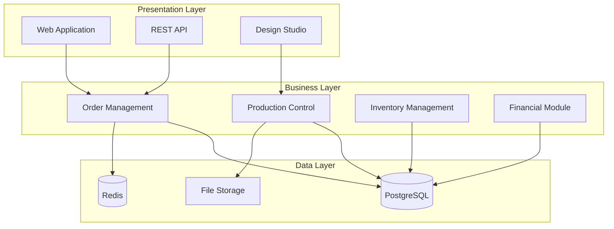

# Comprehensive System Analysis - Origin Alpha Management System

## Executive Summary

This document provides a comprehensive analysis of the Origin Alpha Management System, designed as a custom-built printing business management solution. The system focuses on delivering a tailored experience for printing businesses without the overhead of generic ERP/CRM platforms.

## Business Context

### Company Profile
- **Industry:** Printing and Graphics Services
- **Business Size:** Small to Medium Enterprise
- **Daily Volume:** 6-10 orders
- **Staff Size:** 3-4 employees
- **Services:** Business cards, brochures, large format printing, custom design

### Business Objectives
1. Streamline order processing workflow
2. Automate production management
3. Improve customer experience
4. Enable business scalability
5. Provide SaaS capability for expansion

## System Architecture Analysis

### Current State Assessment

The system is being developed as a monolithic Laravel application with React frontend, chosen for:
- Simplicity and maintainability
- Resource efficiency
- Direct alignment with business needs
- Lower operational complexity

### Technology Stack

| Layer | Technology | Justification |
|-------|------------|---------------|
| Frontend | React 18 + TypeScript | Modern UI, type safety, component reusability |
| Backend | Laravel 11 | Robust PHP framework, excellent ecosystem |
| Database | PostgreSQL 15 | Advanced features, scalability, reliability |
| Cache | Redis | Performance optimization, session management |
| Queue | Laravel Horizon | Background job processing, monitoring |
| Storage | S3/Local | Flexible file storage options |

### Architecture Patterns



## Functional Requirements Analysis

### Core Modules

#### 1. Order Management
**Purpose:** Handle complete order lifecycle from quote to delivery

**Key Features:**
- Online order placement
- Quote generation
- Order tracking
- Status management
- Customer notifications

**Technical Requirements:**
- RESTful API endpoints
- Real-time status updates
- PDF generation for quotes/invoices
- Email/SMS integration

#### 2. Production Management
**Purpose:** Manage printing production workflow

**Key Features:**
- Job queue management
- Production scheduling
- Resource allocation
- Quality control checkpoints
- Machine status tracking

**Technical Implementation:**
```php
// Production Queue Model
class ProductionQueue extends Model
{
    protected $fillable = [
        'order_id',
        'priority',
        'machine_id',
        'operator_id',
        'status',
        'scheduled_at',
        'started_at',
        'completed_at'
    ];
    
    public function scopePending($query)
    {
        return $query->where('status', 'pending')
                    ->orderBy('priority', 'desc')
                    ->orderBy('scheduled_at');
    }
}
```

#### 3. Customer Portal
**Purpose:** Self-service portal for customers

**Key Features:**
- Account management
- Order history
- Design studio access
- File upload/management
- Invoice viewing/payment

#### 4. Design Studio
**Purpose:** Online design tool for customers

**Key Features:**
- Template library
- Custom design tools
- Real-time preview
- Design saving/versioning
- Print-ready file generation

#### 5. Inventory Management
**Purpose:** Track materials and supplies

**Key Features:**
- Stock level monitoring
- Automatic reorder points
- Supplier management
- Cost tracking
- Usage analytics

#### 6. Financial Management
**Purpose:** Handle billing and accounting

**Key Features:**
- Invoice generation
- Payment processing
- Financial reporting
- Tax calculation
- Multi-currency support

## Non-Functional Requirements

### Performance Requirements
- Page load time: < 2 seconds
- API response time: < 200ms
- Concurrent users: 100+
- Database queries: < 50ms
- File upload: Support up to 500MB

### Security Requirements
- OAuth 2.0 authentication
- Role-based access control
- Data encryption at rest
- SSL/TLS for data in transit
- Regular security audits
- GDPR compliance

### Scalability Requirements
- Horizontal scaling capability
- Database replication support
- CDN integration
- Microservices-ready architecture
- Multi-tenant isolation

## Gap Analysis

### Current Gaps

| Area | Current State | Desired State | Priority |
|------|--------------|---------------|----------|
| Order Management | Manual processing | Fully automated | High |
| Production Tracking | Spreadsheets | Real-time dashboard | High |
| Customer Portal | None | Self-service portal | Medium |
| Design Tools | Third-party | Integrated studio | Medium |
| Analytics | Basic reporting | Advanced analytics | Low |

### Implementation Priorities

1. **Phase 1 - Core Foundation (Months 1-2)**
   - User authentication system
   - Basic order management
   - Customer database
   - Admin dashboard

2. **Phase 2 - Production Features (Months 3-4)**
   - Production queue management
   - Job tracking
   - Resource scheduling
   - Status notifications

3. **Phase 3 - Customer Features (Months 5-6)**
   - Customer portal
   - Design studio integration
   - File management
   - Order tracking

4. **Phase 4 - Advanced Features (Month 7+)**
   - Financial management
   - Analytics dashboard
   - Multi-tenancy
   - API for third-party integration

## Risk Assessment

### Technical Risks

| Risk | Probability | Impact | Mitigation Strategy |
|------|------------|--------|-------------------|
| Performance issues | Medium | High | Performance testing, caching, optimization |
| Security vulnerabilities | Low | Critical | Security audits, penetration testing |
| Scalability limitations | Medium | Medium | Cloud-ready architecture, load testing |
| Integration failures | Low | Medium | API versioning, comprehensive testing |

### Business Risks

| Risk | Probability | Impact | Mitigation Strategy |
|------|------------|--------|-------------------|
| User adoption | Medium | High | User training, intuitive UI/UX |
| Requirement changes | High | Medium | Agile development, regular feedback |
| Competition | Medium | Medium | Unique features, competitive pricing |
| Market changes | Low | High | Flexible architecture, regular updates |

## Resource Requirements

### Development Team
- 1 Full-stack Developer (Laravel/React)
- 1 Frontend Developer (React/TypeScript)
- 1 UI/UX Designer (Part-time)
- 1 DevOps Engineer (Part-time)
- 1 QA Tester (Part-time)

### Infrastructure
- Development: 1 VPS (4GB RAM, 2 vCPU)
- Staging: 1 VPS (4GB RAM, 2 vCPU)
- Production: 1 VPS (8GB RAM, 4 vCPU)
- Database: Managed PostgreSQL
- Storage: S3-compatible storage

### Timeline
- Total Duration: 7 months
- Development: 5 months
- Testing: 1 month
- Deployment: 1 month

## Success Metrics

### Technical Metrics
- Code coverage: > 80%
- Bug density: < 5 per KLOC
- System uptime: > 99.9%
- Response time: < 200ms
- Error rate: < 0.1%

### Business Metrics
- Order processing time: -50%
- Customer satisfaction: > 90%
- Revenue increase: +20%
- Operational cost: -30%
- User adoption: > 80%

## Recommendations

### Immediate Actions
1. Finalize technical architecture
2. Set up development environment
3. Begin Phase 1 implementation
4. Establish CI/CD pipeline
5. Create initial documentation

### Long-term Strategy
1. Build modular, extensible architecture
2. Implement comprehensive testing
3. Focus on user experience
4. Plan for scalability from start
5. Maintain detailed documentation

## Conclusion

The Origin Alpha Management System represents a strategic investment in custom software tailored specifically for printing business needs. By avoiding the complexity of generic platforms and focusing on core business requirements, the system will deliver:

- Improved operational efficiency
- Better customer experience
- Scalable growth platform
- Competitive advantage
- Lower total cost of ownership

The analysis confirms that a custom-built solution is the optimal approach for meeting Caldron Flex's specific requirements while maintaining flexibility for future growth.
