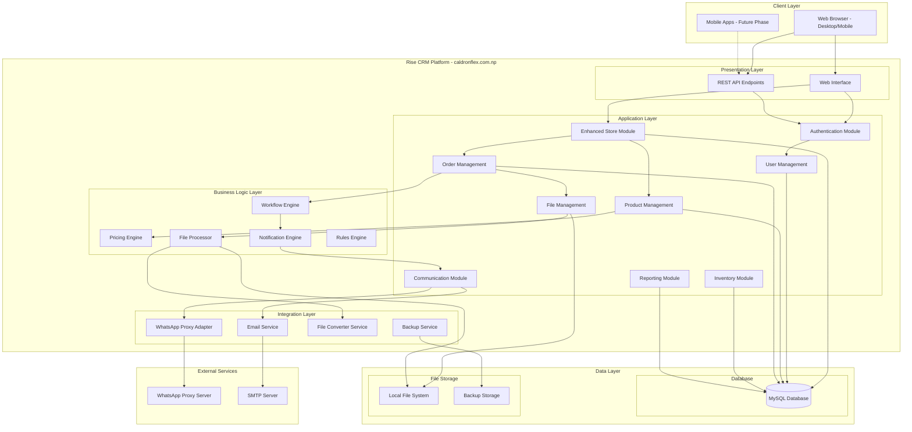
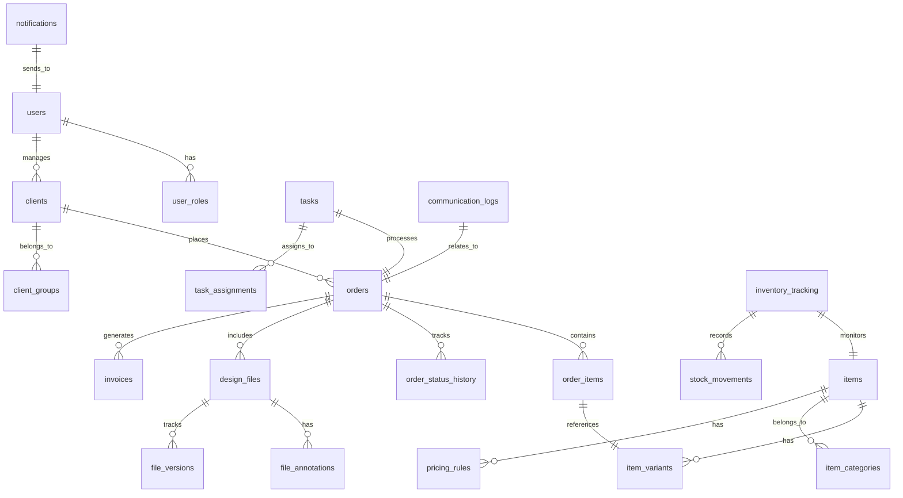
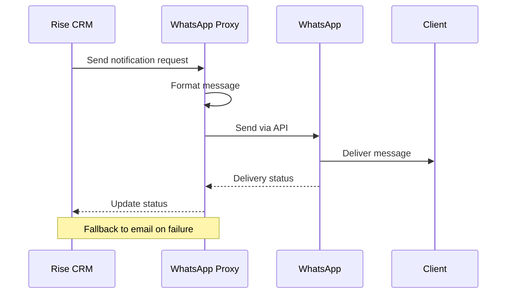

# Software Requirements Specification
## Caldron Flex Business Solution

**Version 1.0**  
**Date: July 23, 2025**

---

## Table of Contents

1. [Executive Summary](#1-executive-summary)
2. [Project Scope and Objectives](#2-project-scope-and-objectives)
3. [Functional Requirements](#3-functional-requirements)
4. [Non-Functional Requirements](#4-non-functional-requirements)
5. [Technical Requirements and Constraints](#5-technical-requirements-and-constraints)
6. [User Stories and Use Cases](#6-user-stories-and-use-cases)
7. [System Architecture Overview](#7-system-architecture-overview)
8. [Data Requirements](#8-data-requirements)
9. [Integration Requirements](#9-integration-requirements)
10. [Security Requirements](#10-security-requirements)
11. [Performance Requirements](#11-performance-requirements)
12. [Testing Requirements](#12-testing-requirements)
13. [Deployment Requirements](#13-deployment-requirements)
14. [Success Criteria and KPIs](#14-success-criteria-and-kpis)
15. [Solution Approaches for Key Technical Decisions](#15-solution-approaches-for-key-technical-decisions)

---

## 1. Executive Summary

The Caldron Flex Business Solution is a comprehensive printing business management system designed to transform Caldron Flex's operations through a unified Laravel React platform. This all-in-one solution integrates customer management, order processing, design workflow automation, inventory tracking, and e-commerce functionality into a single, cohesive system.

### Key Highlights

- **Unified Platform**: Built on Laravel React Starter Kit with React frontend, eliminating the need for multiple systems
- **Single Domain Operation**: All functionality accessible through caldronflex.com.np (no separate store subdomain required)
- **Printing-Specific Features**: Custom workflow for design review, file annotation, and production management
- **Scalable Architecture**: Designed to handle 3x current volume without additional staff
- **Bilingual Support**: Full English and Nepali language support
- **Cost-Effective**: Uses modern Laravel React framework, providing excellent development and maintenance efficiency

### Business Impact

- 50% reduction in manual workflow steps
- 90% automation in preview generation
- Support for 30 concurrent users and 6+ daily orders
- 25% increase in throughput capacity
- 95% customer satisfaction target through streamlined processes

### Technical Overview

- **Platform**: Laravel React Starter Kit (Laravel 10+ framework with React frontend)
- **Hosting**: Dedicated server with optimized resources
- **Database**: Single MySQL database
- **File Support**: Up to 500MB per file with progressive upload
- **Integration**: WhatsApp proxy, SMTP email, TIFF to JPG conversion

---

## 2. Project Scope and Objectives

### 2.1 Project Scope

This project encompasses the development of a unified business management system for Caldron Flex's printing operations, built entirely within the Laravel React platform with modern frontend capabilities.

#### In Scope

1. **Laravel React Platform Enhancement**
   - Extend existing Rise CRM 3.9.3 functionality
   - Enhance built-in Store module for printing e-commerce
   - Develop printing-specific modules and workflows
   - Implement bilingual support (English/Nepali)

2. **Core Business Functions**
   - Product catalog management with variants
   - Dynamic pricing engine (area-based calculations)
   - Order processing and tracking
   - Design file management and annotation
   - Task queue and assignment system
   - Inventory management
   - Customer relationship management
   - Financial tracking and reporting

3. **User Management**
   - Multi-level user hierarchy
   - Role-based access control
   - Organization and individual customer support
   - Guest checkout capabilities

4. **Communication Systems**
   - WhatsApp integration via proxy
   - Email notifications
   - Automated status updates
   - Template-based messaging

5. **File Processing**
   - Large file upload (up to 500MB)
   - TIFF to JPG conversion
   - Design annotation system
   - File version tracking

#### Out of Scope

1. Online payment processing (cash and cheque only)
2. Barcode inventory system
3. Separate store subdomain
4. Mobile applications (planned for Phase 2)
5. AR/VR features (future plugin development)
6. Third-party accounting software integration (future phase)

### 2.2 Project Objectives

#### Primary Objectives

1. **Operational Efficiency**
   - Automate order processing workflow
   - Reduce manual data entry by 50%
   - Streamline design approval process
   - Enable self-service customer portal

2. **Business Growth**
   - Support 3x current order volume
   - Enable 24/7 order placement
   - Improve customer satisfaction to 95%
   - Reduce order processing time by 40%

3. **Quality Improvement**
   - Implement design annotation and review system
   - Track order history and preferences
   - Reduce design revision cycles by 50%
   - Ensure consistent pricing calculations

4. **Cost Reduction**
   - Eliminate need for multiple software systems
   - Reduce communication costs via WhatsApp proxy
   - Minimize training requirements through unified interface
   - Lower maintenance overhead

#### Secondary Objectives

1. **Scalability**
   - Design for future growth
   - Modular architecture for easy extensions
   - Plugin-ready framework
   - Cloud storage integration capability

2. **Data Intelligence**
   - Comprehensive reporting dashboard
   - Customer behavior analytics
   - Inventory optimization insights
   - Performance metrics tracking

3. **Customer Experience**
   - Intuitive self-service portal
   - Real-time order tracking
   - Automated notifications
   - Design preview capabilities

---

## 3. Functional Requirements

### 3.1 User Management Module

#### 3.1.1 User Roles and Permissions

**FR-UM-001**: The system shall support the following user roles:
- Super Administrator (1 user) - Full system access
- Staff Admin (1 user) - Complete operational access
- Staff Helper (1-2 users) - Configurable limited access
- Organization Admin - Full organizational control
- Organization Members - Permissions set by Organization Admin
- Individual Customers - Personal account management
- Guest Users - Minimal registration (name + phone only)

**FR-UM-002**: Staff Helper role shall have access to all functionality EXCEPT purchase price visibility

**FR-UM-003**: The system shall support dynamic role creation and permission management by Super Administrator

**FR-UM-004**: Organization Admins shall manage member permissions within their organization

#### 3.1.2 Authentication and Access Control

**FR-UM-005**: The system shall support email/password authentication
**FR-UM-006**: The system shall implement session-based access control
**FR-UM-007**: Guest users shall checkout with minimal information (name and phone number)
**FR-UM-008**: The system shall maintain audit trails for all user actions

### 3.2 Product Management Module

#### 3.2.1 Product Catalog

**FR-PM-001**: The system shall support the following product categories:
- Flex Banner (Rs.40-150/sqft)
- Certificate Printing (Rs.99-299/piece)
- Token of Love (Rs.250-4000/piece)
- Photo Frame (Rs.349-3000/piece)
- Stamps (Rs.300-500/piece)
- Metal Medals (configurable pricing)
- Custom Quote Items (Holding board, Shield/Trophy, ID cards)

**FR-PM-002**: Products shall support multiple variants:
- Size variations
- Material options (vinyl, fabric, mesh)
- Finish types (matte, glossy, laminated)
- Quality levels

**FR-PM-003**: The system shall support both fixed and custom pricing models

#### 3.2.2 Dynamic Pricing Engine

**FR-PM-004**: The system shall calculate area-based pricing (width × height × rate per sq ft)
**FR-PM-005**: The system shall support quantity-based bulk discounts
**FR-PM-006**: Staff shall override prices with proper authorization and audit trail
**FR-PM-007**: The system shall generate custom quotes for complex items
**FR-PM-008**: Pricing updates shall reflect immediately across all interfaces

### 3.3 Order Processing Module

#### 3.3.1 Order Workflow

**FR-OP-001**: The system shall support the following order workflow:
1. Order Submission
2. Task Queue Assignment
3. Staff Task Claiming
4. Design Phase
5. File Upload and Processing
6. Client Review and Annotation
7. Corrections (max 5 rounds)
8. Final Approval
9. Production Queue
10. Completion and Invoice Generation

**FR-OP-002**: Orders shall support partial payments tracking
**FR-OP-003**: The system shall generate invoices automatically upon order completion
**FR-OP-004**: Rush orders shall be flagged with deadline-based priority

#### 3.3.2 Task Management

**FR-OP-005**: Tasks shall be assigned through a queue-based system
**FR-OP-006**: Staff shall claim tasks from the general queue
**FR-OP-007**: The system shall track task completion times and staff productivity
**FR-OP-008**: Deadline-based priority shall automatically reorder task queue

### 3.4 File Management Module

#### 3.4.1 File Upload and Storage

**FR-FM-001**: The system shall support file uploads up to 500MB
**FR-FM-002**: Supported formats: JPEG, PDF, SVG, PSD, PNG, TIFF
**FR-FM-003**: The system shall implement progressive upload for large files
**FR-FM-004**: Files shall be organized by order and customer

#### 3.4.2 File Processing

**FR-FM-005**: The system shall automatically convert TIFF files to JPG for web preview
**FR-FM-006**: Converted files shall include watermarks
**FR-FM-007**: Original files shall be preserved alongside processed versions
**FR-FM-008**: The system shall generate print-ready files

#### 3.4.3 Design Annotation

**FR-FM-009**: The system shall provide visual annotation tools:
- Commenting on specific areas
- Highlighting regions
- Drawing markup
- Text annotations

**FR-FM-010**: Annotations shall be stored as overlay layers
**FR-FM-011**: The system shall track annotation history
**FR-FM-012**: Maximum 5 revision rounds per design

### 3.5 Inventory Management Module

#### 3.5.1 Stock Tracking

**FR-IM-001**: The system shall track inventory at two levels:
- Raw materials (except flex/banner)
- Finished goods

**FR-IM-002**: Flex/banner products shall track finished goods only
**FR-IM-003**: The system shall generate low stock alerts
**FR-IM-004**: Manual inventory adjustments shall be logged with reasons

#### 3.5.2 Material Management

**FR-IM-005**: The system shall calculate material usage based on orders
**FR-IM-006**: Stock shall be automatically deducted upon order confirmation
**FR-IM-007**: The system shall support multiple warehouse locations(but not needed now)
**FR-IM-008**: Inventory reports shall show current levels and movement history

### 3.6 Communication Module

#### 3.6.1 WhatsApp Integration

**FR-CM-001**: The system shall send notifications via WhatsApp proxy
**FR-CM-002**: Supported notification types:
- Order confirmation
- Status updates
- Design ready for review
- Order completed
- Payment reminders

**FR-CM-003**: The system shall use template-based messaging
**FR-CM-004**: Failed WhatsApp messages shall fallback to email

#### 3.6.2 Email Notifications

**FR-CM-005**: The system shall send email notifications for all events
**FR-CM-006**: Email templates shall be customizable
**FR-CM-007**: The system shall support bulk email for announcements
**FR-CM-008**: Email logs shall be maintained for 90 days

### 3.7 Reporting Module

#### 3.7.1 Operational Reports

**FR-RM-001**: Daily Reports:
- Order status summary
- Completion rates
- Pending tasks
- Staff productivity

**FR-RM-002**: Weekly Reports:
- Revenue analysis
- Customer satisfaction metrics
- Inventory levels
- Production efficiency

**FR-RM-003**: Monthly Reports:
- Financial summary
- Product performance
- Customer analytics
- Growth metrics

#### 3.7.2 Custom Reports

**FR-RM-004**: The system shall allow custom report generation
**FR-RM-005**: Reports shall be exportable in PDF and Excel formats
**FR-RM-006**: The system shall support scheduled report delivery
**FR-RM-007**: Dashboard shall display real-time metrics

### 3.8 Customer Portal

#### 3.8.1 Self-Service Features

**FR-CP-001**: Customers shall view order history
**FR-CP-002**: Customers shall track current order status
**FR-CP-003**: Customers shall upload design files
**FR-CP-004**: Customers shall approve designs online
**FR-CP-005**: Customers shall reorder previous items

#### 3.8.2 Account Management

**FR-CP-006**: Customers shall update profile information
**FR-CP-007**: Organizations shall manage member access
**FR-CP-008**: Customers shall view invoices and payment history
**FR-CP-009**: Customers shall save design templates

---

## 4. Non-Functional Requirements

### 4.1 Performance Requirements

**NFR-PR-001**: The system shall support 30 concurrent users without degradation
**NFR-PR-002**: Page load time shall not exceed 3 seconds
**NFR-PR-003**: File upload shall support progressive loading for files up to 500MB
**NFR-PR-004**: Database queries shall execute within 100ms average
**NFR-PR-005**: The system shall process 6+ orders daily without performance issues
**NFR-PR-006**: Report generation shall complete within 30 seconds
**NFR-PR-007**: Search results shall display within 2 seconds

### 4.2 Scalability Requirements

**NFR-SC-001**: The system architecture shall support 3x current volume without modification
**NFR-SC-002**: Database design shall accommodate 100,000+ orders
**NFR-SC-003**: File storage shall scale to 1.5TB with expansion capability
**NFR-SC-004**: The system shall support modular plugin architecture
**NFR-SC-005**: Caching mechanisms shall reduce database load by 60%

### 4.3 Reliability Requirements

**NFR-RL-001**: System uptime shall be 99.5% during business hours
**NFR-RL-002**: Automated daily backups shall complete successfully 99% of the time
**NFR-RL-003**: The system shall recover from crashes within 5 minutes
**NFR-RL-004**: Data integrity shall be maintained across all transactions
**NFR-RL-005**: Failed transactions shall be logged and recoverable

### 4.4 Usability Requirements

**NFR-US-001**: The interface shall be intuitive requiring minimal training
**NFR-US-002**: The system shall support bilingual operation (English/Nepali)
**NFR-US-003**: Mobile-responsive design for customer portal
**NFR-US-004**: Accessibility compliance with WCAG 2.1 Level AA
**NFR-US-005**: Context-sensitive help shall be available
**NFR-US-006**: Error messages shall be clear and actionable

### 4.5 Security Requirements

**NFR-SE-001**: All passwords shall be encrypted using bcrypt
**NFR-SE-002**: Sessions shall timeout after 30 minutes of inactivity
**NFR-SE-003**: File uploads shall be scanned for malware
**NFR-SE-004**: SQL injection prevention through parameterized queries
**NFR-SE-005**: XSS protection through input sanitization
**NFR-SE-006**: HTTPS encryption for all data transmission
**NFR-SE-007**: Role-based access control enforcement

### 4.6 Maintainability Requirements

**NFR-MN-001**: Code shall follow Rise CRM coding standards
**NFR-MN-002**: All functions shall include documentation
**NFR-MN-003**: Database changes shall use migration scripts
**NFR-MN-004**: Error logging shall facilitate debugging
**NFR-MN-005**: Modular architecture for easy updates
**NFR-MN-006**: Configuration changes shall not require code modifications

### 4.7 Compatibility Requirements

**NFR-CM-001**: Browser support: Chrome, Firefox, Safari, Edge (latest 2 versions)
**NFR-CM-002**: PHP 8.2+ compatibility
**NFR-CM-003**: MySQL 5.7+ or MariaDB 10.3+
**NFR-CM-004**: Dedicated server hosting environment
**NFR-CM-005**: Mobile browser support for customer portal

---

## 5. Technical Requirements and Constraints

### 5.1 Hosting Environment Constraints

**TR-HE-001**: Dedicated server hosting environment (with Docker support)
**TR-HE-002**: PHP 8.2+ with required extensions:
- mysqli, curl, mbstring, intl, json
- mysqlnd, xml, gd, zlib, pdo_mysql
- openssl, fileinfo

**TR-HE-003**: Memory allocation: Optimized for server resources
**TR-HE-004**: Storage capacity: 1.5TB
**TR-HE-005**: Full server access with custom configurations
**TR-HE-006**: Shared hosting performance limitations

### 5.2 Technology Stack

**TR-TS-001**: Framework: CodeIgniter 4 (Rise CRM 3.9.3)
**TR-TS-002**: Database: MySQL single database architecture
**TR-TS-003**: Frontend: jQuery, Bootstrap, HTML5, CSS3
**TR-TS-004**: File Processing: PHP GD library for image manipulation
**TR-TS-005**: Communication: SMTP for email, HTTP API for WhatsApp proxy
**TR-TS-006**: Session Management: File-based sessions

### 5.3 Development Constraints

**TR-DC-001**: Must maintain Rise CRM core compatibility
**TR-DC-002**: Extensions through modular plugin architecture
**TR-DC-003**: No modifications to Rise CRM core files
**TR-DC-004**: Database schema extensions only (no core table modifications)
**TR-DC-005**: Follow MVC pattern consistent with CodeIgniter 4

### 5.4 Integration Constraints

**TR-IC-001**: WhatsApp integration via proxy (not official API)
**TR-IC-002**: Real-time websocket connections supported
**TR-IC-003**: File processing must be asynchronous for large files
**TR-IC-004**: External API calls must have timeout handling
**TR-IC-005**: No direct server-to-server file transfers

### 5.5 Data Constraints

**TR-DT-001**: Single MySQL database for all data
**TR-DT-002**: File storage on local filesystem (no cloud initially)
**TR-DT-003**: Maximum file size: 500MB per upload
**TR-DT-004**: Session data stored in files (not database)
**TR-DT-005**: Backup storage on separate subdomain

---

## 6. User Stories and Use Cases

### 6.1 User Stories

#### 6.1.1 Super Administrator Stories

**US-SA-001**: As a Super Administrator, I want to manage all user roles and permissions so that I can control system access appropriately.

**US-SA-002**: As a Super Administrator, I want to view comprehensive system reports so that I can monitor business performance.

**US-SA-003**: As a Super Administrator, I want to configure system-wide settings so that the platform operates according to business needs.

#### 6.1.2 Staff Admin Stories

**US-AD-001**: As a Staff Admin, I want to manage product catalog and pricing so that customers see accurate information.

**US-AD-002**: As a Staff Admin, I want to override prices for special cases so that I can accommodate customer negotiations.

**US-AD-003**: As a Staff Admin, I want to view all orders and their status so that I can ensure timely delivery.

#### 6.1.3 Staff Helper Stories

**US-SH-001**: As a Staff Helper, I want to claim tasks from the queue so that I can work on assigned orders.

**US-SH-002**: As a Staff Helper, I want to annotate design files so that customers understand required changes.

**US-SH-003**: As a Staff Helper, I want to update order status so that customers are informed of progress.

#### 6.1.4 Customer Stories

**US-CU-001**: As a Customer, I want to browse products and see dynamic pricing so that I can make informed decisions.

**US-CU-002**: As a Customer, I want to upload design files easily so that I can submit my artwork for printing.

**US-CU-003**: As a Customer, I want to review and annotate designs so that I can communicate changes clearly.

**US-CU-004**: As a Customer, I want to track my order status so that I know when to expect delivery.

**US-CU-005**: As a Customer, I want to reorder previous items so that I can save time on repeat orders.

#### 6.1.5 Organization Admin Stories

**US-OA-001**: As an Organization Admin, I want to manage member access so that only authorized personnel can place orders.

**US-OA-002**: As an Organization Admin, I want to view consolidated invoices so that I can manage payments efficiently.

**US-OA-003**: As an Organization Admin, I want to set spending limits for members so that I can control costs.

### 6.2 Use Cases

#### 6.2.1 Use Case: Place Custom Banner Order

**UC-001**: Place Custom Banner Order

**Primary Actor**: Customer
**Preconditions**: Customer is logged in or shopping as guest
**Trigger**: Customer selects "Flex Banner" product

**Main Flow**:
1. Customer selects Flex Banner from product catalog
2. System displays variant options (material, finish)
3. Customer enters dimensions (width and height)
4. System calculates price based on area and selected options
5. Customer uploads design file (up to 500MB)
6. System validates file format and size
7. Customer adds special instructions
8. Customer proceeds to checkout
9. System creates order and adds to task queue
10. Customer receives order confirmation via WhatsApp/Email

**Alternative Flows**:
- 4a. If custom quote required:
  - System prompts for quote request
  - Staff reviews and provides quote
  - Customer approves quote to continue
- 6a. If file format unsupported:
  - System displays error message
  - Customer uploads different file

**Postconditions**: Order created and assigned to task queue

#### 6.2.2 Use Case: Process Design Approval

**UC-002**: Process Design Approval

**Primary Actor**: Staff Helper
**Secondary Actor**: Customer
**Preconditions**: Order exists with uploaded design file

**Main Flow**:
1. Staff Helper claims task from queue
2. Staff processes design file (TIFF to JPG if needed)
3. Staff reviews design for print readiness
4. Staff creates proof with annotations if needed
5. System sends notification to customer
6. Customer reviews design proof
7. Customer approves or requests changes
8. If approved, order moves to production
9. If changes requested, return to step 3 (max 5 iterations)

**Alternative Flows**:
- 7a. If customer requests changes beyond 5 rounds:
  - Staff escalates to Admin
  - Admin decides on additional charges or rejection

**Postconditions**: Design approved and order in production queue

#### 6.2.3 Use Case: Manage Inventory Levels

**UC-003**: Manage Inventory Levels

**Primary Actor**: Staff Admin
**Preconditions**: Admin has inventory management permissions

**Main Flow**:
1. Admin accesses inventory management module
2. System displays current stock levels with alerts
3. Admin selects item to update
4. Admin enters stock adjustment (addition/removal)
5. Admin provides reason for adjustment
6. System updates inventory levels
7. System logs transaction with timestamp and user
8. If stock below reorder point, system generates alert

**Alternative Flows**:
- 4a. If removing stock exceeds available:
  - System displays error
  - Admin corrects quantity

**Postconditions**: Inventory levels updated and logged

---

## 7. System Architecture Overview

### 7.1 Architecture Diagram



### 7.2 Component Description

#### 7.2.1 Presentation Layer
- **Web Interface**: Responsive web UI built with Bootstrap and jQuery
- **REST API**: RESTful endpoints for future mobile app integration

#### 7.2.2 Application Layer
- **Authentication Module**: Handles user login, session management, and access control
- **Enhanced Store Module**: Extended Rise CRM store with printing-specific features
- **User Management**: Role-based access control and permissions
- **Product Management**: Catalog, variants, and pricing rules
- **Order Management**: Complete order lifecycle from placement to delivery
- **File Management**: Upload, storage, processing, and annotation
- **Inventory Module**: Stock tracking and alerts
- **Communication Module**: WhatsApp and email notifications
- **Reporting Module**: Business intelligence and analytics

#### 7.2.3 Business Logic Layer
- **Pricing Engine**: Dynamic price calculations based on dimensions and rules
- **Workflow Engine**: Manages order states and task assignments
- **File Processor**: Handles format conversion and watermarking
- **Notification Engine**: Manages all system notifications
- **Rules Engine**: Business rules and validation logic

#### 7.2.4 Data Layer
- **MySQL Database**: Single database for all application data
- **File Storage**: Local filesystem for uploaded files and processed images
- **Backup Storage**: Separate storage for automated backups

### 7.3 Technology Architecture

#### 7.3.1 Frontend Technologies
- HTML5/CSS3 for markup and styling
- Bootstrap 4 for responsive design
- jQuery for dynamic interactions
- AJAX for asynchronous operations
- Chart.js for reporting visualizations
- Dropzone.js for file uploads

#### 7.3.2 Backend Technologies
- PHP 8.2+ as primary language
- CodeIgniter 4 framework (Rise CRM base)
- MySQL for data persistence
- GD Library for image processing
- TCPDF for PDF generation
- PHPMailer for email services

#### 7.3.3 Infrastructure
- Dedicated server hosting environment
- Apache/Nginx web server with custom configurations
- MySQL database server
- File-based session storage
- Cron jobs for scheduled tasks

---

## 8. Data Requirements

### 8.1 Database Schema Overview



### 8.2 Core Database Tables

#### 8.2.1 Enhanced Tables (Extending Rise CRM)

**items** (Enhanced)
```sql
ALTER TABLE items ADD COLUMN has_variants BOOLEAN DEFAULT FALSE;
ALTER TABLE items ADD COLUMN pricing_type ENUM('fixed', 'area_based', 'custom') DEFAULT 'fixed';
ALTER TABLE items ADD COLUMN base_price DECIMAL(10,2);
ALTER TABLE items ADD COLUMN price_per_sqft DECIMAL(10,2);
ALTER TABLE items ADD COLUMN min_order_quantity INT DEFAULT 1;
ALTER TABLE items ADD COLUMN max_file_size INT DEFAULT 524288000; -- 500MB in bytes
ALTER TABLE items ADD COLUMN allowed_file_types TEXT;
ALTER TABLE items ADD COLUMN production_time_days INT DEFAULT 2;
```

**orders** (Enhanced)
```sql
ALTER TABLE orders ADD COLUMN rush_order BOOLEAN DEFAULT FALSE;
ALTER TABLE orders ADD COLUMN deadline_date DATE NULL;
ALTER TABLE orders ADD COLUMN design_status ENUM('pending', 'in_review', 'approved', 'revision_requested') DEFAULT 'pending';
ALTER TABLE orders ADD COLUMN revision_count INT DEFAULT 0;
ALTER TABLE orders ADD COLUMN production_notes TEXT;
ALTER TABLE orders ADD COLUMN amount_paid DECIMAL(10,2) DEFAULT 0;
ALTER TABLE orders ADD COLUMN amount_remaining DECIMAL(10,2) DEFAULT 0;
```

#### 8.2.2 New Tables

**item_variants**
```sql
CREATE TABLE item_variants (
    id INT PRIMARY KEY AUTO_INCREMENT,
    item_id INT NOT NULL,
    variant_name VARCHAR(255),
    variant_type ENUM('size', 'material', 'finish', 'quality'),
    variant_value VARCHAR(255),
    price_modifier DECIMAL(10,2) DEFAULT 0,
    modifier_type ENUM('fixed', 'percentage') DEFAULT 'fixed',
    stock_quantity INT DEFAULT 0,
    sku VARCHAR(100) UNIQUE,
    sort_order INT DEFAULT 0,
    is_active BOOLEAN DEFAULT TRUE,
    created_at TIMESTAMP DEFAULT CURRENT_TIMESTAMP,
    updated_at TIMESTAMP DEFAULT CURRENT_TIMESTAMP ON UPDATE CURRENT_TIMESTAMP,
    FOREIGN KEY (item_id) REFERENCES items(id) ON DELETE CASCADE,
    INDEX idx_item_variants (item_id, variant_type)
);
```

**item_variant_combinations**
```sql
CREATE TABLE item_variant_combinations (
    id INT PRIMARY KEY AUTO_INCREMENT,
    item_id INT NOT NULL,
    combination_key VARCHAR(255), -- e.g., "size:large|material:vinyl|finish:matte"
    combination_sku VARCHAR(100) UNIQUE,
    price DECIMAL(10,2),
    stock_quantity INT DEFAULT 0,
    variant_ids JSON, -- Array of variant IDs
    is_active BOOLEAN DEFAULT TRUE,
    created_at TIMESTAMP DEFAULT CURRENT_TIMESTAMP,
    FOREIGN KEY (item_id) REFERENCES items(id) ON DELETE CASCADE,
    INDEX idx_combination_key (combination_key)
);
```

**pricing_rules**
```sql
CREATE TABLE pricing_rules (
    id INT PRIMARY KEY AUTO_INCREMENT,
    item_id INT,
    rule_name VARCHAR(255),
    rule_type ENUM('area_based', 'quantity_tier', 'date_range', 'customer_type'),
    rule_config JSON, -- Flexible configuration storage
    priority INT DEFAULT 0,
    is_active BOOLEAN DEFAULT TRUE,
    start_date DATETIME NULL,
    end_date DATETIME NULL,
    created_by INT,
    created_at TIMESTAMP DEFAULT CURRENT_TIMESTAMP,
    FOREIGN KEY (item_id) REFERENCES items(id) ON DELETE CASCADE,
    FOREIGN KEY (created_by) REFERENCES users(id)
);
```

**design_files**
```sql
CREATE TABLE design_files (
    id INT PRIMARY KEY AUTO_INCREMENT,
    order_id INT NOT NULL,
    file_type ENUM('design', 'reference', 'proof'),
    original_filename VARCHAR(255),
    stored_filename VARCHAR(255) UNIQUE,
    file_extension VARCHAR(10),
    file_size BIGINT,
    mime_type VARCHAR(100),
    preview_filename VARCHAR(255),
    has_watermark BOOLEAN DEFAULT FALSE,
    annotations_data JSON,
    version_number INT DEFAULT 1,
    is_approved BOOLEAN DEFAULT FALSE,
    approved_by INT NULL,
    approved_at DATETIME NULL,
    status ENUM('uploaded', 'processing', 'ready', 'approved', 'rejected') DEFAULT 'uploaded',
    uploaded_by INT,
    upload_date TIMESTAMP DEFAULT CURRENT_TIMESTAMP,
    FOREIGN KEY (order_id) REFERENCES orders(id) ON DELETE CASCADE,
    FOREIGN KEY (uploaded_by) REFERENCES users(id),
    FOREIGN KEY (approved_by) REFERENCES users(id),
    INDEX idx_order_files (order_id, file_type)
);
```

**file_annotations**
```sql
CREATE TABLE file_annotations (
    id INT PRIMARY KEY AUTO_INCREMENT,
    design_file_id INT NOT NULL,
    annotation_type ENUM('comment', 'highlight', 'arrow', 'rectangle', 'text'),
    coordinates JSON, -- {x, y, width, height} for shapes
    annotation_text TEXT,
    color VARCHAR(7) DEFAULT '#FF0000',
    created_by INT,
    created_at TIMESTAMP DEFAULT CURRENT_TIMESTAMP,
    is_resolved BOOLEAN DEFAULT FALSE,
    resolved_by INT NULL,
    resolved_at DATETIME NULL,
    FOREIGN KEY (design_file_id) REFERENCES design_files(id) ON DELETE CASCADE,
    FOREIGN KEY (created_by) REFERENCES users(id),
    FOREIGN KEY (resolved_by) REFERENCES users(id)
);
```

**inventory_tracking**
```sql
CREATE TABLE inventory_tracking (
    id INT PRIMARY KEY AUTO_INCREMENT,
    item_id INT,
    variant_combination_id INT NULL,
    location_id INT DEFAULT 1,
    quantity_on_hand INT DEFAULT 0,
    quantity_reserved INT DEFAULT 0,
    quantity_available INT GENERATED ALWAYS AS (quantity_on_hand - quantity_reserved) STORED,
    reorder_level INT DEFAULT 10,
    reorder_quantity INT DEFAULT 50,
    last_reorder_date DATE NULL,
    unit_cost DECIMAL(10,2) DEFAULT 0,
    last_updated TIMESTAMP DEFAULT CURRENT_TIMESTAMP ON UPDATE CURRENT_TIMESTAMP,
    FOREIGN KEY (item_id) REFERENCES items(id),
    FOREIGN KEY (variant_combination_id) REFERENCES item_variant_combinations(id),
    UNIQUE KEY unique_inventory (item_id, variant_combination_id, location_id)
);
```

**communication_logs**
```sql
CREATE TABLE communication_logs (
    id INT PRIMARY KEY AUTO_INCREMENT,
    order_id INT NULL,
    client_id INT NULL,
    communication_type ENUM('whatsapp', 'email', 'sms'),
    template_used VARCHAR(100),
    recipient VARCHAR(255),
    subject VARCHAR(255) NULL,
    message TEXT,
    status ENUM('pending', 'sent', 'delivered', 'failed') DEFAULT 'pending',
    error_message TEXT NULL,
    retry_count INT DEFAULT 0,
    sent_at DATETIME NULL,
    delivered_at DATETIME NULL,
    created_at TIMESTAMP DEFAULT CURRENT_TIMESTAMP,
    FOREIGN KEY (order_id) REFERENCES orders(id),
    FOREIGN KEY (client_id) REFERENCES clients(id),
    INDEX idx_communication_status (status, created_at)
);
```

**custom_quotes**
```sql
CREATE TABLE custom_quotes (
    id INT PRIMARY KEY AUTO_INCREMENT,
    quote_number VARCHAR(20) UNIQUE,
    client_id INT NOT NULL,
    item_name VARCHAR(255),
    item_specifications JSON,
    quantity INT DEFAULT 1,
    quoted_price DECIMAL(10,2),
    cost_breakdown JSON,
    valid_days INT DEFAULT 30,
    valid_until DATE GENERATED ALWAYS AS (DATE_ADD(created_at, INTERVAL valid_days DAY)) STORED,
    status ENUM('draft', 'sent', 'accepted', 'rejected', 'expired') DEFAULT 'draft',
    notes TEXT,
    created_by INT,
    approved_by INT NULL,
    created_at TIMESTAMP DEFAULT CURRENT_TIMESTAMP,
    updated_at TIMESTAMP DEFAULT CURRENT_TIMESTAMP ON UPDATE CURRENT_TIMESTAMP,
    FOREIGN KEY (client_id) REFERENCES clients(id),
    FOREIGN KEY (created_by) REFERENCES users(id),
    FOREIGN KEY (approved_by) REFERENCES users(id)
);
```

### 8.3 Data Retention and Archival

**DR-001**: Order data shall be retained for 7 years
**DR-002**: Design files shall be archived after 1 year of inactivity
**DR-003**: Communication logs shall be purged after 90 days
**DR-004**: Deleted user data shall be anonymized, not removed
**DR-005**: Financial records shall never be deleted, only archived

---

## 9. Integration Requirements

### 9.1 WhatsApp Integration

#### 9.1.1 Integration Architecture



#### 9.1.2 Integration Requirements

**IR-WA-001**: Integration via HTTP REST API to proxy server
**IR-WA-002**: Support for template-based messaging
**IR-WA-003**: Message types supported:
- Order confirmation
- Status updates  
- Design ready for review
- Payment reminders
- Delivery notifications

**IR-WA-004**: Automatic fallback to email on failure
**IR-WA-005**: Delivery status tracking and logging
**IR-WA-006**: Rate limiting to prevent spam (max 100 messages/hour)
**IR-WA-007**: Template variables support for personalization

#### 9.1.3 Configuration

```php
// WhatsApp Proxy Configuration
$config['whatsapp'] = [
    'proxy_url' => 'https://wa-proxy.example.com/api/v1',
    'api_key' => 'encrypted_api_key',
    'timeout' => 30,
    'retry_attempts' => 3,
    'fallback_to_email' => true,
    'rate_limit' => 100,
    'templates' => [
        'order_confirmation' => 'order_confirm_v1',
        'status_update' => 'status_update_v1',
        'design_ready' => 'design_review_v1'
    ]
];
```

### 9.2 Email Integration

#### 9.2.1 SMTP Configuration

**IR-EM-001**: SMTP integration for transactional emails
**IR-EM-002**: Support for HTML and plain text formats
**IR-EM-003**: Attachment support up to 25MB
**IR-EM-004**: Email templates with variable substitution
**IR-EM-005**: Bounce handling and logging
**IR-EM-006**: Bulk email support with throttling

#### 9.2.2 Email Types

- Order confirmations with PDF invoice
- Design approval requests with preview links
- Password reset and account notifications
- Marketing communications (with unsubscribe)
- System alerts and error notifications

### 9.3 File Processing Integration

#### 9.3.1 TIFF to JPG Conversion

**IR-FP-001**: Automatic conversion triggered on TIFF upload
**IR-FP-002**: Conversion requirements:
- Maintain aspect ratio
- Maximum dimension: 2000px
- JPEG quality: 85%
- Add watermark overlay
- Generate thumbnail (300px)

**IR-FP-003**: Processing queue for large files
**IR-FP-004**: Progress tracking for user feedback
**IR-FP-005**: Error handling with user notification

#### 9.3.2 Implementation

```php
// File Processor Service
class FileProcessorService {
    public function convertTiffToJpg($inputPath, $outputPath) {
        // Use Imagick or GD library
        $image = new Imagick($inputPath);
        $image->setImageFormat('jpeg');
        $image->setImageCompressionQuality(85);
        
        // Add watermark
        $watermark = new Imagick('watermark.png');
        $image->compositeImage($watermark, Imagick::COMPOSITE_OVER, 10, 10);
        
        // Resize if needed
        if ($image->getImageWidth() > 2000) {
            $image->scaleImage(2000, 0);
        }
        
        $image->writeImage($outputPath);
        
        // Generate thumbnail
        $image->thumbnailImage(300, 0);
        $image->writeImage($this->getThumbnailPath($outputPath));
    }
}
```

### 9.4 Backup Integration

#### 9.4.1 Automated Backup System

**IR-BK-001**: Daily automated backups at 2 AM local time
**IR-BK-002**: Backup components:
- Complete database dump
- Uploaded files (incremental)
- System configuration
- Generated reports

**IR-BK-003**: Backup retention: 30 days rolling
**IR-BK-004**: Backup verification with checksums
**IR-BK-005**: Email notification on backup completion/failure
**IR-BK-006**: Storage on separate subdomain (bck.caldronflex.com.np)

### 9.5 Future Integration Points

#### 9.5.1 Mobile App API (Phase 2)

**IR-MA-001**: RESTful API with JWT authentication
**IR-MA-002**: API versioning support
**IR-MA-003**: Rate limiting per API key
**IR-MA-004**: Endpoints for:
- User authentication
- Product browsing
- Order placement
- Order tracking
- Push notifications

#### 9.5.2 AR/VR Plugin (Future)

**IR-AR-001**: WebGL-based 3D visualization
**IR-AR-002**: AR.js integration for mobile AR
**IR-AR-003**: Product dimension overlay
**IR-AR-004**: Real-world scale preview

#### 9.5.3 Accounting Software (Future)

**IR-AC-001**: Export capabilities for common formats
**IR-AC-002**: API integration preparation
**IR-AC-003**: Transaction synchronization
**IR-AC-004**: Tax report generation

---

## 10. Security Requirements

### 10.1 Authentication and Authorization

**SR-AA-001**: Multi-factor authentication option for admin users
**SR-AA-002**: Password complexity requirements:
- Minimum 8 characters
- At least one uppercase, lowercase, number, and special character
- Password history (last 5 passwords)
- Password expiry every 90 days for staff

**SR-AA-003**: Account lockout after 5 failed attempts
**SR-AA-004**: Session management:
- Secure session cookies (httpOnly, secure flags)
- Session timeout after 30 minutes inactivity
- Single session per user (configurable)
- Session invalidation on password change

**SR-AA-005**: Role-based access control (RBAC) enforcement at all levels
**SR-AA-006**: API authentication using API keys with rate limiting

### 10.2 Data Protection

**SR-DP-001**: Encryption requirements:
- Passwords: bcrypt with cost factor 12
- Sensitive data: AES-256 encryption
- File uploads: Encrypted at rest
- Database: Encrypted connections

**SR-DP-002**: Data masking:
- Credit card numbers (if future implementation)
- Phone numbers in logs (show last 4 digits)
- Email addresses in public views

**SR-DP-003**: Personally Identifiable Information (PII) handling:
- Access logging for PII data
- Right to erasure compliance
- Data minimization principles
- Purpose limitation enforcement

### 10.3 Application Security

**SR-AS-001**: Input validation:
- Server-side validation for all inputs
- Whitelist approach for allowed characters
- File type validation by content, not extension
- Maximum input length enforcement

**SR-AS-002**: SQL injection prevention:
- Parameterized queries mandatory
- Stored procedures where applicable
- ORM usage with escape mechanisms
- Database user privilege restrictions

**SR-AS-003**: Cross-Site Scripting (XSS) prevention:
- Output encoding for all user content
- Content Security Policy (CSP) headers
- HTML purification for rich text
- Template engine auto-escaping

**SR-AS-004**: Cross-Site Request Forgery (CSRF) protection:
- CSRF tokens for all forms
- Same-site cookie attributes
- Referrer validation
- Double-submit cookie pattern

### 10.4 Infrastructure Security

**SR-IS-001**: File upload security:
- Virus scanning for uploaded files
- File stored outside web root
- Randomized file names
- MIME type verification
- Size limit enforcement (500MB)

**SR-IS-002**: Error handling:
- Generic error messages to users
- Detailed errors in secure logs only
- Stack traces disabled in production
- Custom error pages

**SR-IS-003**: Security headers:
- X-Frame-Options: DENY
- X-Content-Type-Options: nosniff
- X-XSS-Protection: 1; mode=block
- Strict-Transport-Security
- Content-Security-Policy

### 10.5 Audit and Compliance

**SR-AC-001**: Audit logging requirements:
- User authentication attempts
- Authorization failures
- Data modifications
- Administrative actions
- File access and downloads
- Payment transactions

**SR-AC-002**: Log retention and protection:
- Logs retained for 1 year
- Encrypted log storage
- Tamper-proof logging
- Log access restrictions

**SR-AC-003**: Compliance requirements:
- Data protection regulations
- PCI DSS readiness (future)
- Industry best practices
- Regular security assessments

### 10.6 Security Monitoring

**SR-SM-001**: Real-time monitoring:
- Failed login attempts
- Unusual access patterns
- Large data exports
- Privilege escalation attempts

**SR-SM-002**: Security alerts:
- Email alerts for critical events
- Dashboard for security metrics
- Automated threat detection
- Incident response procedures

---

## 11. Performance Requirements

### 11.1 Response Time Requirements

**PR-RT-001**: Page Load Times
- Homepage: < 2 seconds
- Product listing: < 3 seconds
- Order submission: < 5 seconds
- Report generation: < 30 seconds
- File upload: Progressive with immediate feedback

**PR-RT-002**: API Response Times
- Authentication: < 500ms
- Product search: < 1 second
- Price calculation: < 2 seconds
- Order status check: < 500ms

**PR-RT-003**: Database Query Performance
- Simple queries: < 50ms
- Complex reports: < 5 seconds
- Search operations: < 2 seconds
- Bulk operations: < 30 seconds

### 11.2 Throughput Requirements

**PR-TP-001**: Concurrent Users
- Support 30 concurrent active users
- Support 100 concurrent sessions
- Handle 10 simultaneous file uploads
- Process 6+ orders per day minimum

**PR-TP-002**: Transaction Volumes
- 1000 page views per hour
- 50 orders per day (peak)
- 100 file uploads per day
- 500 notifications per day

### 11.3 Resource Utilization

**PR-RU-001**: Server Resources
- CPU usage: < 70% average
- Memory usage: Optimized for available server resources
- Disk I/O: < 100 IOPS average
- Network bandwidth: < 100 Mbps

**PR-RU-002**: Database Resources
- Connection pool: 20 connections
- Query cache hit rate: > 80%
- Index usage: > 90%
- Lock wait time: < 1 second

### 11.4 Scalability Metrics

**PR-SC-001**: Growth Capacity
- Handle 3x current load without degradation
- Database growth to 100,000 orders
- File storage growth to 1TB
- User base growth to 1000 users

**PR-SC-002**: Performance Degradation Limits
- < 10% degradation at 2x load
- < 25% degradation at 3x load
- Graceful degradation beyond limits
- Automatic scaling triggers

### 11.5 Optimization Requirements

**PR-OP-001**: Caching Strategy
- Page cache: 1 hour for static content
- Database query cache: 5 minutes
- Session cache: 30 minutes
- File cache: 24 hours for processed images

**PR-OP-002**: Code Optimization
- Lazy loading for images
- Minified CSS/JS in production
- Gzip compression enabled
- Database query optimization

**PR-OP-003**: Resource Optimization
- Image optimization (WebP format)
- Pagination for large datasets
- Asynchronous processing for heavy tasks
- Connection pooling for external services

---

## 12. Testing Requirements

### 12.1 Unit Testing

**TR-UT-001**: Code Coverage
- Minimum 70% code coverage
- Critical functions: 90% coverage
- New code: 80% coverage requirement
- Automated coverage reports

**TR-UT-002**: Test Categories
- Model validation tests
- Business logic tests
- Utility function tests
- API endpoint tests

### 12.2 Integration Testing

**TR-IT-001**: Module Integration
- User authentication flow
- Order processing workflow
- File upload and processing
- Payment and invoicing
- Notification delivery

**TR-IT-002**: External Integration
- WhatsApp proxy communication
- Email delivery verification
- File conversion service
- Backup service operation

### 12.3 System Testing

**TR-ST-001**: Functional Testing
- Complete user workflows
- Cross-module operations
- Data integrity verification
- Business rule validation

**TR-ST-002**: Performance Testing
- Load testing (30 concurrent users)
- Stress testing (3x normal load)
- Endurance testing (24-hour run)
- Spike testing (sudden load increase)

### 12.4 User Acceptance Testing

**TR-UAT-001**: Test Scenarios
- Order placement by different user types
- Design review and approval process
- Inventory management operations
- Report generation and export

**TR-UAT-002**: Test Participants
- 2 staff admins
- 2 staff helpers
- 5 regular customers
- 2 organization admins

### 12.5 Security Testing

**TR-SEC-001**: Vulnerability Testing
- SQL injection attempts
- XSS vulnerability scans
- CSRF token validation
- Authentication bypass attempts
- File upload exploits

**TR-SEC-002**: Penetration Testing
- Annual third-party assessment
- Automated vulnerability scanning
- Security compliance verification
- Incident response testing

### 12.6 Regression Testing

**TR-REG-001**: Test Suite Maintenance
- Automated regression suite
- Test case version control
- Monthly full regression
- Critical path daily tests

**TR-REG-002**: Change Impact Testing
- Module modification testing
- Database change validation
- API compatibility testing
- UI consistency checks

---

## 13. Deployment Requirements

### 13.1 Deployment Environment

**DR-ENV-001**: Production Environment
- Dedicated server hosting platform
- PHP 8.2+ with required extensions
- MySQL 5.7+ database
- Apache web server
- SSL certificate installed

**DR-ENV-002**: Staging Environment
- Mirror of production setup
- Separate database instance
- Test data population
- Same PHP configuration

### 13.2 Deployment Process

**DR-PR-001**: Deployment Steps
1. Code review and approval
2. Backup current system
3. Deploy to staging
4. Run automated tests
5. User acceptance on staging
6. Schedule maintenance window
7. Deploy to production
8. Verify deployment
9. Monitor for issues

**DR-PR-002**: Rollback Plan
- Automated backup before deployment
- Database migration rollback scripts
- Previous version retention (3 versions)
- Rollback decision criteria
- Maximum rollback time: 30 minutes

### 13.3 Configuration Management

**DR-CM-001**: Environment Configuration
- Separate config files per environment
- Encrypted sensitive configurations
- Version controlled configs
- Environment variable usage

**DR-CM-002**: Database Migrations
- Sequential migration scripts
- Rollback capabilities
- Migration version tracking
- Data integrity verification

### 13.4 Deployment Validation

**DR-VAL-001**: Post-Deployment Checks
- Service availability tests
- Critical functionality verification
- Performance baseline comparison
- Error log monitoring
- User access verification

**DR-VAL-002**: Monitoring Setup
- Real-time error tracking
- Performance monitoring
- Resource usage alerts
- User activity tracking
- Security event logging

### 13.5 Documentation Requirements

**DR-DOC-001**: Deployment Documentation
- Step-by-step deployment guide
- Configuration reference
- Troubleshooting procedures
- Emergency contact list
- Architecture diagrams

**DR-DOC-002**: User Documentation
- User manual for each role
- Video tutorials
- FAQ section
- API documentation
- Change logs

---

## 14. Success Criteria and KPIs

### 14.1 Operational Success Metrics

**SC-OP-001**: Process Efficiency
- Order processing time: 40% reduction
- Manual data entry: 50% reduction
- Design approval cycles: 50% reduction
- Task assignment time: 80% reduction

**SC-OP-002**: System Reliability
- System uptime: 99.5% during business hours
- Backup success rate: 99%
- Error rate: < 0.1% of transactions
- Recovery time: < 5 minutes

### 14.2 Business Success Metrics

**SC-BS-001**: Revenue Impact
- Order capacity: 3x increase capability
- Revenue growth: 25% within 6 months
- Average order value: 20% increase
- Customer retention: 85%

**SC-BS-002**: Customer Satisfaction
- First design approval rate: 95%
- Customer satisfaction score: 90%+
- Support ticket reduction: 30%
- Order fulfillment accuracy: 98%

### 14.3 Technical Success Metrics

**SC-TC-001**: Performance Metrics
- Page load time: < 3 seconds average
- Database query time: < 100ms average
- File upload success rate: 99%
- API response time: < 500ms

**SC-TC-002**: Quality Metrics
- Code coverage: 70% minimum
- Bug density: < 5 per KLOC
- Security vulnerabilities: Zero critical
- Technical debt: < 20% of codebase

### 14.4 User Adoption Metrics

**SC-UA-001**: System Usage
- Active user rate: 80% of registered
- Feature adoption: 70% core features
- Mobile usage: 30% of traffic
- Self-service rate: 60% of orders

**SC-UA-002**: Training Effectiveness
- Training completion: 95% of staff
- Time to proficiency: < 1 week
- Support requests: < 10% post-training
- User error rate: < 5%

### 14.5 Long-term Success Indicators

**SC-LT-001**: Scalability Validation
- 3x load handling confirmed
- Database performance maintained
- Storage growth managed
- Feature expansion capability

**SC-LT-002**: ROI Achievement
- Development cost recovery: 12 months
- Operational cost reduction: 30%
- Revenue per employee: 25% increase
- Market share growth: 15%

---

## 15. Solution Approaches for Key Technical Decisions

### 15.1 Database Schema Design Approaches

#### Approach 1: Normalized Schema (Recommended)
**Pros:**
- Data integrity and consistency
- Efficient storage usage
- Easier maintenance and updates
- Follows Rise CRM patterns

**Cons:**
- More complex queries with joins
- Potential performance impact on reports
- Requires careful index planning

**Implementation:**
- Separate tables for variants, pricing rules, inventory
- Foreign key constraints for data integrity
- Indexes on frequently queried columns

#### Approach 2: Denormalized Schema
**Pros:**
- Faster query performance
- Simpler queries
- Better for read-heavy operations

**Cons:**
- Data redundancy
- Complex update operations
- Potential data inconsistency
- More storage required

**Implementation:**
- Combine related data in single tables
- Use JSON columns for flexible data
- Materialized views for reports

### 15.2 API Architecture Patterns

#### Approach 1: RESTful API (Recommended)
**Pros:**
- Industry standard
- Easy to understand and implement
- Good tooling support
- Stateless and scalable

**Cons:**
- Multiple requests for related data
- Over/under fetching issues
- Versioning complexity

**Implementation:**
```php
// RESTful endpoints
GET    /api/v1/products
GET    /api/v1/products/{id}
POST   /api/v1/orders
PUT    /api/v1/orders/{id}
DELETE /api/v1/orders/{id}
```

#### Approach 2: GraphQL API
**Pros:**
- Flexible data fetching
- Single request for complex data
- Strong typing
- Real-time subscriptions

**Cons:**
- Steeper learning curve
- Complex server implementation
- Caching challenges
- Not native to CodeIgniter

### 15.3 Frontend Framework Choices

#### Approach 1: jQuery + Bootstrap (Recommended)
**Pros:**
- Already in Rise CRM
- Minimal learning curve
- Wide browser support
- Large ecosystem

**Cons:**
- Not reactive
- Manual DOM manipulation
- Less modern approach

**Implementation:**
- Enhance existing Rise CRM UI
- Progressive enhancement
- AJAX for dynamic updates

#### Approach 2: Vue.js Integration
**Pros:**
- Reactive components
- Better performance
- Modern development
- Easy integration

**Cons:**
- Learning curve for team
- Build process required
- Potential conflicts with Rise CRM
- Additional complexity

### 15.4 File Handling Strategies

#### Approach 1: Local Storage with CDN (Recommended)
**Pros:**
- Simple implementation
- Direct file access
- No external dependencies
- Cost-effective

**Cons:**
- Limited by server storage
- Backup complexity
- No automatic scaling

**Implementation:**
```php
// File storage structure
/files
  /orders
    /{year}/{month}/{order_id}
      /originals
      /processed
      /thumbnails
```

#### Approach 2: Cloud Storage (S3/Google Cloud)
**Pros:**
- Unlimited storage
- Automatic backups
- Global accessibility
- Better performance

**Cons:**
- Additional costs
- Internet dependency
- API complexity
- Compliance concerns

### 15.5 Caching Strategies

#### Approach 1: File-based Caching (Recommended)
**Pros:**
- Simple implementation
- No additional services
- Works with dedicated server
- Easy to clear

**Cons:**
- Disk I/O limitations
- Not distributed
- Manual invalidation

**Implementation:**
```php
// Cache configuration
$config['cache'] = [
    'handler' => 'file',
    'backup' => 'dummy',
    'path' => WRITEPATH . 'cache/',
    'ttl' => 3600, // 1 hour
    'prefix' => 'caldron_'
];
```

#### Approach 2: Redis/Memcached
**Pros:**
- High performance
- Distributed caching
- Automatic expiration
- Less disk I/O

**Cons:**
- Available on dedicated server
- Additional service required
- Memory limitations
- Complex setup

### 15.6 Communication Strategy

#### Approach 1: WhatsApp Proxy + Email (Recommended)
**Pros:**
- Cost-effective
- High delivery rates
- Customer preference
- Fallback mechanism

**Cons:**
- Proxy reliability
- Limited formatting
- No official support

**Implementation:**
```php
class CommunicationService {
    public function send($recipient, $message, $type = 'order') {
        try {
            $result = $this->whatsappProxy->send($recipient, $message);
            if (!$result->success) {
                throw new Exception('WhatsApp failed');
            }
        } catch (Exception $e) {
            // Fallback to email
            $this->emailService->send($recipient, $message);
        }
    }
}
```

#### Approach 2: Official WhatsApp Business API
**Pros:**
- Official support
- Better reliability
- Rich messaging
- Analytics

**Cons:**
- High costs
- Complex approval
- Strict policies
- Template limitations

---

## Appendices

### Appendix A: Glossary

- **Rise CRM**: The base Customer Relationship Management platform (version 3.9.3)
- **Store Module**: Built-in e-commerce functionality within Rise CRM
- **Flex Banner**: Large format printing product with customizable size
- **Design Annotation**: Visual markup system for design feedback
- **Task Queue**: Unassigned task pool for staff to claim
- **Progressive Upload**: Chunked file upload for large files
- **WhatsApp Proxy**: Third-party service for WhatsApp messaging
- **Area-based Pricing**: Pricing calculation based on dimensions (width × height)
- **Variant**: Product variation (size, material, finish)
- **Credit Management**: Allowing customers to order on credit terms

### Appendix B: References

1. Rise CRM Documentation: [Internal documentation]
2. CodeIgniter 4 Framework: https://codeigniter.com/user_guide/
3. MySQL Documentation: https://dev.mysql.com/doc/
4. PHP Standards Recommendations (PSR): https://www.php-fig.org/psr/
5. OWASP Security Guidelines: https://owasp.org/
6. RESTful API Design: https://restfulapi.net/

### Appendix C: Revision History

| Version | Date | Author | Changes |
|---------|------|--------|---------|
| 1.0 | 2025-07-23 | Kilo Code | Initial version |

---

**Document End**