# System Architecture Document
## Caldron Flex Business Solution
### Laravel React Enhancement for Printing Business Management

**Version 1.0**  
**Date: July 23, 2025**

---

## Table of Contents

1. [Executive Summary](#1-executive-summary)
2. [High-Level Architecture Overview](#2-high-level-architecture-overview)
3. [Technical Architecture Components](#3-technical-architecture-components)
4. [System Context Diagram](#4-system-context-diagram)
5. [Container Diagram](#5-container-diagram)
6. [Component Diagrams](#6-component-diagrams)
7. [Database Architecture](#7-database-architecture)
8. [Sequence Diagrams](#8-sequence-diagrams)
9. [Deployment Architecture](#9-deployment-architecture)
10. [Integration Architecture](#10-integration-architecture)
11. [Security Architecture](#11-security-architecture)
12. [Performance Architecture](#12-performance-architecture)
13. [Module-Specific Architecture](#13-module-specific-architecture)
14. [Technology Stack Details](#14-technology-stack-details)
15. [Architectural Decisions](#15-architectural-decisions)

---

## 1. Executive Summary

The Caldron Flex Business Solution architecture is designed as a monolithic enhancement to Rise CRM 3.9.3, transforming its Store module into a comprehensive printing business management system. The architecture prioritizes:

- **Vertical Optimization**: Maximizing server performance with dedicated resources
- **Component-Based Architecture**: Modern React components with Laravel backend
- **CDN-Ready File Storage**: Local storage with future CDN integration capability
- **JWT Authentication**: Modern authentication for web and APIs
- **Advanced Caching**: Optimized for server performance

### Key Architectural Principles

1. **Laravel React Foundation**: All enhancements built on modern Laravel React architecture
2. **Performance First**: Designed for 3x growth within resource constraints
3. **Progressive Enhancement**: CDN and cloud-ready without immediate implementation
4. **Security Layering**: Multiple security layers with defense in depth
5. **Scalability Path**: Clear upgrade path to horizontal scaling when needed

---

## 2. High-Level Architecture Overview

### System Landscape

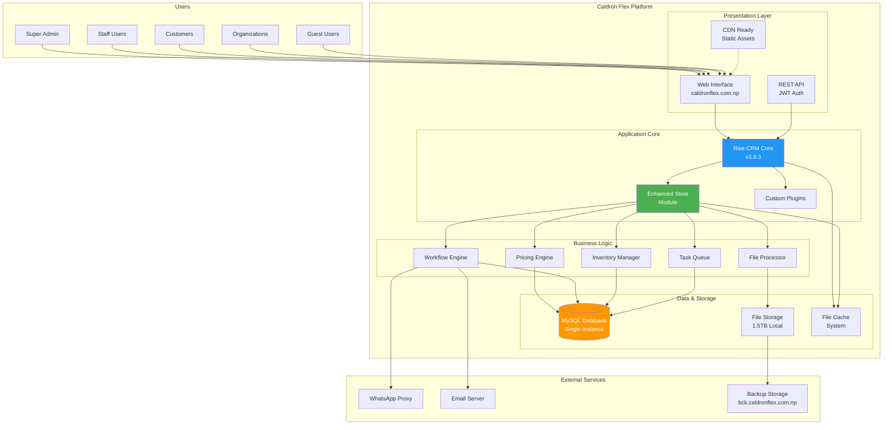

### Architectural Layers

1. **Presentation Layer**: Web UI and REST API endpoints
2. **Application Layer**: Rise CRM core with enhanced Store module
3. **Business Logic Layer**: Domain-specific processing engines
4. **Data Layer**: MySQL database and file storage
5. **Integration Layer**: External service connectors
6. **Infrastructure Layer**: Dedicated server hosting environment

---

## 3. Technical Architecture Components

### 3.1 Frontend Architecture (MVC Pattern)

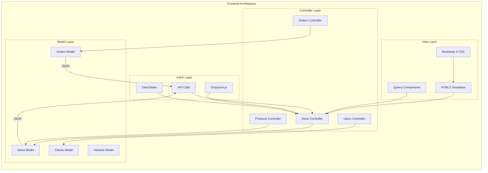

### 3.2 Backend Architecture (CodeIgniter 4)

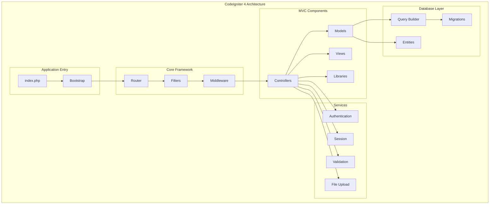

### 3.3 Database Architecture

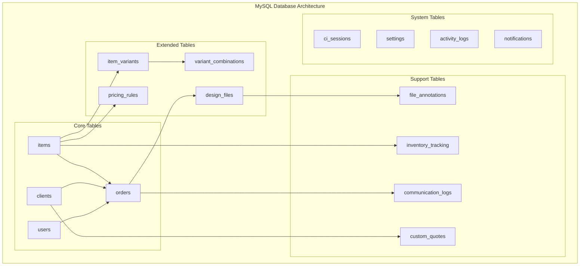

### 3.4 API Architecture (REST)

```mermaid
graph LR
    subgraph "REST API Architecture"
        subgraph "API Gateway"
            ROUTE[API Router]
            AUTH_MW[JWT Middleware]
            RATE[Rate Limiter]
            CORS[CORS Handler]
        end
        
        subgraph "API Endpoints"
            subgraph "v1"
                PROD[/products]
                ORD[/orders]
                USR[/users]
                FILE[/files]
                INV[/inventory]
            end
        end
        
        subgraph "Response Format"
            JSON[JSON Response]
            HAL[HAL+JSON]
            ERROR[Error Handler]
        end
    end
    
    ROUTE --> AUTH_MW
    AUTH_MW --> RATE
    RATE --> CORS
    
    CORS --> PROD
    CORS --> ORD
    CORS --> USR
    CORS --> FILE
    CORS --> INV
    
    PROD --> JSON
    ORD --> JSON
    USR --> JSON
    FILE --> HAL
    INV --> JSON
    
    JSON --> ERROR
    HAL --> ERROR
```

### 3.5 File Storage Architecture

```mermaid
graph TB
    subgraph "File Storage Architecture (1.5TB)"
        subgraph "Directory Structure"
            ROOT[/files]
            ORDERS_DIR[/orders]
            DESIGNS[/designs]
            TEMPS[/temp]
            PROFILE[/profile_images]
            SYSTEM[/system]
        end
        
        subgraph "Order Files Organization"
            YEAR[/2025]
            MONTH[/07]
            ORDER[/order_12345]
            subgraph "File Types"
                ORIG[/originals]
                PROC[/processed]
                THUMB[/thumbnails]
                PROOF[/proofs]
            end
        end
        
        subgraph "CDN Ready Structure"
            STATIC[/static]
            ASSETS[/assets]
            MEDIA[/media]
            CDN_CACHE[/cdn-cache]
        end
    end
    
    ROOT --> ORDERS_DIR
    ROOT --> DESIGNS
    ROOT --> TEMPS
    ROOT --> PROFILE
    ROOT --> SYSTEM
    
    ORDERS_DIR --> YEAR
    YEAR --> MONTH
    MONTH --> ORDER
    ORDER --> ORIG
    ORDER --> PROC
    ORDER --> THUMB
    ORDER --> PROOF
    
    ROOT --> STATIC
    STATIC --> ASSETS
    STATIC --> MEDIA
    STATIC --> CDN_CACHE
```

### 3.6 Caching Architecture (File-Based)

```mermaid
graph LR
    subgraph "File-Based Cache System"
        subgraph "Cache Types"
            PAGE[Page Cache<br/>1 hour TTL]
            QUERY[Query Cache<br/>5 min TTL]
            SESS[Session Cache<br/>30 min TTL]
            IMG[Image Cache<br/>24 hour TTL]
        end
        
        subgraph "Cache Storage"
            CACHE_DIR[/cache]
            PAGES[/pages]
            DATA[/data]
            IMAGES[/images]
            TEMP[/temp]
        end
        
        subgraph "Cache Strategy"
            LRU[LRU Eviction]
            TTL[TTL Based]
            SIZE[Size Limits]
            PURGE[Manual Purge]
        end
    end
    
    PAGE --> PAGES
    QUERY --> DATA
    SESS --> DATA
    IMG --> IMAGES
    
    CACHE_DIR --> PAGES
    CACHE_DIR --> DATA
    CACHE_DIR --> IMAGES
    CACHE_DIR --> TEMP
    
    LRU --> CACHE_DIR
    TTL --> CACHE_DIR
    SIZE --> CACHE_DIR
    PURGE --> CACHE_DIR
```

---

## 4. System Context Diagram

### C4 Model - Level 1: System Context

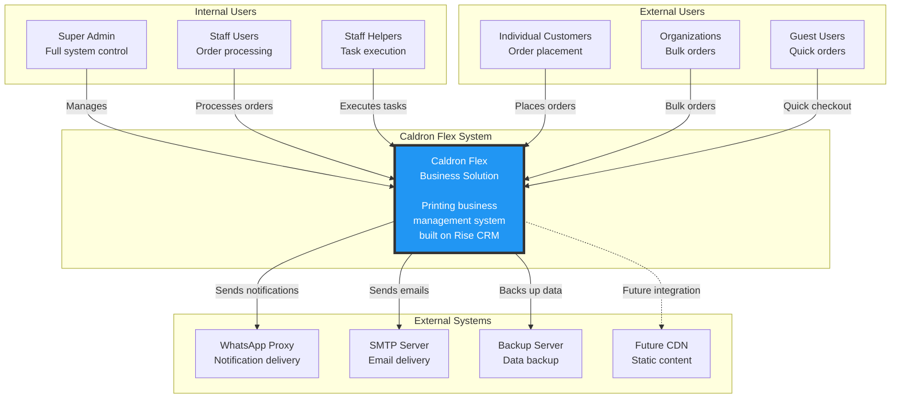

---

## 5. Container Diagram

### C4 Model - Level 2: Container View

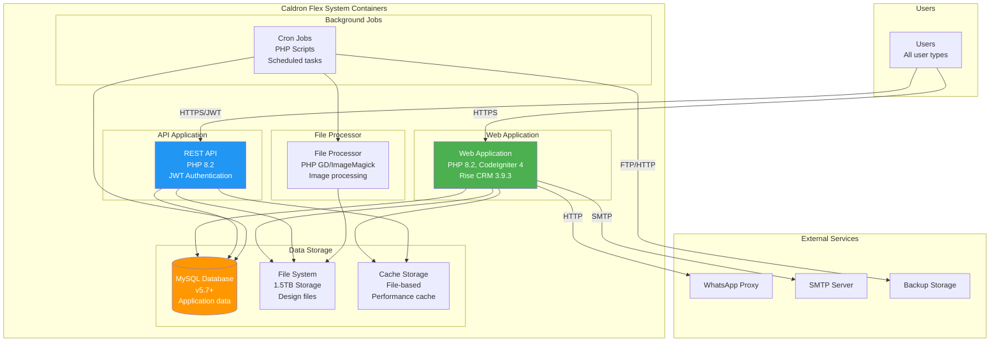

---

## 6. Component Diagrams

### 6.1 Store Module Components

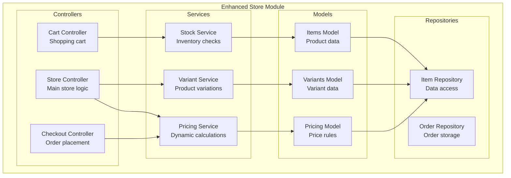

### 6.2 Order Management Components

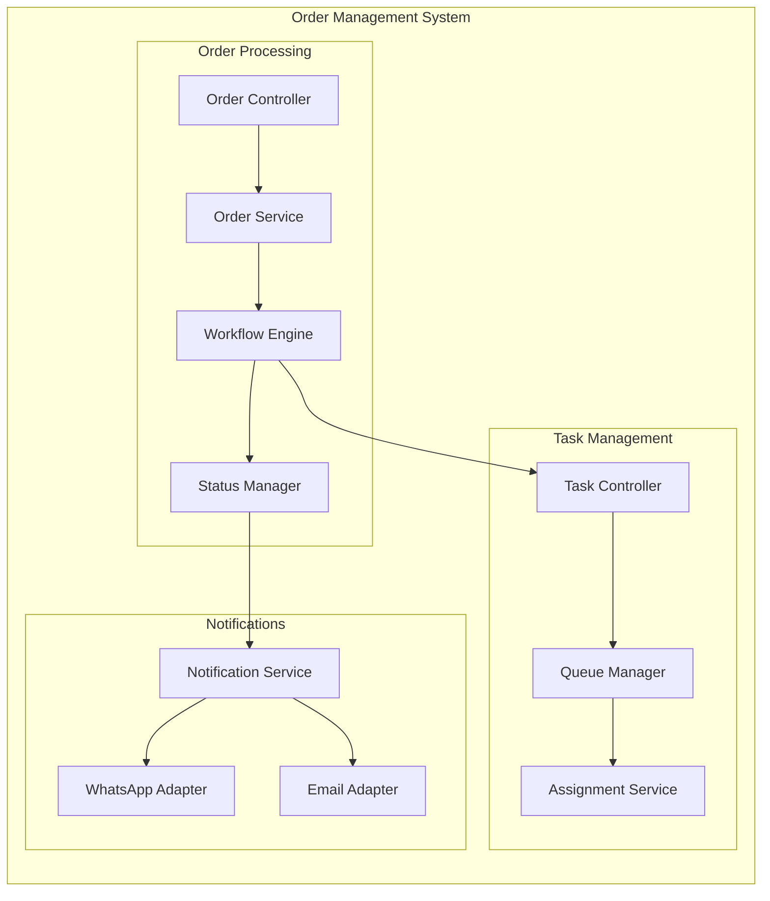

### 6.3 File Management Components

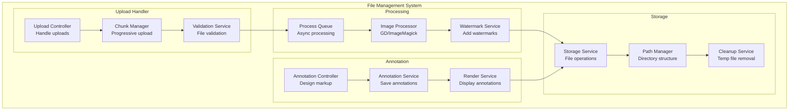

---

## 7. Database Architecture

### 7.1 Entity Relationship Diagram (ERD)

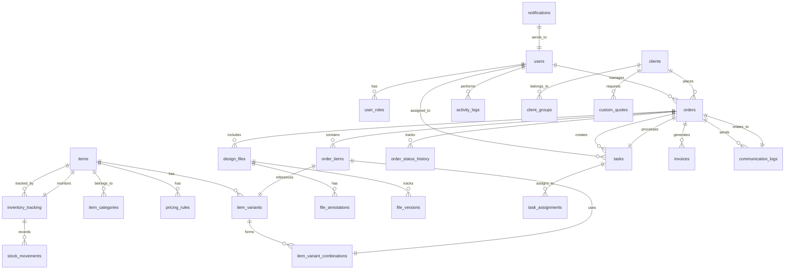

### 7.2 Key Table Schemas

#### Enhanced Tables

```sql
-- Enhanced items table for printing products
ALTER TABLE items ADD COLUMN has_variants BOOLEAN DEFAULT FALSE;
ALTER TABLE items ADD COLUMN pricing_type ENUM('fixed', 'area_based', 'custom') DEFAULT 'fixed';
ALTER TABLE items ADD COLUMN base_price DECIMAL(10,2);
ALTER TABLE items ADD COLUMN price_per_sqft DECIMAL(10,2);
ALTER TABLE items ADD COLUMN min_order_quantity INT DEFAULT 1;
ALTER TABLE items ADD COLUMN max_file_size INT DEFAULT 524288000; -- 500MB
ALTER TABLE items ADD COLUMN allowed_file_types TEXT;
ALTER TABLE items ADD COLUMN production_time_days INT DEFAULT 2;

-- Enhanced orders table
ALTER TABLE orders ADD COLUMN rush_order BOOLEAN DEFAULT FALSE;
ALTER TABLE orders ADD COLUMN deadline_date DATE NULL;
ALTER TABLE orders ADD COLUMN design_status ENUM('pending', 'in_review', 'approved', 'revision_requested') DEFAULT 'pending';
ALTER TABLE orders ADD COLUMN revision_count INT DEFAULT 0;
ALTER TABLE orders ADD COLUMN production_notes TEXT;
ALTER TABLE orders ADD COLUMN amount_paid DECIMAL(10,2) DEFAULT 0;
ALTER TABLE orders ADD COLUMN amount_remaining DECIMAL(10,2) DEFAULT 0;
```

#### New Tables for Printing Features

```sql
-- Product variants table
CREATE TABLE item_variants (
    id INT PRIMARY KEY AUTO_INCREMENT,
    item_id INT NOT NULL,
    variant_name VARCHAR(255),
    variant_type ENUM('size', 'material', 'finish', 'quality'),
    variant_value VARCHAR(255),
    price_modifier DECIMAL(10,2) DEFAULT 0,
    modifier_type ENUM('fixed', 'percentage') DEFAULT 'fixed',
    stock_quantity INT DEFAULT 0,
    sku VARCHAR(100) UNIQUE,
    sort_order INT DEFAULT 0,
    is_active BOOLEAN DEFAULT TRUE,
    created_at TIMESTAMP DEFAULT CURRENT_TIMESTAMP,
    updated_at TIMESTAMP DEFAULT CURRENT_TIMESTAMP ON UPDATE CURRENT_TIMESTAMP,
    FOREIGN KEY (item_id) REFERENCES items(id) ON DELETE CASCADE,
    INDEX idx_item_variants (item_id, variant_type)
);

-- Design files management
CREATE TABLE design_files (
    id INT PRIMARY KEY AUTO_INCREMENT,
    order_id INT NOT NULL,
    file_type ENUM('design', 'reference', 'proof'),
    original_filename VARCHAR(255),
    stored_filename VARCHAR(255) UNIQUE,
    file_extension VARCHAR(10),
    file_size BIGINT,
    mime_type VARCHAR(100),
    preview_filename VARCHAR(255),
    has_watermark BOOLEAN DEFAULT FALSE,
    annotations_data JSON,
    version_number INT DEFAULT 1,
    is_approved BOOLEAN DEFAULT FALSE,
    approved_by INT NULL,
    approved_at DATETIME NULL,
    status ENUM('uploaded', 'processing', 'ready', 'approved', 'rejected') DEFAULT 'uploaded',
    uploaded_by INT,
    upload_date TIMESTAMP DEFAULT CURRENT_TIMESTAMP,
    FOREIGN KEY (order_id) REFERENCES orders(id) ON DELETE CASCADE,
    FOREIGN KEY (uploaded_by) REFERENCES users(id),
    FOREIGN KEY (approved_by) REFERENCES users(id),
    INDEX idx_order_files (order_id, file_type),
    INDEX idx_file_status (status, upload_date)
);
```

---

## 8. Sequence Diagrams

### 8.1 Order Processing Workflow

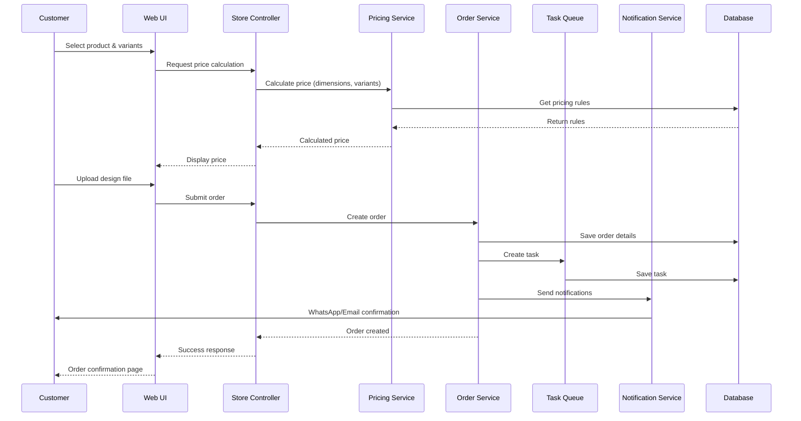

### 8.2 File Upload & Processing Flow

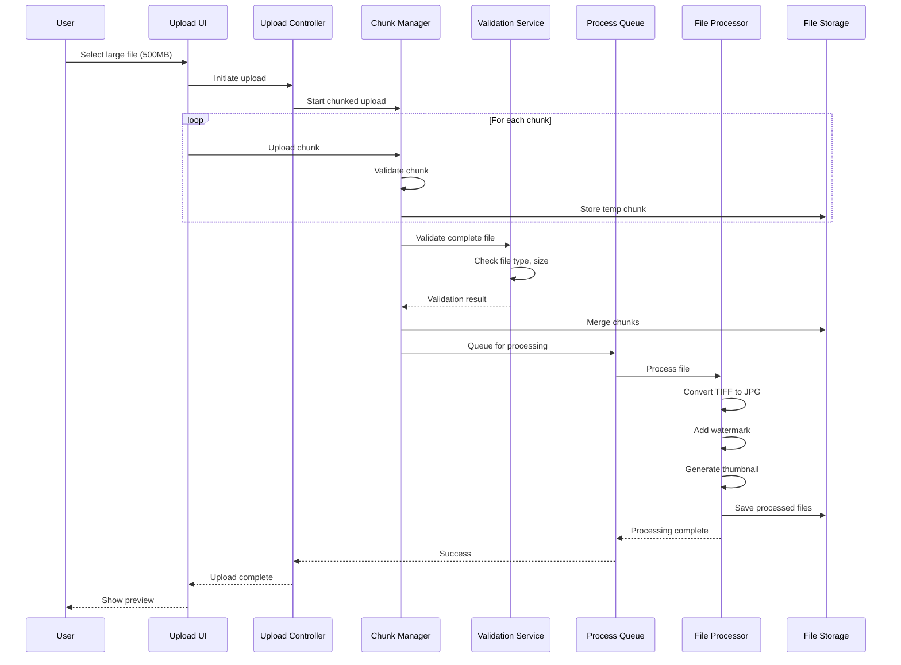

### 8.3 Dynamic Pricing Calculation

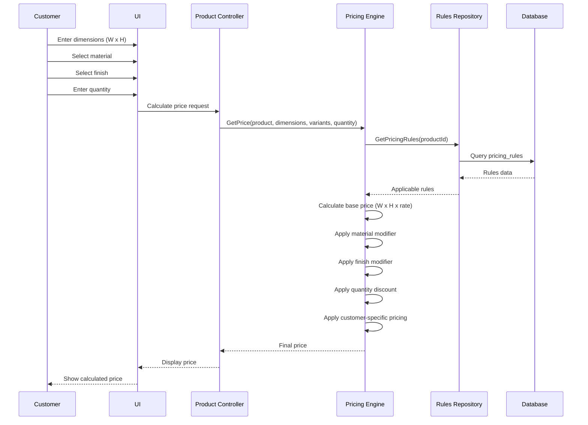

---

## 9. Deployment Architecture

### 9.1 Dedicated Server Deployment Diagram

```mermaid
graph TB
    subgraph "Dedicated Server Hosting Environment"
        subgraph "Web Server"
            APACHE[Apache 2.4<br/>mod_rewrite enabled]
            PHP[PHP 8.2 FPM<br/>Optimized memory_limit]
            HTACCESS[.htaccess<br/>URL routing]
        end
        
        subgraph "Application"
            RISE[Rise CRM Core<br/>/public_html]
            STORE[Enhanced Store<br/>/application/modules]
            PLUGINS[Custom Plugins<br/>/plugins]
        end
        
        subgraph "Database"
            MYSQL[MySQL 5.7<br/>Single database<br/>InnoDB engine]
        end
        
        subgraph "File Storage"
            FILES[/files<br/>1.5TB allocated]
            CACHE[/cache<br/>File-based cache]
            BACKUP[/backup<br/>Daily snapshots]
        end
        
        subgraph "Cron Jobs"
            CRON1[Backup Script<br/>Daily 2 AM]
            CRON2[Cache Cleanup<br/>Hourly]
            CRON3[Queue Processor<br/>Every 5 min]
        end
    end
    
    subgraph "DNS & SSL"
        DNS[DNS Records<br/>A: caldronflex.com.np<br/>CNAME: www, api]
        SSL[Let's Encrypt SSL<br/>Auto-renewal]
    end
    
    APACHE --> PHP
    PHP --> RISE
    RISE --> STORE
    RISE --> PLUGINS
    
    RISE --> MYSQL
    STORE --> MYSQL
    
    RISE --> FILES
    STORE --> FILES
    RISE --> CACHE
    
    CRON1 --> BACKUP
    CRON2 --> CACHE
    CRON3 --> MYSQL
    
    DNS --> APACHE
    SSL --> APACHE
```

### 9.2 Directory Structure

```
/home/caldronf/
├── public_html/                    # Document root
│   ├── index.php                   # Application entry
│   ├── .htaccess                   # Apache config
│   ├── assets/                     # Static assets
│   │   ├── css/
│   │   ├── js/
│   │   └── images/
│   ├── app/                        # Rise CRM application
│   │   ├── Controllers/
│   │   ├── Models/
│   │   ├── Views/
│   │   └── ThirdParty/
│   └── system/                     # CodeIgniter core
├── files/                          # File storage (outside web root)
│   ├── orders/
│   ├── designs/
│   ├── temp/
│   └── backups/
├── cache/                          # Cache directory
│   ├── pages/
│   ├── data/
│   └── sessions/
├── logs/                           # Application logs
├── cron/                           # Cron scripts
└── backups/                        # System backups
```

---

## 10. Integration Architecture

### 10.1 WhatsApp Integration

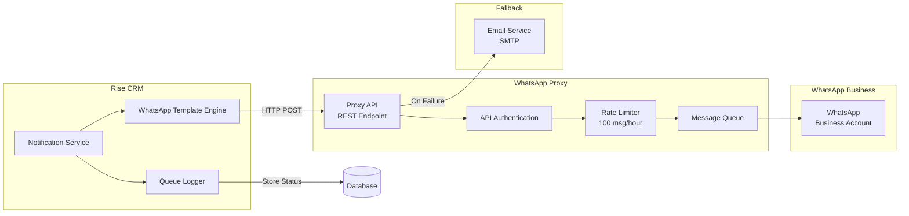

#### WhatsApp Integration Configuration

```php
// config/whatsapp.php
return [
    'proxy' => [
        'endpoint' => env('WHATSAPP_PROXY_URL'),
        'api_key' => env('WHATSAPP_API_KEY'),
        'timeout' => 30,
        'retry_attempts' => 3,
        'retry_delay' => 5 // seconds
    ],
    'templates' => [
        'order_confirmation' => [
            'id' => 'order_confirm_v1',
            'variables' => ['order_id', 'customer_name', 'total_amount']
        ],
        'design_ready' => [
            'id' => 'design_review_v1',
            'variables' => ['order_id', 'review_link']
        ]
    ],
    'rate_limits' => [
        'per_hour' => 100,
        'per_minute' => 10
    ],
    'fallback' => [
        'enabled' => true,
        'method' => 'email'
    ]
];
```

### 10.2 Email Integration

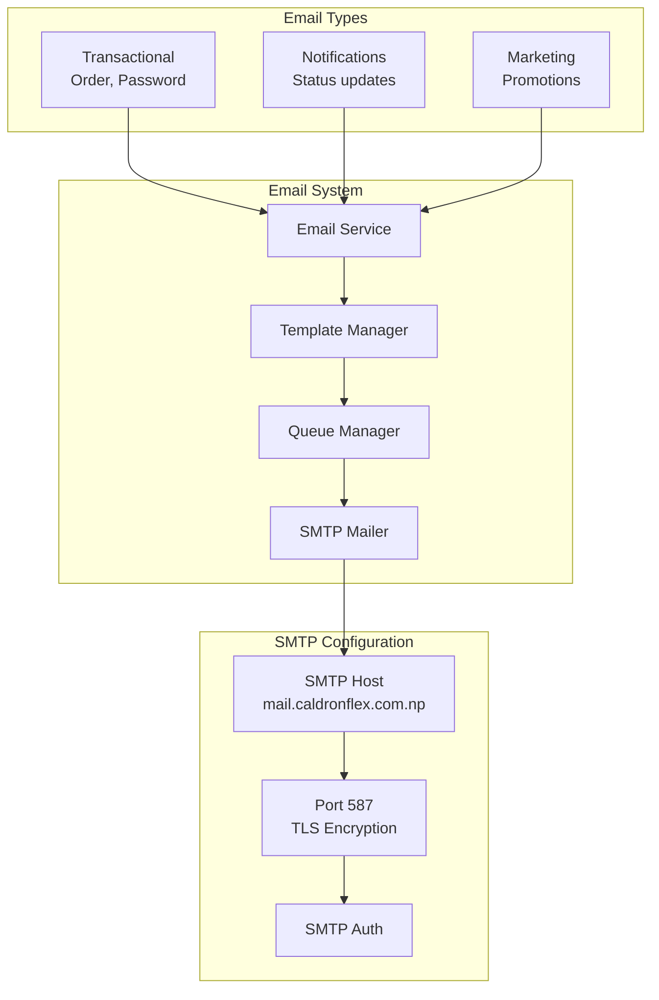

### 10.3 File Processing Integration

```mermaid
graph LR
    subgraph "File Processing Pipeline"
        INPUT[File Input<br/>TIFF/PSD/PDF]
        DETECT[Format Detector]
        CONV[Converter Service]
        PROC[Image Processor]
        OUTPUT[Processed Output<br/>JPG/PNG]
    end
    
    subgraph "Processing Tools"
        GD[PHP GD Library]
        IM[ImageMagick<br/>via exec()]
        PDF[PDF Library]
    end
    
    subgraph "Operations"
        RESIZE[Resize/Scale]
        WATER[Watermark]
        THUMB[Thumbnail]
        OPTIM[Optimize]
    end
    
    INPUT --> DETECT
    DETECT --> CONV
    CONV --> GD
    CONV --> IM
    CONV --> PDF
    
    GD --> PROC
    IM --> PROC
    PDF --> PROC
    
    PROC --> RESIZE
    PROC --> WATER
    PROC --> THUMB
    PROC --> OPTIM
    
    RESIZE --> OUTPUT
    WATER --> OUTPUT
    THUMB --> OUTPUT
    OPTIM --> OUTPUT
```

---

## 11. Security Architecture

### 11.1 Authentication & Authorization Flow

```mermaid
graph TB
    subgraph "Authentication Layer"
        subgraph "Web Authentication"
            LOGIN[Login Form]
            SESS_AUTH[Session Auth]
            COOKIE[Secure Cookie]
            CSRF[CSRF Token]
        end
        
        subgraph "API Authentication"
            API_LOGIN[API Login]
            JWT_GEN[JWT Generator]
            JWT_VAL[JWT Validator]
            REFRESH[Refresh Token]
        end
    end
    
    subgraph "Authorization Layer"
        RBAC[Role-Based Access]
        PERM[Permission Matrix]
        ACL[Access Control List]
    end
    
    subgraph "Security Middleware"
        AUTH_MW[Auth Middleware]
        RATE_MW[Rate Limiter]
        CORS_MW[CORS Handler]
        XSS_MW[XSS Protection]
    end
    
    LOGIN --> SESS_AUTH
    SESS_AUTH --> COOKIE
    COOKIE --> CSRF
    
    API_LOGIN --> JWT_GEN
    JWT_GEN --> JWT_VAL
    JWT_VAL --> REFRESH
    
    SESS_AUTH --> AUTH_MW
    JWT_VAL --> AUTH_MW
    
    AUTH_MW --> RBAC
    RBAC --> PERM
    PERM --> ACL
    
    AUTH_MW --> RATE_MW
    RATE_MW --> CORS_MW
    CORS_MW --> XSS_MW
```

### 11.2 Data Encryption Architecture

```mermaid
graph LR
    subgraph "Encryption Layers"
        subgraph "Data at Rest"
            PWD[Password Hashing<br/>bcrypt cost 12]
            FILE_ENC[File Encryption<br/>AES-256]
            DB_ENC[Database Fields<br/>AES-256]
        end
        
        subgraph "Data in Transit"
            HTTPS[HTTPS/TLS 1.3]
            API_ENC[API Encryption<br/>JWT + HTTPS]
            SMTP_TLS[SMTP TLS]
        end
        
        subgraph "Key Management"
            APP_KEY[Application Key<br/>ENV variable]
            API_KEY[API Keys<br/>Encrypted storage]
            SALT[Dynamic Salts]
        end
    end
    
    PWD --> APP_KEY
    FILE_ENC --> APP_KEY
    DB_ENC --> APP_KEY
    
    HTTPS --> API_ENC
    API_ENC --> API_KEY
    SMTP_TLS --> APP_KEY
    
    APP_KEY --> SALT
```

### 11.3 Access Control Design

```mermaid
graph TB
    subgraph "User Hierarchy"
        SA[Super Admin]
        ADMIN[Staff Admin]
        HELPER[Staff Helper]
        ORG_ADM[Org Admin]
        ORG_MEM[Org Member]
        CUST[Customer]
        GUEST[Guest]
    end
    
    subgraph "Permission Levels"
        FULL[Full Access]
        MANAGE[Management Access]
        OPERATE[Operational Access]
        VIEW[View Access]
        LIMITED[Limited Access]
    end
    
    subgraph "Resource Access"
        SYS[System Settings]
        USERS[User Management]
        PRODUCTS[Product Catalog]
        ORDERS[Order Processing]
        REPORTS[Reports & Analytics]
        FILES[File Management]
    end
    
    SA --> FULL
    ADMIN --> MANAGE
    HELPER --> OPERATE
    ORG_ADM --> MANAGE
    ORG_MEM --> VIEW
    CUST --> LIMITED
    GUEST --> LIMITED
    
    FULL --> SYS
    FULL --> USERS
    MANAGE --> PRODUCTS
    MANAGE --> ORDERS
    OPERATE --> ORDERS
    VIEW --> REPORTS
    LIMITED --> FILES
```

---

## 12. Performance Architecture

### 12.1 Optimization Strategy for Server Performance

```mermaid
graph TB
    subgraph "Memory Management"
        subgraph "PHP Memory"
            REQ_MEM[Request Memory<br/>256MB limit]
            UPLOAD_MEM[Upload Memory<br/>512MB for large files]
            SCRIPT_MEM[Script Memory<br/>Time limit: 300s]
        end
        
        subgraph "Cache Allocation"
            FILE_CACHE[File Cache<br/>500MB allocated]
            QUERY_CACHE[Query Cache<br/>200MB]
            OBJ_CACHE[Object Cache<br/>100MB]
        end
        
        subgraph "System Reserved"
            OS_MEM[OS & Services<br/>1GB reserved]
            MYSQL_MEM[MySQL Buffer<br/>800MB]
            APACHE_MEM[Apache Workers<br/>400MB]
        end
    end
    
    REQ_MEM --> |Dynamic| SCRIPT_MEM
    UPLOAD_MEM --> |On demand| SCRIPT_MEM
    
    FILE_CACHE --> |LRU eviction| OBJ_CACHE
    QUERY_CACHE --> |TTL based| OBJ_CACHE
```

### 12.2 Database Optimization

```mermaid
graph LR
    subgraph "Query Optimization"
        INDEX[Strategic Indexing]
        QUERY_OPT[Query Optimization]
        LAZY[Lazy Loading]
        BATCH[Batch Operations]
    end
    
    subgraph "Connection Management"
        POOL[Connection Pool<br/>Max 20 connections]
        PERSIST[Persistent Connections]
        TIMEOUT[Query Timeout<br/>30 seconds]
    end
    
    subgraph "Data Optimization"
        PARTITION[Table Partitioning<br/>Orders by month]
        ARCHIVE[Data Archival<br/>After 1 year]
        COMPRESS[Data Compression]
    end
    
    INDEX --> QUERY_OPT
    QUERY_OPT --> LAZY
    LAZY --> BATCH
    
    POOL --> PERSIST
    PERSIST --> TIMEOUT
    
    PARTITION --> ARCHIVE
    ARCHIVE --> COMPRESS
```

### 12.3 Caching Strategy

```mermaid
graph TB
    subgraph "Multi-Level Cache"
        subgraph "L1: Browser Cache"
            STATIC[Static Assets<br/>1 year]
            IMG_CDN[Images<br/>30 days]
            CSS_JS[CSS/JS<br/>7 days]
        end
        
        subgraph "L2: Application Cache"
            PAGE_C[Page Cache<br/>1 hour]
            FRAG_C[Fragment Cache<br/>30 minutes]
            DATA_C[Data Cache<br/>5 minutes]
        end
        
        subgraph "L3: Database Cache"
            QUERY_C[Query Results<br/>5 minutes]
            META_C[Metadata<br/>1 hour]
            COUNT_C[Count Cache<br/>15 minutes]
        end
    end
    
    STATIC --> PAGE_C
    IMG_CDN --> FRAG_C
    CSS_JS --> DATA_C
    
    PAGE_C --> QUERY_C
    FRAG_C --> META_C
    DATA_C --> COUNT_C
```

---

## 13. Module-Specific Architecture

### 13.1 Product Variants System

```mermaid
graph TB
    subgraph "Variant Management Architecture"
        subgraph "Variant Engine"
            VAR_CTRL[Variant Controller]
            COMBO_GEN[Combination Generator]
            PRICE_CALC[Price Calculator]
            STOCK_CHECK[Stock Checker]
        end
        
        subgraph "Data Model"
            BASE_PROD[Base Product]
            VAR_TYPES[Variant Types<br/>Size, Material, Finish]
            VAR_VALUES[Variant Values]
            VAR_COMBO[Combinations]
        end
        
        subgraph "UI Components"
            VAR_SELECT[Variant Selector]
            PRICE_DISP[Price Display]
            AVAIL_IND[Availability Indicator]
        end
    end
    
    VAR_CTRL --> COMBO_GEN
    COMBO_GEN --> PRICE_CALC
    PRICE_CALC --> STOCK_CHECK
    
    BASE_PROD --> VAR_TYPES
    VAR_TYPES --> VAR_VALUES
    VAR_VALUES --> VAR_COMBO
    
    VAR_SELECT --> VAR_CTRL
    VAR_CTRL --> PRICE_DISP
    STOCK_CHECK --> AVAIL_IND
```

### 13.2 Dynamic Pricing Engine

```mermaid
graph LR
    subgraph "Pricing Engine Architecture"
        subgraph "Price Components"
            BASE[Base Price]
            AREA[Area Calculation<br/>W × H × Rate]
            MOD[Modifiers<br/>Material, Finish]
            DISC[Discounts<br/>Bulk, Customer]
        end
        
        subgraph "Rule Engine"
            RULE_EVAL[Rule Evaluator]
            PRIORITY[Priority Manager]
            CONFLICT[Conflict Resolver]
        end
        
        subgraph "Price Output"
            FINAL[Final Price]
            BREAKDOWN[Cost Breakdown]
            MARGIN[Margin Analysis]
        end
    end
    
    BASE --> AREA
    AREA --> MOD
    MOD --> DISC
    
    DISC --> RULE_EVAL
    RULE_EVAL --> PRIORITY
    PRIORITY --> CONFLICT
    
    CONFLICT --> FINAL
    FINAL --> BREAKDOWN
    BREAKDOWN --> MARGIN
```

### 13.3 Inventory Management

```mermaid
graph TB
    subgraph "Inventory Architecture"
        subgraph "Stock Tracking"
            RT_STOCK[Real-time Stock]
            RESERVE[Reservation System]
            MOVEMENT[Stock Movement]
            ALERTS[Low Stock Alerts]
        end
        
        subgraph "Inventory Operations"
            RECEIVE[Goods Receipt]
            ISSUE[Stock Issue]
            ADJUST[Adjustments]
            TRANSFER[Transfers]
        end
        
        subgraph "Reporting"
            LEVELS[Stock Levels]
            HISTORY[Movement History]
            FORECAST[Demand Forecast]
            REORDER[Reorder Points]
        end
    end
    
    RT_STOCK --> RESERVE
    RESERVE --> MOVEMENT
    MOVEMENT --> ALERTS
    
    RECEIVE --> RT_STOCK
    ISSUE --> RT_STOCK
    ADJUST --> RT_STOCK
    TRANSFER --> RT_STOCK
    
    RT_STOCK --> LEVELS
    MOVEMENT --> HISTORY
    HISTORY --> FORECAST
    FORECAST --> REORDER
```

### 13.4 File Management System

```mermaid
graph TB
    subgraph "File Management Architecture"
        subgraph "Upload Pipeline"
            CHUNK_UP[Chunked Upload<br/>Progressive]
            VALID[Validation<br/>Type, Size]
            VIRUS[Virus Scan<br/>ClamAV]
            STORE[Storage<br/>Organized paths]
        end
        
        subgraph "Processing Pipeline"
            QUEUE[Process Queue]
            CONVERT[Format Converter<br/>TIFF→JPG]
            OPTIMIZE[Optimizer<br/>Compression]
            WATERMARK[Watermarking]
        end
        
        subgraph "Access Control"
            PERM[Permissions]
            LINK_GEN[Secure Links]
            EXPIRE[Link Expiry]
            AUDIT[Access Audit]
        end
        
        subgraph "CDN Ready"
            CDN_SYNC[CDN Sync Ready]
            PURGE[Cache Purge]
            FALLBACK[Origin Fallback]
        end
    end
    
    CHUNK_UP --> VALID
    VALID --> VIRUS
    VIRUS --> STORE
    
    STORE --> QUEUE
    QUEUE --> CONVERT
    CONVERT --> OPTIMIZE
    OPTIMIZE --> WATERMARK
    
    STORE --> PERM
    PERM --> LINK_GEN
    LINK_GEN --> EXPIRE
    EXPIRE --> AUDIT
    
    WATERMARK --> CDN_SYNC
    CDN_SYNC --> PURGE
    PURGE --> FALLBACK
```

---

## 14. Technology Stack Details

### 14.1 Core Technologies

| Component | Technology | Version | Purpose |
|-----------|------------|---------|----------|
| **Language** | PHP | 8.2+ | Primary development language |
| **Framework** | CodeIgniter | 4.x | MVC framework (Rise CRM base) |
| **CRM Platform** | Rise CRM | 3.9.3 | Base business platform |
| **Database** | MySQL | 5.7+ | Data persistence |
| **Web Server** | Apache | 2.4 | HTTP server with mod_rewrite |
| **Cache** | File-based | - | Performance optimization |

### 14.2 Frontend Technologies

| Component | Technology | Version | Purpose |
|-----------|------------|---------|----------|
| **CSS Framework** | Bootstrap | 4.6 | Responsive UI framework |
| **JavaScript** | jQuery | 3.6 | DOM manipulation & AJAX |
| **File Upload** | Dropzone.js | 5.9 | Drag-drop file uploads |
| **Data Tables** | DataTables | 1.11 | Interactive tables |
| **Charts** | Chart.js | 3.7 | Data visualization |
| **Date Picker** | Bootstrap Datepicker | 1.9 | Date selection |
| **Select2** | Select2 | 4.1 | Enhanced select boxes |

### 14.3 Backend Libraries

| Component | Technology | Purpose |
|-----------|------------|----------|
| **Image Processing** | PHP GD | Image manipulation |
| **PDF Generation** | TCPDF | Invoice & report generation |
| **Email** | PHPMailer | SMTP email sending |
| **File Handling** | PHP FileInfo | MIME type detection |
| **JSON Processing** | PHP JSON | API data handling |
| **Session Management** | CI4 Session | User session handling |
| **Validation** | CI4 Validation | Input validation |

### 14.4 Development & Deployment Tools

| Tool | Purpose | Configuration |
|------|---------|---------------|
| **Version Control** | Git | GitHub/GitLab repository |
| **Dependency Manager** | Composer | PHP package management |
| **Asset Building** | Webpack | CSS/JS bundling (optional) |
| **Testing** | PHPUnit | Unit testing framework |
| **Code Quality** | PHP CodeSniffer | Coding standards |
| **Documentation** | phpDocumentor | API documentation |
| **Deployment** | Git Deployment | Version deployment |

### 14.5 Third-Party Services

| Service | Provider | Purpose |
|---------|----------|---------|
| **WhatsApp** | Proxy Service | Customer notifications |
| **SMTP** | Local/Gmail | Email delivery |
| **SSL** | Let's Encrypt | HTTPS encryption |
| **DNS** | Cloudflare | DNS management & basic CDN |
| **Backup** | Automated Backup | Automated backups |
| **Monitoring** | Custom/UptimeRobot | System monitoring |

### 14.6 Configuration Examples

#### PHP Configuration (php.ini)
```ini
memory_limit = 256M
upload_max_filesize = 500M
post_max_size = 500M
max_execution_time = 300
max_input_time = 300
session.gc_maxlifetime = 1800
```

#### Apache Configuration (.htaccess)
```apache
# Enable rewrite engine
RewriteEngine On

# Force HTTPS
RewriteCond %{HTTPS} off
RewriteRule ^(.*)$ https://%{HTTP_HOST}/$1 [R=301,L]

# CodeIgniter routing
RewriteCond %{REQUEST_FILENAME} !-f
RewriteCond %{REQUEST_FILENAME} !-d
RewriteRule ^(.*)$ index.php/$1 [L]

# Security headers
Header set X-Frame-Options "SAMEORIGIN"
Header set X-Content-Type-Options "nosniff"
Header set X-XSS-Protection "1; mode=block"

# Compression
<IfModule mod_deflate.c>
    AddOutputFilterByType DEFLATE text/plain
    AddOutputFilterByType DEFLATE text/html
    AddOutputFilterByType DEFLATE text/css
    AddOutputFilterByType DEFLATE application/javascript
</IfModule>

# Cache control
<IfModule mod_expires.c>
    ExpiresActive On
    ExpiresByType image/jpg "access plus 1 year"
    ExpiresByType image/png "access plus 1 year"
    ExpiresByType text/css "access plus 1 month"
    ExpiresByType application/javascript "access plus 1 month"
</IfModule>
```

---

## 15. Architectural Decisions

### 15.1 Key Design Decisions

| Decision | Choice | Rationale | Trade-offs |
|----------|--------|-----------|------------|
| **Architecture Pattern** | Monolithic with plugins | Maintains Rise CRM compatibility, simpler deployment | Less scalable than microservices |
| **File Storage** | Local with CDN prep | Cost-effective, immediate implementation | Manual scaling required |
| **Caching** | Advanced Caching | Optimized performance, scalable services | Configurable based on needs |
| **API Design** | REST with JWT | Industry standard, good tooling | Not as flexible as GraphQL |
| **Database** | Single MySQL instance | Hosting constraint, simpler management | No read replicas for scaling |
| **Security** | Hybrid (Session + JWT) | Web and API support | More complex than single approach |

### 15.2 Architectural Patterns

#### Pattern 1: Repository Pattern
```php
// Implementation example
interface OrderRepositoryInterface {
    public function find($id);
    public function findByStatus($status);
    public function save(Order $order);
}

class OrderRepository implements OrderRepositoryInterface {
    private $db;
    
    public function __construct($db) {
        $this->db = $db;
    }
    
    public function find($id) {
        return $this->db->table('orders')
                       ->where('id', $id)
                       ->first();
    }
}
```

#### Pattern 2: Service Layer
```php
// Business logic separation
class OrderService {
    private $orderRepo;
    private $notificationService;
    private $taskService;
    
    public function createOrder($data) {
        // Begin transaction
        $this->db->transStart();
        
        // Create order
        $order = $this->orderRepo->save($data);
        
        // Create task
        $this->taskService->createTask($order);
        
        // Send notification
        $this->notificationService->sendOrderConfirmation($order);
        
        // Commit transaction
        $this->db->transComplete();
        
        return $order;
    }
}
```

#### Pattern 3: Strategy Pattern for Pricing
```php
// Flexible pricing strategies
interface PricingStrategy {
    public function calculate($basePrice, $parameters);
}

class AreaBasedPricing implements PricingStrategy {
    public function calculate($basePrice, $parameters) {
        $area = $parameters['width'] * $parameters['height'];
        return $area * $basePrice;
    }
}

class FixedPricing implements PricingStrategy {
    public function calculate($basePrice, $parameters) {
        return $basePrice * $parameters['quantity'];
    }
}
```

### 15.3 Future Architecture Evolution

```mermaid
graph LR
    subgraph "Current: Monolithic"
        MONO[Single Application<br/>Rise CRM Enhanced]
    end
    
    subgraph "Phase 2: Modular"
        CORE[Rise CRM Core]
        MOD1[Store Module]
        MOD2[Task Module]
        MOD3[File Module]
    end
    
    subgraph "Phase 3: Distributed"
        API_GW[API Gateway]
        SVC1[Order Service]
        SVC2[File Service]
        SVC3[Notification Service]
        QUEUE[Message Queue]
    end
    
    MONO --> |Refactor| CORE
    MONO --> |Extract| MOD1
    MONO --> |Extract| MOD2
    MONO --> |Extract| MOD3
    
    CORE --> |Evolve| API_GW
    MOD1 --> |Convert| SVC1
    MOD2 --> |Convert| SVC2
    MOD3 --> |Convert| SVC3
    
    API_GW --> QUEUE
    SVC1 --> QUEUE
    SVC2 --> QUEUE
    SVC3 --> QUEUE
```

---

## Conclusion

This system architecture provides a comprehensive blueprint for the Caldron Flex Business Solution, balancing technical constraints with business requirements. The architecture is designed to:

1. **Maximize Performance** with dedicated server hosting and optimized resources
2. **Maintain Compatibility** with Rise CRM core while adding extensive functionality
3. **Enable Future Growth** through CDN-ready structures and clear evolution paths
4. **Ensure Security** with multiple layers of protection
5. **Support Scale** for 3x business growth without major restructuring

The modular design, plugin architecture, and clear separation of concerns ensure that the system can evolve as business needs change while maintaining stability and performance.

---

**Document Version**: 1.0  
**Last Updated**: July 23, 2025  
**Author**: Kilo Code