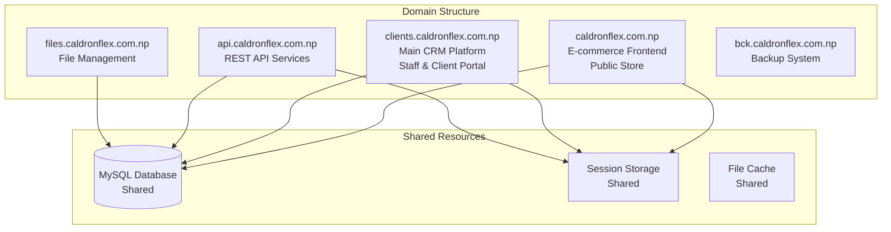

# Caldron Flex Project: Final Implementation Roadmap

## CRITICAL CLARIFICATION: Project Actual Status

### Current Reality (July 23, 2025)
- **Laravel React Starter Kit**: Foundation platform from https://github.com/laravel/react-starter-kit.git
- **Sprint Status**: NO sprints have been implemented yet
- **Documentation Status**: All files in .project_rules are REQUIREMENTS to be built, not completed work
- **Architecture Requirement**: Each subdomain needs separate PHP scripts

## Project Overview

### Business Context
Caldron Flex is a printing business that needs a comprehensive management system built on Laravel React Starter Kit. The system must handle:
- Product catalog with dynamic pricing
- Order processing with design workflow
- File management (up to 500MB files)
- Task queue system for staff
- WhatsApp integration
- Multi-subdomain architecture

### Technical Constraints
- **Hosting**: Dedicated server (with Docker support)
- **Database**: Single MySQL database
- **Storage**: 1.5TB capacity
- **Load**: 30 concurrent users, 6 daily orders
- **File Size**: Support up to 500MB uploads

## REVISED Subdomain Architecture Plan



## Implementation Priorities (Starting from Zero)

### Phase 1: Foundation Setup (Week 1-2)

#### Sprint 2 Implementation (PRIORITY 1)
All Sprint 2 tasks need to be implemented first as they form the foundation:

1. **CFBS-009**: Create variant database schema (5 SP)
   - Tables: item_variants, item_variant_combinations, variant_price_history
   - Migration files in app/Database/Migrations/

2. **CFBS-010**: Extend Items model for variant support (8 SP)
   - Create Variants_model.php
   - Extend Items_model.php with variant methods

3. **CFBS-011**: Update Store controller for variant selection UI (8 SP)
   - Create Item_variants.php controller
   - Build views: index.php, modal_form.php, variant_selector.php
   - Create variants.js for frontend

4. **CFBS-012**: Implement area-based pricing calculations (8 SP)
   - Create area_calculator.js with visual input
   - Implement price_calculator.js for real-time calculations

5. **CFBS-013**: Create pricing rules engine (5 SP)
   - Build Pricing_engine.php library
   - Implement robust caching for optimal performance

6. **CFBS-014**: Add bulk discount calculations (3 SP)
   - Integrate quantity-based discounts
   - Add tier evaluation system

### Phase 2: Enhanced Features (Week 3-4)

#### Sprint 3 Implementation
Complete all pending Sprint 3 tasks:

1. **CFBS-015**: Custom dimension input for flex banners (5 SP)
2. **CFBS-016**: Material and finish selections (5 SP)
3. **CFBS-017**: Design file validation system (8 SP)
4. **CFBS-018**: Printing specifications capture (5 SP)
5. **CFBS-019**: Basic inventory tracking system (8 SP)
6. **CFBS-020**: Low stock alerts (5 SP)

#### Sprint 4 Implementation
File management system (already documented but not implemented):

1. **CFBS-019**: File management database migration (8 SP)
2. **CFBS-020**: Image Processing Service (13 SP)
3. **CFBS-021**: Chunked Upload Service (13 SP)
4. **CFBS-022**: File Management Models (8 SP)
5. **CFBS-023**: File management controllers (8 SP)
6. **CFBS-024**: Views and UI Components (13 SP)

## Subdomain Implementation Structure

### 1. E-commerce Frontend (caldronflex.com.np)
```
/htdocs/CaldronFlex.Com.np/
├── index.php              # Store entry point
├── bootstrap.php          # Load Laravel framework
├── config/
│   └── store.php         # Store-specific config
├── controllers/
│   ├── Store.php         # Public store controller
│   ├── Cart.php          # Shopping cart
│   ├── Checkout.php      # Order placement
│   └── Products.php      # Product browsing
├── views/
│   ├── store/            # Store templates
│   ├── cart/             # Cart views
│   └── checkout/         # Checkout views
└── .htaccess
```

### 2. Main CRM Platform (clients.caldronflex.com.np)
```
/htdocs/clients.CaldronFlex.Com.np/
├── index.php              # CRM entry point  
├── bootstrap.php          # Load framework
├── controllers/
│   ├── Dashboard.php      # Main dashboard
│   ├── Orders.php         # Order management
│   ├── Tasks.php          # Task queue
│   ├── Clients.php        # Client management
│   └── Reports.php        # Reporting
├── views/
│   ├── dashboard/         # Dashboard views
│   ├── orders/            # Order views
│   └── clients/           # Client views
└── .htaccess
```

### 3. API Services (api.caldronflex.com.np)
```
/htdocs/api.CaldronFlex.Com.np/
├── index.php              # API entry point
├── bootstrap.php          # Load framework
├── v1/
│   ├── products.php      # Product endpoints
│   ├── orders.php        # Order endpoints
│   ├── inventory.php     # Inventory endpoints
│   ├── files.php         # File endpoints
│   └── auth.php          # JWT authentication
├── middleware/
│   └── jwt.php           # JWT verification
└── .htaccess
```

### 4. File Management (files.caldronflex.com.np)
```
/htdocs/files.CaldronFlex.Com.np/
├── index.php              # File handler
├── upload.php             # Chunked upload handler
├── download.php           # Secure download
├── process.php            # Image processing
├── storage/               # File storage
│   ├── orders/
│   │   └── 2025/
│   │       └── 07/
│   ├── designs/
│   └── temp/
└── .htaccess
```

## Directory Structure for Each Subdomain

### Shared Components Setup
```php
// bootstrap.php - Common initialization for all subdomains
<?php
// Define subdomain constants
define('SUBDOMAIN', $_SERVER['HTTP_HOST']);
define('IS_STORE', SUBDOMAIN === 'caldronflex.com.np');
define('IS_CRM', SUBDOMAIN === 'clients.caldronflex.com.np');
define('IS_API', SUBDOMAIN === 'api.caldronflex.com.np');
define('IS_FILES', SUBDOMAIN === 'files.caldronflex.com.np');

// Load Laravel framework
require_once __DIR__ . '/../CaldronFlex.Com.np/vendor/autoload.php';
require_once __DIR__ . '/../CaldronFlex.Com.np/app/Config/Paths.php';

// Initialize CodeIgniter
$app = \Config\Services::codeigniter();
$app->initialize();

// Load database
$db = \Config\Database::connect();

// Configure session for cross-subdomain
ini_set('session.cookie_domain', '.caldronflex.com.np');
$session = \Config\Services::session();

// Load subdomain-specific configuration
if (IS_STORE) {
    require_once __DIR__ . '/config/store.php';
} elseif (IS_CRM) {
    require_once __DIR__ . '/config/crm.php';
} elseif (IS_API) {
    require_once __DIR__ . '/config/api.php';
}
```

## Implementation Tasks by Priority

### Immediate Actions (Week 1)

1. **Setup Subdomain Structure**
   - Create directories for each subdomain
   - Configure Apache virtual hosts
   - Setup cross-subdomain session handling
   - Configure shared authentication

2. **Database Schema Implementation**
   - Run Sprint 2 migrations
   - Create variant tables
   - Add pricing rules tables
   - Implement file management schema

3. **Core Model Development**
   - Variants_model.php
   - Pricing_rules_model.php
   - Design_files_model.php
   - Extend existing Laravel models

### Short-term Goals (Week 2-3)

4. **Store Frontend Development** (caldronflex.com.np)
   - Public product browsing
   - Shopping cart functionality
   - Guest checkout process
   - Customer registration

5. **CRM Platform Development** (clients.caldronflex.com.np)
   - Staff dashboard
   - Order management interface
   - Task queue system
   - Client portal access

6. **API Development** (api.caldronflex.com.np)
   - Product endpoints
   - Order management APIs
   - Authentication system
   - File upload endpoints

### Medium-term Goals (Week 4-6)

7. **Integration Implementation**
   - WhatsApp proxy setup
   - Email notification system
   - Cross-subdomain authentication
   - File processing service

8. **Testing & Optimization**
   - Performance testing (30 users)
   - File upload testing (500MB)
   - Cross-subdomain sessions
   - Cache optimization

## Apache Virtual Host Configuration

### 1. E-commerce Frontend (caldronflex.com.np)
```apache
<VirtualHost *:80>
    ServerName caldronflex.com.np
    ServerAlias www.caldronflex.com.np
    DocumentRoot /home/caldron/public_html
    
    <Directory /home/caldron/public_html>
        Options -Indexes +FollowSymLinks
        AllowOverride All
        Require all granted
    </Directory>
    
    # PHP Configuration
    php_value upload_max_filesize 500M
    php_value post_max_size 500M
    php_value max_execution_time 300
    php_value memory_limit 512M
</VirtualHost>
```

### 2. CRM Platform (clients.caldronflex.com.np)
```apache
<VirtualHost *:80>
    ServerName clients.caldronflex.com.np
    DocumentRoot /home/caldron/clients_html
    
    <Directory /home/caldron/clients_html>
        Options -Indexes +FollowSymLinks
        AllowOverride All
        Require all granted
    </Directory>
</VirtualHost>
```

## Risk Mitigation Strategies

### Technical Risks

1. **Cross-Subdomain Sessions**
   - Risk: Session data not shared properly
   - Mitigation: Set session.cookie_domain = '.caldronflex.com.np'
   - Fallback: Implement SSO with JWT tokens

2. **Public Store Security**
   - Risk: Unauthorized access to CRM from store
   - Mitigation: Separate authentication systems
   - Fallback: IP-based access restrictions

3. **File Upload Performance**
   - Risk: 500MB uploads fail on public store
   - Mitigation: Chunked upload with progress
   - Fallback: Direct file upload to files subdomain

### Business Risks

1. **User Confusion**
   - Risk: Users confused by multiple URLs
   - Mitigation: Clear branding and navigation
   - Fallback: Unified login portal

2. **SEO Impact**
   - Risk: Main domain for e-commerce may affect SEO
   - Mitigation: Proper SEO optimization
   - Fallback: Consider store.caldronflex.com.np later

## Success Metrics

### Technical KPIs
- Page load time < 3 seconds
- File upload success rate > 99%
- System uptime > 99.5%
- Cross-subdomain auth success > 99.9%

### Business KPIs
- Order processing time: -50%
- Customer conversion rate: +25%
- Staff efficiency: +40%
- Daily order capacity: 18+ (3x current)

## Next Steps

1. **Immediate (Today)**
   - Create subdomain directories
   - Setup Apache virtual hosts
   - Configure session sharing

2. **This Week**
   - Implement Sprint 2 features
   - Build store frontend
   - Create CRM dashboard

3. **Next Week**
   - Complete Sprint 3 features
   - API development
   - WhatsApp integration

## Conclusion

This revised roadmap aligns with the corrected subdomain architecture:
- **caldronflex.com.np**: Public e-commerce store
- **clients.caldronflex.com.np**: CRM and client portal
- **api.caldronflex.com.np**: API services
- **files.caldronflex.com.np**: File management
- **bck.caldronflex.com.np**: Backup system

The separation provides clear distinction between public-facing store and internal CRM operations while maintaining shared resources and authentication where needed.

Key success factors:
- Implement subdomain architecture correctly from start
- Ensure proper session sharing across subdomains
- Focus on Sprint 2 foundation features first
- Test cross-subdomain functionality thoroughly
- Maintain security boundaries between public and private areas