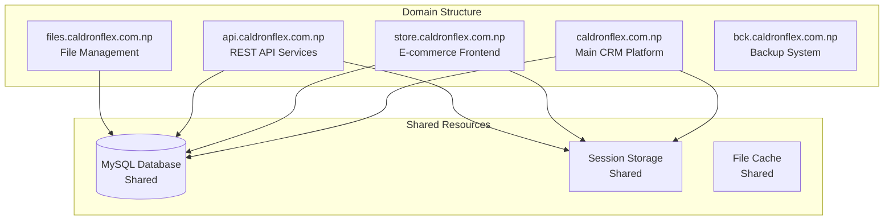

# Caldron Flex Project Implementation Roadmap

## CRITICAL CLARIFICATION: Project Actual Status

### Current Reality (July 23, 2025)
- **Laravel React Starter Kit**: Foundation platform from https://github.com/laravel/react-starter-kit.git
- **Sprint Status**: NO sprints have been implemented yet
- **Documentation Status**: All files in .project_rules are REQUIREMENTS to be built, not completed work
- **Architecture Requirement**: Each subdomain needs separate PHP scripts

## Project Overview

### Business Context
Caldron Flex is a printing business that needs a comprehensive management system built on Laravel React Starter Kit. The system must handle:
- Product catalog with dynamic pricing
- Order processing with design workflow
- File management (up to 500MB files)
- Task queue system for staff
- WhatsApp integration
- Multi-subdomain architecture

### Technical Constraints
- **Hosting**: Dedicated server (with Docker support)
- **Database**: Single MySQL database
- **Storage**: 1.5TB capacity
- **Load**: 30 concurrent users, 6 daily orders
- **File Size**: Support up to 500MB uploads

## Subdomain Architecture Plan



## Implementation Priorities (Starting from Zero)

### Phase 1: Foundation Setup (Week 1-2)

#### Sprint 2 Implementation (PRIORITY 1)
All Sprint 2 tasks need to be implemented first as they form the foundation:

1. **CFBS-009**: Create variant database schema (5 SP)
   - Tables: item_variants, item_variant_combinations, variant_price_history
   - Migration files in app/Database/Migrations/

2. **CFBS-010**: Extend Items model for variant support (8 SP)
   - Create Variants_model.php
   - Extend Items_model.php with variant methods

3. **CFBS-011**: Update Store controller for variant selection UI (8 SP)
   - Create Item_variants.php controller
   - Build views: index.php, modal_form.php, variant_selector.php
   - Create variants.js for frontend

4. **CFBS-012**: Implement area-based pricing calculations (8 SP)
   - Create area_calculator.js with visual input
   - Implement price_calculator.js for real-time calculations

5. **CFBS-013**: Create pricing rules engine (5 SP)
   - Build Pricing_engine.php library
   - Implement robust caching for optimal performance

6. **CFBS-014**: Add bulk discount calculations (3 SP)
   - Integrate quantity-based discounts
   - Add tier evaluation system

### Phase 2: Enhanced Features (Week 3-4)

#### Sprint 3 Implementation
Complete all pending Sprint 3 tasks:

1. **CFBS-015**: Custom dimension input for flex banners (5 SP)
2. **CFBS-016**: Material and finish selections (5 SP)
3. **CFBS-017**: Design file validation system (8 SP)
4. **CFBS-018**: Printing specifications capture (5 SP)
5. **CFBS-019**: Basic inventory tracking system (8 SP)
6. **CFBS-020**: Low stock alerts (5 SP)

#### Sprint 4 Implementation
File management system (already documented but not implemented):

1. **CFBS-019**: File management database migration (8 SP)
2. **CFBS-020**: Image Processing Service (13 SP)
3. **CFBS-021**: Chunked Upload Service (13 SP)
4. **CFBS-022**: File Management Models (8 SP)
5. **CFBS-023**: File management controllers (8 SP)
6. **CFBS-024**: Views and UI Components (13 SP)

## Subdomain Implementation Structure

### 1. Main CRM Platform (caldronflex.com.np)
```
/htdocs/CaldronFlex.Com.np/
├── app/                    # Laravel application
├── public/                 # Web root
│   └── index.php          # Main entry point
├── .env                   # Environment config
└── .htaccess             # URL rewriting
```

### 2. Store Frontend (store.caldronflex.com.np)
```
/htdocs/store.CaldronFlex.Com.np/
├── index.php              # Store entry point
├── bootstrap.php          # Load Laravel framework
├── config/
│   └── store.php         # Store-specific config
├── controllers/
│   └── StorePublic.php   # Public store controller
└── .htaccess
```

### 3. API Services (api.caldronflex.com.np)
```
/htdocs/api.CaldronFlex.Com.np/
├── index.php              # API entry point
├── bootstrap.php          # Load framework
├── v1/
│   ├── products.php      # Product endpoints
│   ├── orders.php        # Order endpoints
│   └── auth.php          # JWT authentication
└── .htaccess
```

### 4. File Management (files.caldronflex.com.np)
```
/htdocs/files.CaldronFlex.Com.np/
├── index.php              # File handler
├── upload.php             # Chunked upload handler
├── download.php           # Secure download
├── storage/               # File storage
│   ├── orders/
│   ├── designs/
│   └── temp/
└── .htaccess
```

## Directory Structure for Each Subdomain

### Shared Components Setup
```php
// bootstrap.php - Common initialization for all subdomains
<?php
// Load Laravel framework
require_once __DIR__ . '/../CaldronFlex.Com.np/vendor/autoload.php';
require_once __DIR__ . '/../CaldronFlex.Com.np/app/Config/Paths.php';

// Initialize CodeIgniter
$app = \Config\Services::codeigniter();
$app->initialize();

// Load database
$db = \Config\Database::connect();

// Session management
$session = \Config\Services::session();
```

## Implementation Tasks by Priority

### Immediate Actions (Week 1)

1. **Setup Subdomain Structure**
   - Create subdomain directories
   - Configure Apache/Nginx virtual hosts
   - Setup shared session handling
   - Configure cross-domain authentication

2. **Database Schema Implementation**
   - Run Sprint 2 migrations
   - Create variant tables
   - Add pricing rules tables
   - Implement file management schema

3. **Core Model Development**
   - Variants_model.php
   - Pricing_rules_model.php
   - Design_files_model.php
   - Extend existing Laravel models

### Short-term Goals (Week 2-3)

4. **Controller Implementation**
   - Store frontend controllers
   - API endpoints
   - File upload handlers
   - Admin management interfaces

5. **Frontend Development**
   - Variant selection UI
   - Dynamic pricing calculator
   - File upload interface
   - Design annotation system

6. **Integration Points**
   - WhatsApp proxy setup
   - Email notification templates
   - Task queue system
   - Inventory tracking

### Medium-term Goals (Week 4-6)

7. **Testing & Optimization**
   - Performance testing (30 users)
   - File upload testing (500MB)
   - Cross-subdomain authentication
   - Cache optimization

8. **Documentation & Training**
   - User manuals
   - Staff training materials
   - API documentation
   - System administration guide

## Risk Mitigation Strategies

### Technical Risks

1. **Subdomain Session Management**
   - Risk: Session data not shared across subdomains
   - Mitigation: Configure session.cookie_domain in PHP
   - Fallback: Implement JWT token-based auth

2. **File Upload Performance**
   - Risk: 500MB uploads optimized for server performance
   - Mitigation: Chunked upload implementation
   - Fallback: FTP upload for large files

3. **Database Performance**
   - Risk: Single DB bottleneck with multiple subdomains
   - Mitigation: Query optimization and caching
   - Fallback: Read replicas if needed

### Business Risks

1. **Development Timeline**
   - Risk: 6-week timeline may be aggressive
   - Mitigation: Prioritize core features (MVP)
   - Fallback: Phase 2 for non-critical features

2. **User Adoption**
   - Risk: Complex system for staff
   - Mitigation: Gradual rollout by department
   - Fallback: Maintain manual processes initially

## Success Metrics

### Technical KPIs
- Page load time < 3 seconds
- File upload success rate > 99%
- System uptime > 99.5%
- Concurrent user support: 30+

### Business KPIs
- Order processing time: -50%
- Design revision cycles: -40%
- Customer satisfaction: >95%
- Daily order capacity: 18+ (3x current)

## Next Steps

1. **Immediate (Today)**
   - Create subdomain directories
   - Setup development environment
   - Begin Sprint 2 database migrations

2. **This Week**
   - Implement variant system
   - Build pricing engine
   - Create file upload infrastructure

3. **Next Week**
   - Complete Sprint 3 features
   - Begin WhatsApp integration
   - Start user training preparation

## Conclusion

This roadmap provides a realistic path from the current state (Laravel React Starter Kit foundation) to a fully functional printing business management system. The modern architecture ensures scalability while the phased approach minimizes risk.

Key success factors:
- Start with Sprint 2 foundation features
- Implement subdomain architecture early
- Focus on core workflow first
- Test thoroughly with real scenarios
- Train staff incrementally