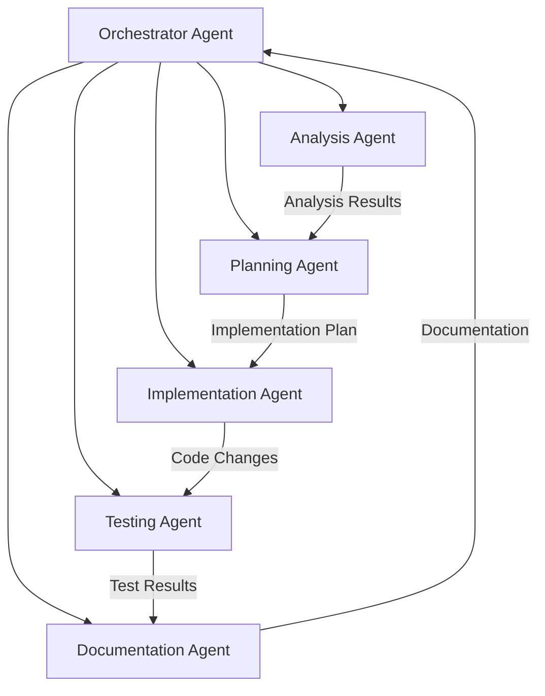
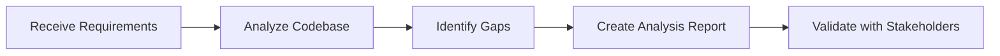
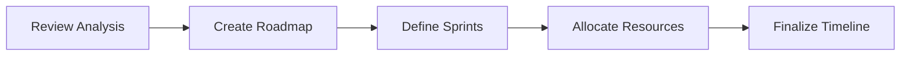
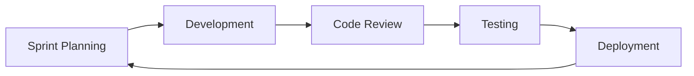

# Sub-Agent Architecture for Origin Alpha Management System

## Overview

This document defines the sub-agent architecture for analyzing, planning, and implementing the Origin Alpha Management System. Each agent has specific responsibilities and works collaboratively to deliver a comprehensive solution.

## Agent Hierarchy



## Agent Definitions

### 1. Orchestrator Agent (Ultra-Think)

**Purpose:** Coordinate all sub-agents and manage the overall workflow.

**Responsibilities:**
- Task distribution and prioritization
- Agent coordination and communication
- Progress tracking and reporting
- Decision making on architecture choices
- Quality assurance oversight

**Input:** Business requirements, project goals
**Output:** Coordinated project delivery

**Implementation Plan:**
```markdown
## Orchestrator Tasks
- [ ] Initialize project structure
- [ ] Define agent communication protocols
- [ ] Set up task queue system
- [ ] Implement progress tracking
- [ ] Create decision logging system
```

### 2. Analysis Agent

**Purpose:** Analyze existing codebase, requirements, and business needs.

**Responsibilities:**
- Requirement analysis and validation
- Codebase assessment
- Technology stack evaluation
- Gap analysis
- Risk assessment
- Performance analysis

**Input:** Raw PRD files, existing code, business documents
**Output:** Detailed analysis reports in .md format

**Analysis Framework:**
```markdown
## Analysis Checklist
1. Business Requirements
   - [ ] Core features identified
   - [ ] User stories documented
   - [ ] Acceptance criteria defined

2. Technical Requirements
   - [ ] Architecture patterns identified
   - [ ] Integration points mapped
   - [ ] Security requirements documented

3. Gap Analysis
   - [ ] Missing features listed
   - [ ] Technical debt identified
   - [ ] Migration requirements noted
```

### 3. Planning Agent

**Purpose:** Create detailed implementation plans based on analysis results.

**Responsibilities:**
- Sprint planning
- Task breakdown
- Resource allocation
- Timeline estimation
- Dependency mapping
- Risk mitigation planning

**Input:** Analysis reports
**Output:** Implementation roadmaps, sprint plans

**Planning Template:**
```markdown
## Sprint Plan Template
### Sprint Goal
[Define clear sprint objective]

### User Stories
- [ ] Story 1: As a [user], I want [feature] so that [benefit]
  - Task 1.1: [Technical task]
  - Task 1.2: [Technical task]

### Dependencies
- External: [List external dependencies]
- Internal: [List internal dependencies]

### Timeline
- Start: [Date]
- End: [Date]
- Milestones: [Key dates]
```

### 4. Implementation Agent

**Purpose:** Execute the implementation plan and develop code.

**Responsibilities:**
- Code generation
- API development
- Database schema implementation
- Frontend development
- Integration implementation
- Code optimization

**Input:** Implementation plans, technical specifications
**Output:** Working code, API endpoints, database schemas

**Implementation Standards:**
```php
// Laravel Controller Example
class OrderController extends Controller
{
    /**
     * Implementation follows:
     * - RESTful conventions
     * - Repository pattern
     * - Service layer architecture
     * - Request validation
     * - Response transformation
     */
}
```

### 5. Testing Agent

**Purpose:** Ensure code quality and functionality through comprehensive testing.

**Responsibilities:**
- Unit test creation
- Integration testing
- Performance testing
- Security testing
- User acceptance testing
- Test automation

**Input:** Implemented code
**Output:** Test reports, coverage reports

**Testing Strategy:**
```markdown
## Test Coverage Requirements
- Unit Tests: 80% minimum
- Integration Tests: Critical paths
- E2E Tests: User workflows
- Performance: Response time < 200ms
- Security: OWASP compliance
```

### 6. Documentation Agent

**Purpose:** Create and maintain comprehensive documentation.

**Responsibilities:**
- API documentation
- User guides
- Technical documentation
- Architecture diagrams
- Deployment guides
- Change logs

**Input:** Code, test results, implementation details
**Output:** Complete documentation suite

**Documentation Structure:**
```markdown
## Documentation Hierarchy
/docs
  /api           - API specifications
  /architecture  - System architecture
  /deployment    - Deployment guides
  /user-guide    - End-user documentation
  /development   - Developer guides
  /testing       - Test documentation
```

## Agent Communication Protocol

### Message Format
```json
{
  "agent_id": "analyzer_001",
  "timestamp": "2025-10-02T10:00:00Z",
  "message_type": "task_complete",
  "payload": {
    "task_id": "TASK-001",
    "status": "completed",
    "output_location": "/analysis/task-001-results.md",
    "next_agent": "planner_001"
  }
}
```

### Task Queue System
```yaml
queue:
  high_priority:
    - critical_bug_fixes
    - security_patches
    - production_issues
  
  medium_priority:
    - feature_development
    - performance_optimization
    - refactoring
  
  low_priority:
    - documentation_updates
    - code_cleanup
    - nice_to_have_features
```

## Workflow Execution

### Phase 1: Analysis (Week 1-2)


### Phase 2: Planning (Week 3)


### Phase 3: Implementation (Week 4-12)


## Data Storage Structure

```
/Origin-Alpha-Management-System
  /.Raw-PRD
    /sub-agents
      /orchestrator
        - decisions.md
        - progress.md
      /analyzer
        - business-analysis.md
        - technical-analysis.md
        - gap-analysis.md
      /planner
        - roadmap.md
        - sprint-plans.md
        - resource-allocation.md
      /implementer
        - implementation-log.md
        - code-standards.md
      /tester
        - test-results.md
        - coverage-reports.md
      /documenter
        - api-docs.md
        - user-guides.md
```

## Success Metrics

### Orchestrator
- Task completion rate: > 95%
- On-time delivery: > 90%
- Quality score: > 8/10

### Analyzer
- Requirement coverage: 100%
- Analysis accuracy: > 95%
- Gap identification: Complete

### Planner
- Sprint velocity accuracy: ±10%
- Resource utilization: > 80%
- Dependency resolution: 100%

### Implementer
- Code quality score: > 8/10
- Bug rate: < 5 per sprint
- Performance targets: Met

### Tester
- Test coverage: > 80%
- Bug detection rate: > 90%
- Automation coverage: > 70%

### Documenter
- Documentation completeness: 100%
- Update frequency: Every sprint
- User satisfaction: > 8/10

## Integration Points

### External Systems
- Version Control: Git
- CI/CD: GitHub Actions / GitLab CI
- Project Management: Integrated task tracking
- Communication: Webhook notifications

### Internal Systems
- Database: PostgreSQL
- Cache: Redis
- Queue: Laravel Horizon
- Storage: S3/Local

## Risk Management

### Identified Risks
1. **Communication Breakdown**
   - Mitigation: Clear protocols, regular sync
   
2. **Task Dependencies**
   - Mitigation: Dependency mapping, buffer time

3. **Quality Issues**
   - Mitigation: Automated testing, code review

4. **Timeline Slippage**
   - Mitigation: Agile approach, regular monitoring

## Conclusion

This sub-agent architecture provides a structured approach to building the Origin Alpha Management System. Each agent has clear responsibilities and works within a coordinated framework to deliver high-quality results efficiently.
