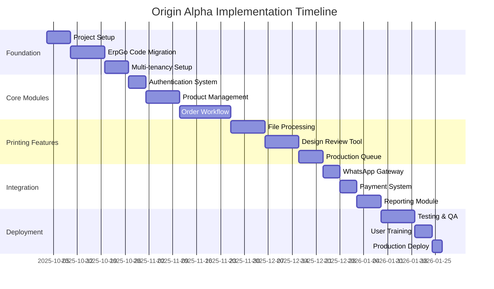

# Implementation Roadmap - Origin Alpha Management System
**Agent:** Planning Agent
**Date:** October 2, 2025
**Status:** Active

## Executive Summary

This roadmap outlines the implementation strategy for Origin Alpha Management System, leveraging ErpGo Saas components with 60% code reusability while building custom printing-specific features.

## 1. Project Timeline Overview



## 2. Sprint Planning

### Sprint 0: Foundation (Week 1-2)
**Goal:** Set up development environment and migrate ErpGo foundation

#### Tasks
```markdown
- [ ] Initialize Laravel 11 project
- [ ] Set up Docker development environment
- [ ] Configure PostgreSQL database
- [ ] Install Redis and configure queues
- [ ] Migrate ErpGo authentication module
- [ ] Set up React frontend scaffold
- [ ] Configure CI/CD pipeline
- [ ] Create project documentation structure
```

#### Deliverables
- Working development environment
- Basic authentication system
- API structure defined
- Documentation framework

### Sprint 1: Multi-Tenancy (Week 3-4)
**Goal:** Implement multi-tenant architecture

#### Tasks
```markdown
- [ ] Implement tenant identification system
- [ ] Create tenant database isolation
- [ ] Build tenant management interface
- [ ] Configure subdomain routing
- [ ] Implement tenant-specific storage
- [ ] Create tenant onboarding flow
- [ ] Add tenant switching for super admin
- [ ] Test tenant isolation
```

#### ErpGo Components to Adapt
```php
// Multi-company system from ErpGo
App\Models\Company → App\Models\Tenant
App\Http\Middleware\CompanyMiddleware → App\Http\Middleware\TenantMiddleware

// Enhance with proper isolation
- Database per tenant
- Separate file storage
- Redis key prefixing
```

### Sprint 2: Product & Pricing (Week 5-6)
**Goal:** Build comprehensive product management with dynamic pricing

#### Tasks
```markdown
- [ ] Migrate ErpGo product module (70% reuse)
- [ ] Add variant pricing system
- [ ] Implement bundle configuration
- [ ] Create dynamic pricing engine
- [ ] Add seasonal discount management
- [ ] Build product catalog API
- [ ] Create React product management UI
- [ ] Implement price override permissions
```

#### Code Reuse Strategy
```php
// From ErpGo
Modules\Product\Models\Product
Modules\Product\Controllers\ProductController

// Custom additions
- VariantPricing model
- BundleConfiguration model
- PricingEngine service
- SeasonalDiscount model
```

### Sprint 3: Order Workflow Engine (Week 7-9)
**Goal:** Implement printing-specific order workflow

#### Tasks
```markdown
- [ ] Design state machine for order workflow
- [ ] Adapt ErpGo order module (40% reuse)
- [ ] Implement task queue system
- [ ] Create priority management
- [ ] Build status automation
- [ ] Add deadline tracking
- [ ] Implement staff claiming mechanism
- [ ] Create order tracking API
- [ ] Build React order management UI
```

#### Workflow States
```yaml
States:
  - submitted: Initial order submission
  - queued: In task queue
  - claimed: Staff claimed task
  - designing: Design in progress
  - review: Client review
  - corrections: Corrections needed
  - approved: Design approved
  - production: In production
  - completed: Ready for collection
  - delivered: Order delivered
  - invoiced: Invoice generated
  - paid: Payment received

Transitions:
  - submit → queue
  - queue → claim
  - claim → design
  - design → review
  - review → approve|corrections
  - corrections → design
  - approve → production
  - production → complete
  - complete → deliver
  - deliver → invoice
  - invoice → paid
```

### Sprint 4: File Processing System (Week 10-11)
**Goal:** Build robust file handling with format conversion

#### Tasks
```markdown
- [ ] Implement chunked file upload
- [ ] Create TIFF to JPG converter
- [ ] Add watermarking system
- [ ] Build progressive upload handler
- [ ] Implement file versioning
- [ ] Create CDN integration
- [ ] Add virus scanning
- [ ] Build file preview generator
- [ ] Create file management API
```

#### Technical Implementation
```php
// File processing pipeline
class FileProcessor {
    public function process(UploadedFile $file) {
        // 1. Validate file
        // 2. Scan for viruses
        // 3. Store original
        // 4. Generate preview
        // 5. Apply watermark
        // 6. Upload to CDN
        // 7. Create database record
    }
}
```

### Sprint 5: Design Review System (Week 12-13)
**Goal:** Create annotation and correction tracking system

#### Tasks
```markdown
- [ ] Build canvas-based annotation tool
- [ ] Implement comment system
- [ ] Create correction tracking
- [ ] Add version comparison
- [ ] Build approval workflow
- [ ] Implement revision limits
- [ ] Create notification system
- [ ] Build React design review UI
```

#### Frontend Architecture
```typescript
// React components structure
components/
  DesignCanvas/
    AnnotationLayer.tsx
    CommentPin.tsx
    DrawingTools.tsx
  VersionControl/
    VersionList.tsx
    VersionCompare.tsx
  ApprovalFlow/
    ApprovalButton.tsx
    RevisionCounter.tsx
```

### Sprint 6: Production Management (Week 14)
**Goal:** Implement production queue and tracking

#### Tasks
```markdown
- [ ] Create production queue system
- [ ] Build machine allocation
- [ ] Implement resource scheduling
- [ ] Add production status tracking
- [ ] Create completion notifications
- [ ] Build production dashboard
- [ ] Add quality checkpoints
- [ ] Implement production reports
```

### Sprint 7: Communication Integration (Week 15)
**Goal:** Integrate WhatsApp and email notifications

#### Tasks
```markdown
- [ ] Set up WhatsApp Business API
- [ ] Create message templates
- [ ] Implement fallback to email
- [ ] Build notification preferences
- [ ] Create status update triggers
- [ ] Add bulk messaging
- [ ] Implement delivery tracking
- [ ] Test notification flow
```

### Sprint 8: Billing & Payments (Week 16)
**Goal:** Adapt billing system for printing business

#### Tasks
```markdown
- [ ] Migrate ErpGo invoice module (75% reuse)
- [ ] Add partial payment tracking
- [ ] Implement credit management
- [ ] Create cash/cheque recording
- [ ] Add GST calculation
- [ ] Build invoice templates
- [ ] Create payment reminders
- [ ] Generate financial reports
```

### Sprint 9: Reporting & Analytics (Week 17-18)
**Goal:** Build comprehensive reporting system

#### Tasks
```markdown
- [ ] Create operational dashboards
- [ ] Build order analytics
- [ ] Implement revenue reports
- [ ] Add inventory reports
- [ ] Create customer insights
- [ ] Build staff performance metrics
- [ ] Add export functionality
- [ ] Create scheduled reports
```

### Sprint 10: Testing & Deployment (Week 19-20)
**Goal:** Ensure quality and deploy to production

#### Tasks
```markdown
- [ ] Perform unit testing
- [ ] Conduct integration testing
- [ ] Execute load testing
- [ ] Run security audit
- [ ] Fix critical bugs
- [ ] Optimize performance
- [ ] Create user documentation
- [ ] Conduct user training
- [ ] Deploy to production
- [ ] Monitor post-launch
```

## 3. Resource Allocation

### Team Structure
```yaml
Team Lead: 1
  - Overall coordination
  - Architecture decisions
  - Code reviews

Backend Developer: 1-2
  - Laravel development
  - API implementation
  - Database design

Frontend Developer: 1
  - React development
  - UI/UX implementation
  - Component library

DevOps Engineer: 0.5 (Part-time)
  - Infrastructure setup
  - CI/CD pipeline
  - Deployment

QA Tester: 0.5 (Part-time)
  - Test planning
  - Manual testing
  - Automation
```

### Skill Requirements
- Laravel 10+ experience
- React 18 with TypeScript
- PostgreSQL database design
- Redis and queue management
- REST API development
- Multi-tenant architecture
- Docker and deployment
- Testing and QA

## 4. Risk Mitigation Plan

### Technical Risks
| Risk | Mitigation Strategy | Owner | Timeline |
|------|-------------------|-------|----------|
| ErpGo code quality | Code audit in Sprint 0 | Tech Lead | Week 1 |
| Performance issues | Load testing each sprint | DevOps | Ongoing |
| File size limits | Implement CDN early | Backend Dev | Week 10 |
| Integration complexity | Incremental integration | Full Team | Ongoing |

### Business Risks
| Risk | Mitigation Strategy | Owner | Timeline |
|------|-------------------|-------|----------|
| Timeline slippage | Weekly progress reviews | Team Lead | Weekly |
| Scope creep | Clear sprint goals | Product Owner | Per Sprint |
| User adoption | Early user feedback | UX Designer | Week 12+ |
| Budget overrun | Track effort daily | Team Lead | Daily |

## 5. Quality Assurance Plan

### Code Quality Standards
```yaml
Coverage Requirements:
  - Unit tests: 80% minimum
  - Integration tests: Critical paths
  - E2E tests: Main workflows

Code Review Process:
  - All PRs require review
  - Automated linting
  - Security scanning
  - Performance profiling

Documentation:
  - API documentation (OpenAPI)
  - Code comments
  - Architecture decisions
  - User guides
```

### Testing Strategy
1. **Unit Testing:** PHPUnit for Laravel, Jest for React
2. **Integration Testing:** API endpoint testing
3. **E2E Testing:** Cypress for critical workflows
4. **Load Testing:** JMeter for performance
5. **Security Testing:** OWASP scanning
6. **UAT:** User acceptance with client

## 6. Deployment Strategy

### Environment Setup
```yaml
Development:
  - Local Docker environment
  - Feature branches
  - Automated tests

Staging:
  - Production-like environment
  - Integration testing
  - Performance testing
  - User acceptance

Production:
  - Blue-green deployment
  - Database migrations
  - Zero-downtime deploy
  - Monitoring and alerts
```

### Deployment Checklist
```markdown
Pre-deployment:
- [ ] All tests passing
- [ ] Code review completed
- [ ] Documentation updated
- [ ] Database migrations ready
- [ ] Performance validated
- [ ] Security scan passed

Deployment:
- [ ] Backup production database
- [ ] Deploy to staging
- [ ] Run smoke tests
- [ ] Deploy to production
- [ ] Verify deployment
- [ ] Monitor metrics

Post-deployment:
- [ ] User communication
- [ ] Monitor logs
- [ ] Track errors
- [ ] Gather feedback
```

## 7. Success Metrics

### Development KPIs
- Sprint velocity: Story points completed
- Bug rate: Bugs per feature
- Code coverage: >80%
- Technical debt: <10%
- API response time: <200ms

### Business KPIs
- Order processing time: -50%
- User satisfaction: >90%
- System uptime: >99.9%
- Data accuracy: >99%
- Support tickets: <5/week

## 8. Communication Plan

### Daily Standups
- Time: 9:00 AM
- Duration: 15 minutes
- Format: What done, what next, blockers

### Sprint Ceremonies
- Planning: Monday mornings (2 hours)
- Review: Friday afternoons (1 hour)
- Retrospective: Friday end (30 minutes)

### Stakeholder Updates
- Weekly progress email
- Bi-weekly demo sessions
- Monthly steering committee

## 9. Continuous Improvement

### Sprint Retrospectives
- What went well
- What needs improvement
- Action items for next sprint

### Code Refactoring
- Dedicate 20% time for refactoring
- Address technical debt regularly
- Performance optimization

### Knowledge Sharing
- Weekly tech talks
- Documentation updates
- Pair programming sessions

## 10. Conclusion

This implementation roadmap provides a structured approach to building Origin Alpha Management System in 20 weeks (5 months). Key success factors:

1. **Leverage ErpGo:** 60% code reusability reduces effort
2. **Incremental delivery:** Working software every sprint
3. **Risk management:** Proactive mitigation strategies
4. **Quality focus:** Comprehensive testing approach
5. **Team collaboration:** Clear communication plan

The roadmap balances speed with quality, ensuring delivery of a robust, scalable printing business management system that meets all specified requirements.

---

*Roadmap Ready. Implementation Agent can begin development following this plan.*
